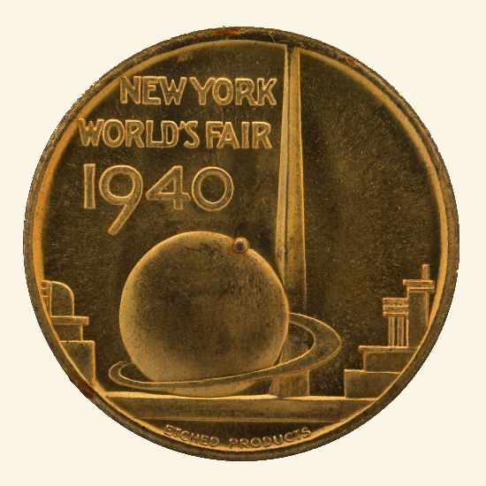
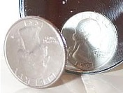
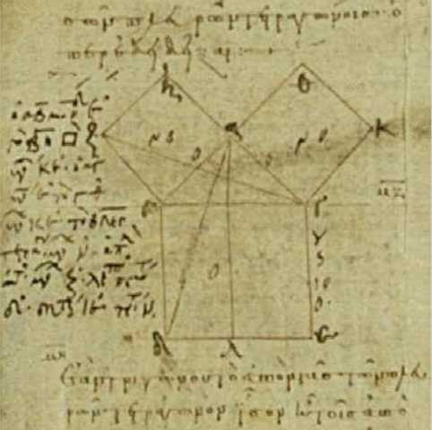
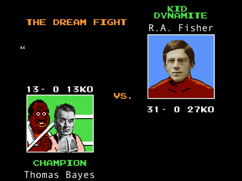

```{r setup, include=FALSE}
options(htmltools.dir.version = FALSE)
knitr::knit_hooks$set(crop = knitr::hook_pdfcrop)
knitr::opts_chunk$set(warning = FALSE, message = FALSE,
                      fig.showtext = TRUE)

library(tidyverse) # load tidyverse package
library(MASS)
library(ggplot2)
library(ggthemes)
library(kableExtra)
library(flextable)
library(cowplot)
library(xaringan)
library(xaringanthemer)
#library(gg3D)
library(leaflet)
library(maps)
library(fontawesome)
library(ggrepel)
library(DescTools)
library(renderthis)
library(wesanderson)
library(HDInterval)

## To create pdf version:

# setwd("~/Documents/PSY 208/PSY_207-208_23-24/Lectures")
# renderthis::to_pdf("Classical_Bayesian_Inference.Rmd", complex_slides = TRUE)

## To create PowerPoint version:

# renderthis::to_pptx("Classical_Bayesian_Inference.Rmd", complex_slides = TRUE)
```

```{r xaringan-themer, include=FALSE, warning=FALSE, eval=FALSE}
library(xaringanthemer)
style_mono_dark(
  base_color = "#1e90ff",
#  secondary_color = "#FFFFFF",
  header_font_google = google_font("Jost"),
  text_font_google = google_font("Jost", "400", "400i"),
  code_font_google = google_font("Roboto Mono")
)
```

### Our Experiment

Let's imagine that we are running a deeply implausible and blatantly unethical experiment on the effects of gamma radiation.

> Twenty Mild-mannered Scientists are exposed to gamma radiation.

> Sixteen of them exhibit behavioral and physiological alterations. Four do not.

$$N = 20$$

$$s = 16, f = 4$$

where $s$ is a *success* and $f$ is a *failure*\*

.footnote[\* *Success* in this terminology means *the thing we are looking for*; *failure* means *the other thing*]
---

# The challenge

### How can we generalize the results of our experiment from our small sample to the whole world?

---

### The Simplest Possible Approach

The observed rate is ** $\frac{16}{20}=80\%$.**

We *could* just tell the world that gamma radiation turns $80\%$ of mild-mannered scientists (and, presumably, their cousins who are lawyers) into Hulks.

That would be **easy**. But it wouldn't make much **sense**. So we have to do something **more complicated.**

```{r echo=FALSE, fig.align='center', out.width = "50%"}

```


---

### The Great Statistical Schism

.slightly-smaller[

**Parameters** are **unknown quantities**. We have **hypotheses** about them. 

]

***


.pull-left[


.slightly-smaller[

**Bayesian** statisticians say things about parameters - *.e.g.*, ** $\mu$** -  like:

> There's a $90\%$ chance that $\mu \ge 5$

> $\mu = 8$ is more probable than $\mu = 6$

All of those things imply that **a parameter can be represented by a** ***probability distribution***.


]
]

</div>
.pull-right[

.slightly-smaller[

**Classical** (or, **Frequentist**) statisicians say:

> **Relative frequency** is the only valid way to assign **probability values**

> A **parameter** is a **single number** without a **frequency**

Thus, **a parameter** ***can not*** be represented by a distribution.

]
]

***

.slightly-smaller[

This difference is **the source** of **every other difference** between the approaches.

]
---

### The Bayesian Approach

If you have **data**, and you are trying to find the **probability** of a hypothesis **given** those data, then you use **Bayes's Theorem** (hence the name):

$$p(H|D)=\frac{p(H)p(D|H)}{p(D)}$$
In the Bayesian framework:

> the **hypotheses** (for the **parameters**) are associated with **probability distributions** 

> the **data** are treated as **facts**.

.footnote[
Note: while the big difference between the two schools is the probability of parameters, frequentists also get snippy about subjective prior probabilities.
]
---

### The Bayesian Approach

.pull-left[
```{r echo=FALSE, fig.height = 5.5}
x<-seq(0, 1, 1/10000)
y<-dbeta(x, 17, 5)

ggplot(data.frame(x, y), aes(x, y))+
  geom_line(linewidth = 1.2)+
  theme_tufte(ticks=FALSE)+
  theme_xaringan(css_file="aquatic.css")+
  labs(x = bquote(pi),
       y = "Probability Density",
       title = bquote("Beta Distribution with "~alpha==17~","~beta==5))+
  theme(title=element_text(size=24))
```

]

.pull-right[

In our example, the observed rate (** $80\%$**) is a **proportion**.

Proportions are modeled by **beta distributions**

Therefore, information about the *true rate* (in this case, of mutation) can be learned from **the beta distribution associated with $s = 16, f = 4$**

]

We'll see that the observed ** $s$** and ** $f$** imply that the **true rate** has a **probability distribution** that is a **beta with $\alpha = 17$ and $\beta = 5$**.

---

### The Bayesian Approach

Estimating a **(posterior) probability distribution** allows us make statements like:

.pull-left[
```{r echo=FALSE, fig.height = 3}
x<-seq(0, 1, 1/10000)
y<-dbeta(x, 17, 5)

beta_ex <- data.frame(x, y)

ggplot(beta_ex, aes(x, y))+
  geom_line(linewidth = 1.2)+
  theme_tufte(ticks=FALSE)+
  theme_xaringan(css_file="aquatic.css")+
  geom_area(data = subset(beta_ex,
                          beta_ex$x >= 0.75),
            fill = "#1e90ff")+
  labs(x = bquote(pi),
       y = "Probability\nDensity",
       title = bquote("Beta Distribution with "~alpha==17~","~beta==5))+
  theme(title=element_text(size=24),
        axis.title.y = element_text(size = 18))
```

]

.pull-right[

> There is a $`r round(pbeta(0.75, 17, 5, lower.tail = FALSE), 2)`\%$ posterior probability that $\pi> 0.75$

]

.pull-left[

> There is a $95\%$ posterior probability that $`r round(hdi(qbeta, credMass = 0.95, shape1 = 17, shape2 = 5)[1], 2)` \le \pi \le `r round(hdi(qbeta, credMass = 0.95, shape1 = 17, shape2 = 5)[2], 2)`$

]

.pull-right[

```{r echo=FALSE, fig.height = 3}
x<-seq(0, 1, 1/10000)
y<-dbeta(x, 17, 5)

beta_ex <- data.frame(x, y)

ggplot(beta_ex, aes(x, y))+
  geom_line(linewidth = 1.2)+
  theme_tufte(ticks=FALSE)+
  theme_xaringan(css_file="aquatic.css")+
  geom_area(data = subset(beta_ex,
                          beta_ex$x >= 0.6 & beta_ex$x <= 0.93),
            fill = "#1e90ff")+
  labs(x = bquote(pi),
       y = "Probability\nDensity",
       title = bquote("Beta Distribution with "~alpha==17~","~beta==5))+
  theme(title=element_text(size=24),
        axis.title.y = element_text(size = 18))
```

]
---

### The Classical Approach

If you **start by assuming a model** for a hypothesis, and then you collect **data**, you can assess the **likelihood** of those data **given** the model:

$$p(D|H)$$
In the Classical framework:

> the **data** are treated as **random samples**

> the **hypotheses** (for **parameters**) are treated as **facts**.

The classical approach is **inductive**\*: assume **one model** (typically a boring, ordinary one), and if the **evidence doesn't support it**, **something else** must be true.

.footnote[
\* The specific logical principle is called *modus tollens*.
]
---

### The Classical Approach: Null Hypothesis Testing

.pull-left[

```{r echo=FALSE}
x<-0:20
y<-dbinom(x, 20, prob=0.5)

data.frame(x, y) %>% 
  mutate(fill = ifelse(x>15, "B", "A")) %>% 
  ggplot(aes(x, y, fill=fill))+
  geom_bar(stat="identity")+
  theme_tufte(ticks=FALSE)+
  theme_xaringan(css_file="aquatic.css")+
  scale_fill_manual(values=c("#3B9AB2", "#F21A00"))+
  theme(legend.position = "none")+
  labs(x="s", y = "Probability",
       title = "Binomial Distribution for \u03c0 = 0.5")+
  theme(title=element_text(size=24))
```

]

.pull-right[

*aka* **NHST** (for Null Hypothesis Statistical Testing)

Assume a chance rate (*e.g.*, $\pi = 0.5$)

Note the cumulative probability of $s \ge s_{obs}$

If the cumulative probability is **super-small**, you have something other than chance.

]

---
### The Other Classical Approach: Confidence Intervals

.pull-left[
```{r}
library(binom)
binom.confint(16, 20, 0.95, 
              methods="exact")
```

]

.pull-right[
.slightly-smaller[
The Classical confidence interval represents the **proportion of times (in this case, $95\%$) that future samples on which similar intervals are calculated will contain the true rate**.


It is tedious to calculate for proportions with small $n$, hence the software solution at left.

]
]

***

Classical confidence intervals **do not make any statement about a parameter itself**. Rather, they indicate **expectations** of **future samples** given the **observed data**.

---

class: inverse, middle, center

# Classical Inference

---

### Classical Null Hypothesis Testing

.pull-left[

Null Hypothesis $(H_0)$: 

> **Nothing special** is happening

Alternative Hypothesis $(H_1)$: 

> **Something** is happening

]

.pull-right[

The **alternative** hypothesis is the scientific theory we think will be supported

We never **prove** the alternative hypothesis

**Rejecting the null** is also known as declaring a result to be **statistically significant**.

]
---

### Hypothesis Testing: Basic Logic

We define our **null** and **alternative hypotheses**

We collect and analyze data

If the analysis indicates that the observed results – or more extreme unobserved results over repeated samples\* – are **extremely unlikely to have happened if the null hypothesis were true**, then we reject the null hypothesis in favor of the alternative hypothesis

Otherwise, we **continue to assume the null hypothesis**

.footnote[\*yes, this is super-weird. We’ll come back to it.]

---
### Hypothesis Testing: Type-I and Type-II Errors

When the null hypothesis is correct, but we reject the null anyway, this is known as a **Type-I error**, also known as:

> an $\alpha$-error

> a false alarm


When the alternative hypothesis is correct, but continue to assume the null, this is known as a **Type-II error**, also known as:

> a $\beta$-error

> a miss

---

### Errors in Null Hypothesis Testing

.pull-left[

False Alarm: Type-I $(\alpha)$ error

> $\alpha$-rate: the long-term rate of false alarms

Miss: Type-II $(\beta)$ error

> $\beta$-rate: the long-term rate of misses

In order, these errors were made by:

> The Boy

> The Villagers\*

]

.pull-right[
```{r echo=FALSE}

```

]

.footnote[\*source: Nerd Twitter]

---
### Errors in Null Hypothesis Testing


There are tradeoffs between Type-I and Type-II errors

> If we want **fewer false alarms**, we can be **more careful** about rejecting the null

>> And we’ll get more **misses**

>If we want fewer misses, we can be **more liberal** about rejecting the null

>> And we’ll get more **false alarms**


---
### $\alpha$: the Type-I Error Rate

Rejecting the null = the null is not **likely** to be true: we must decide how to define **unlikely enough** to reject $H_0$

.pull-left[

Imagine an academic test where people who don’t study have scores that are normally distributed with $\mu=70$ and $\sigma=10$.

People who study do *better.*	

Student X got a $90$.

Did Student X study? Let's investigate like classical statisticians!
]

.pull-right[
```{r echo=FALSE}
x<-seq(40, 100, 60/10000)
y<-dnorm(x, mean=70, sd = 10)

ggplot(data.frame(x, y), aes(x, y))+
  geom_line(linewidth = 1.2)+
  theme_tufte(ticks=FALSE)+
  theme_xaringan(css_file="aquatic.css")+
  labs(x="test scores", y="probability density")
```

]
---
### $\alpha$: the Type-I Error Rate

.pull-left[

Let’s say that $p\le 0.05$ is unlikely enough for us. That means $0.05$ is our $\alpha$-rate.

> If the cumulative likelihood of the observed score or more extreme scores is less than or equal to $\alpha$, we will reject $H_0$

The probability of getting a $90$ or better *without studying* is about 2.3%
]

.pull-right[
```{r echo=FALSE}
x<-seq(40, 100, 60/10000)
y<-dnorm(x, mean=70, sd = 10)
testcurve<-data.frame(x, y) 
 
  ggplot(testcurve, aes(x, y))+
  geom_line(linewidth = 1.2)+
  geom_area(data=subset(testcurve, testcurve$x>=90),
            fill="#F21A00")+
  theme_tufte(ticks=FALSE)+
  theme_xaringan(css_file="aquatic.css")+
  labs(x="test scores", y="probability density")+
    geom_segment(aes(x=90, xend=90,
                     y=0.02, yend=dnorm(90, 70, 10)),
                 arrow=arrow(angle=15,
                             type="closed"),
                 color="#E1AF00")+
    annotate("text",
             x=90,
             y=0.0225,
             label="Our\nHero's\nTest\nScore",
             color="#0047ab",
             vjust=0,
             size=18/.pt)+
    annotate("text",
             x=57,
             y=dnorm(60, 70, 10),
             label="The Curve of\nNon-Studiers",
             color="#0047ab",
             vjust=0.5,
             hjust=1,
             size=18/.pt)
```
]
---
### $\alpha$: the Type-I Error Rate

By that logic, $2.3\%$ is too **small a likelihood** to believe that Student X came from the unstudying population. We **reject** that hypothesis!

We're implying that Student X belongs to a different, **studying** population:

```{r echo=FALSE, fig.height=4, fig.width = 12}
x<-seq(40, 100, 60/10000)
y<-dnorm(x, mean=70, sd = 10)

testcurve<-data.frame(x, y) %>% 
  mutate(y2=dnorm(x, mean = 80, sd = 5)) %>% 
  mutate(y3=dnorm(x, mean = 92, sd = 4))

testcurve %>%  
  ggplot()+
  geom_line(aes(x, y), linewidth = 1.2, color="#3B9AB2")+
  geom_line(aes(x, y2), linewidth = 1.2, color="#78B7C5", lty=2)+
  geom_line(aes(x, y3), linewidth = 1.2, color="#78B7C5", lty=2)+
  theme_tufte(ticks=FALSE)+
  theme_xaringan(css_file="aquatic.css")+
  labs(x="test scores", y="probability density")+
    geom_segment(aes(x=90, xend=90,
                     y=0.02, yend=dnorm(90, 70, 10)),
                 arrow=arrow(angle=15,
                             type="closed"),
                 color="#E1AF00")+
    annotate("text",
             x=90,
             y=0.0225,
             label="Our\nHero's\nTest\nScore",
             color="#0047ab",
             vjust=0,
             hjust = 0,
             size=18/.pt)+
    annotate("text",
             x=57,
             y=dnorm(60, 70, 10)+0.01,
             label="The Curve of\nNon-Studiers",
             color="#0047ab",
             vjust=0.5,
             hjust=1,
             size=18/.pt)
```


But **probably not** (but not definitely not) the curve from the null hypothesis.

---
### $\alpha$: the Type-I Error Rate

**Type-I error rate** = **False Alarm rate** = ** $\alpha$-rate** or ** $\alpha$-level**

If the probability of the observed data (or more extreme unobserved data) given the null hypothesis is less than the Type-I error rate, we will reject the null hypothesis.

> This means that if the null hypothesis is true, then over time, we will reject the null **when the null is actually true** at the false alarm rate over time.

By convention, the usual type-I error rate is .05

> Somewhat arbitrary

---

### Types of Alternative Hypotheses

**Directional (One-Tailed) Hypothesis**: An alternative hypothesis that posits that a parameter is **larger** or **smaller** (one or the other: not *both at the same time*) than the parameter suggested by the null hypothesis

> *Example 1:* A disease has a fatality rate of .37

> A drug is developed to treat the disease

> This drug will be considered successful if it reduces the fatality rate in a clinical sample

$$H_0: \pi \ge 0.37$$
$$H_1: \pi < 0.37$$
---

### Types of Alternative Hypotheses

**Point (Two-Tailed) Hypothesis**: The alternative is **different** than the null

> Example: do we have a fair coin or is it biased in either direction?

$$H_0: \pi = 0.5$$
$$H_1: \pi \ne 0.5$$

---

### Six-Step Hypothesis Testing Procedure

1. Describe the null and the alternative hypotheses

2. Set the Type-I error rate

3. Make a statement regarding the statistical model

4. Declare a rule for deciding between null & alternative hypotheses

5. Obtain data and make calculations

6. Make a decision

> Note: The six steps are a **basic outline**. The wording, order, and even *number* of steps will vary between sources. The *idea* is always the same.

---
### The Most Important Thing About the Six-Step Procedure:

The rules for finding something to be statistically significant:

> stating the null and alternative hypotheses, 

> setting the $\alpha$-rate, 

> declaring the type of statistical test, and 

> indicating the criterion for decising between $H_0$ and $H_1$ - are declared **before** collecting data, analyzing it, and making a decision

make NHST a model for **ethical** and **reproducible** science!

Re-analyzing data *after* seeing results opens the door to practices like **HARKing** and ** $p$-hacking.**
---

### Back to our Experiment

.pull-left[

The outcome of our experiment is a yes/no kind of deal: a **binomial test** is appropriate.

We will use what we know about **binomial probability** to assess the **likelihood of the observed data and of more extreme unobserved data over repeated samples**.

As a reminder, our data are:

$$n=20$$
$$s=16, f=4$$
]

.pull-right[

```{r echo=FALSE}

```

]

---

### Classical Inference

**Step 1: Describe the null and alternative hypotheses**

Let's assume that there's a 50/50 chance that gamma radiation will turn a participant into a Hulk.

$$H_0: \pi \le 0.5$$

$$H_1: \pi > 0.5$$

This setup implies that we are interested in whether the gamma rays make Hulks at **greater** than a chance rate.

---
### Classical Inference

**Step 2: Set the Type-I error rate**

Let's go with the industry standard:

$$\alpha=0.05$$

So, if the gamma rays really are **as likely as not** to change the biochemistry of our test participants, we will reject the null hypothesis (incorrectly) about $5\%$ of the time.

---

### Classical Inference

**Step 3: Make a statement regarding the statistical model**

This is the part where we talk about what kind of stats we're going to do.

In this case, we know that we're going to do a **binomial test**. That implies that the data are **modeled** by the binomial likelihood function\*:

$$p(s\ge s_{obs}|n, \pi)=\frac{n!}{s!f!}\pi^s\left(1-\pi\right)^f$$

To be more specific, our **null model** has $n=20$ and $\pi=0.5$ (specified by $H_0$):

$$p(s\ge s_{obs}|n=20, \pi=0.5)=\frac{20!}{s!f!}(0.5)^s\left(0.5\right)^f$$

.footnote[
\*or we could say *the data are generated by a binomial process*
]
---

### Classical Inference

**Step 4. Declare a rule for deciding between null & alternative hypotheses**

We will **reject the null hypothesis in favor of the alternative hypothesis** if the likelihood of the observed or more extreme unobserved events happening given the null hypothesis is smaller than our $\alpha$-level.

This likelihood is called a $p$-*value*, and it is widely misunderstood.

---

### $p$-values: The common misunderstanding

$p$-values are commonly thought of as the *probability of the results*

This is **wrong** primarily for two reasons:

1. They are the likelihood of the results *and more extreme unobserved results*

2. They depend on the null hypothesis

---

### More extreme unobserved results

.left-column[
```{r echo=FALSE}


```
]

.right-column[

Let’s test this coin to see if it’s fair.

Observed data: $1,000$ flips; $500$ heads. Seems legit.

But, the likelihood of seeing *exactly* $500$ heads flips of a fair coin is $0.025$. 

The likelihood of $500$ or more (or $500$ or fewer) is $0.51$.

With a few exceptions, **cumulative (range) probabilities are more meaningful than density (point) probabilities**.
]

---

### Dependence on the Null Hypothesis

A coin is flipped 10 times and comes up heads 10 times.

.pull-left[
```{r echo=FALSE, out.width="50%", fig.align='center'}


```

]

.pull-right[


If we assume that the coin is **fair**, the probability of this result is:

$$p=\frac{1}{2^{10}}=0.000977$$

]

***

.pull-left[

```{r echo=FALSE, out.width = "50%", fig.align='center'}


```

]

.pull-right[

But, if we assume that the coin is **double-headed**, the probability of the result is:

$$p=1$$


]

---

### Classical Inference

**Step 4. Declare a rule for deciding between null & alternative hypotheses**

Here is where we lay out the rules of our game:

> If $p(s \ge s_{obs}|n, \pi) \le \alpha$, we reject $H_0$ in favor of $H_1$

> Otherwise, we continue to assume $H_0$

---

### Classical Inference

**Step 5. Obtain and analyze data**

Our data:

$$s=16, f=4$$

Our analysis:

$$p(s \ge 16|n=20, \pi=0.5)=\sum p(16)\ldots p(20)$$

$$=0.0059$$

---

### Classical Inference

**Step 6: Make a Decision**

In this step, we decide **whether or not something is statistically significant** based on what we wrote in the first 5 steps (the null and alternative hypotheses, the type-I error rate, the data analysis, *etc.*)

$$0.0059\le 0.025\\p_{obs} \le \frac{\alpha}{2}$$
> Interpretation:

>> We would **still** reject $H_0$ in that case.

The choice of *tailedness* ***should*** be related *only* to the scientific hypothesis. Some people are dogmatic about *always* using two-tailed tests when possible (the basic argument is that directions are subjective).

---

### Classical Inference

**Step 6: Make a Decision**

Note: if we had used a **two-tailed** hypothesis, we would have compared the ** $p$-value** to ** $\frac{\alpha}{2}$** to account for **equally extreme unobserved data** ***in the opposite direction***

> We might have adopted a **two-tailed** hypothesis if our **scientific** hypothesis was something like *the gamma rays will affect participants at a rate* ***different** *from a chance value of $50\%$*.

$$p_{obs} \le \alpha$$
> Interpretation:

>> Therefore, we **reject $H_0$ in favor of $H_1$.**

>> There is a **greater-than-chance** rate that gamma rays affect human physiology in a hulky way.
---


### Classical Confidence Intervals

** $1-\alpha\%$ confidence intervals (CIs)** represent **the range in which $1-\alpha\%$ of future samples using the same algorithm are expected to capture the true parameter with their interval estimates**.

> Just as the most commonly-used $\alpha$ is $\alpha = 0.05$, the most commonly-used confidence interval is ** $1-0.05\% = 95\%$**

The confidence interval is pretty close to **Bayesian interval estimates** *numerically* but *philosophically* much different.

It is *not* the range where we are $95\%$ confident that the parameter is (that would imply a $p(H)$, which is **not allowed** in classical statistics).

For our example data, the ** $95\%~CI = [0.563, 0.943]$** (calculated using `R` in an earlier slide).

---

### Classical Confidence Intervals

The **exact method** is (as the name implies) the most precise method of finding **confidence interval** estimates for **proportions**.

> When ** $n$ is small** (the rule of thumb is $\le 20$), we pretty much have to use the exact method.

The exact method is based on the following rules:

The value of the **lower limit** of the $95\%$ confidence interval $(0.563)$ is the value of $\hat{\pi}$ for which $p(s \ge 16)=2.5\%$.

The value of the **upper limit** of the $95\%$ confidence interval $(0.943)$ is the value of $\hat{\pi}$ for which $p(s \le 16) = 2.5\%$.

All values of $\hat{\pi}$ between those limits have cumulative probabilities $>0.025$
---
### Classical Confidence Intervals

There are **lots** of methods for calculating CIs on **proportions**. The key methods are:

.pull-left[

.slightly-smaller[

**exact**

> good for small $n$


**Wilson**

> relatively accurate, quasi-Bayesian


**asymptotic**

> based on the **normal approximation to the binomial**

> super-common

]
]

.pull-right[
```{r echo = FALSE}
binom.confint(16, 20, conf.level = 0.95) %>% 
  flextable() %>% 
  color(color = "#3B9AB2", part = "all") %>% 
  colformat_double(j = 4:6, digits = 4) %>% 
  colformat_double(j = 2:3, digits = 0) %>% 
  bg(i = c(2, 5, 11),
     bg = "#EBCC2A") %>% 
  color(i = c(2, 5, 11), color = "#0047ab", part = "body")
```

]


---

### Classical Confidence Intervals

Confidence intervals are useful for **comparisons**:


> A **narrower** confidence interval indicates **higher precision**; a **wider** confidence interval indicates **lower precision**.

> Confidence intervals that don’t include values of interest - in this case, 0.5 might be considered **interesting** because it suggests **coin-flip chance** - are indicators of **statistical significance** (even though the 6-step procedure hasn’t been strictly followed)

> Confidence intervals for multiple samples that don’t overlap indicate significant differences; confidence intervals that do overlap indicate lack of significant differences.

Confidence intervals can be computed for **any statistic**. We will revisit CIs when we talk about **CIs** on **sample means** and on **regression coefficients**.

---

class: inverse, middle, center

# Bayesian Inference


---

### Bayesian Inference

```{r echo=FALSE, fig.align='center'}

```

**Procedure**:

describe the probability of the hypothesis (or relative probability of hypotheses) in **pretty much any way that is meaningful.**

(This part of the Bayesian program is not as rigid as its Classical counterpart)

---

### Bayesian Inference


# $$p(H|D)=\frac{p(H)p(D|H)}{p(D)}$$

.center[

$p(H)$: *prior probability*

$p(D|H)$: *likelihood*

$p(D)$: *base rate*

$p(H|D)$: *posterior probability*

]

---

### Bayesian Inference

We are going to do this two ways for our example experiment:

.pull-left[
```{r echo=FALSE, out.height='200px', out.width='300px', fig.align='center'}

```

.slightly-smaller[
$1$. Old-school pen-and-paper (ish)
]
]

.pull-right[

```{r echo=FALSE, out.height='200px', fig.align='center'}
knitr::include_graphics("images/mainframe.jpeg")
```

.slightly-smaller[
$2$. With software, like normal people. 
]
]

The first method is just a really effective way of demonstrating how Bayes's Theorem is directly involved in statistical inference.

---

### Bayesian Inference

The **classical analysis** gave us:

1. a **rejection of the null assumption that the effect of gamma rays were just random** (with *random* defined as *just as likely to cause hulking-out as not*)

2. A **long-term expectation of the range of observed proportion of successes** (again, the term *success* is defined *very* loosely).

In our Bayesian analysis, we are going to look for:

1. An **interval estimate for the population-level parameter $\pi$** (*i.e.*, the true rate of hulk-making)

2. The **probability that $\pi$ exceeds certain values of interest** (we'll use $0.5$ as an example but it will be super easy to see if, for example, $\pi>0.25$, or $\pi > 0.6$, *etc*.)

---

### Bayesian Inference

We're going to start with **11 guesses**\* for what the population parameter $\pi$ could be. We'll call those *candidate* values $\pi_i$:

$$\pi_i=0, 0.1, 0.2, \ldots, 1.0$$

We are going to **test each $\pi$ value** to determine the **posterior probability that it is the real $\pi$ parameter**.

Each value of $\pi_i$ represents a different **hypothesis** about the true parameter value.

.footnote[
\*Arbitrary? Sure. Imprecise? Yes. Good enough to make our point? I hope so!
]
---

### Bayesian Inference

.pull-left[
We will start by assigning a **prior probability** $p(H)$ to each value of $\pi_i$. 

Let's say that we have **absolutely no information at the start** on the effect of gamma radiation.

It is thus reasonable to start with the basic assumption that **each $\pi_i$ is equally likely**.

So, each prior probability $p(H_i)=1/11$ (as in the figure on the right)
]

.pull-right[
```{r echo=FALSE}
data.frame(x=seq(0, 1, 0.1),
           y=rep(1/11, 11)) %>% 
  ggplot(aes(x, y))+
  geom_bar(stat="identity")+
  theme_tufte(ticks=FALSE)+
  theme_xaringan(css_file="aquatic.css")+
  labs(x=bquote(pi[i]),
       y=bquote(p(pi[i])))+
  scale_x_continuous(breaks=seq(0, 1, 0.1))+
  ylim(0, 0.5)+
  ggtitle("prior probabilities")
```
]

---

### Bayesian Inference

.pull-left[
Next, we will calculate the **likelihood** $p(D|H)$ for each value of $\pi_i$. 

The likelihood formula for this step is **the same likelihood formula we used for** ***classical*** **inference**! It's the **binomial likelihood function**.

$$p(s|n, \pi_i)=\frac{n!}{s!f!}\pi_i^s(1-\pi_i)^f$$

]

.pull-right[
```{r echo=FALSE}
x<-seq(0, 1, 0.1)
y<-dbinom(16, 20, x) 
data.frame(x, y) %>% 
  ggplot(aes(x, y))+
  geom_bar(stat="identity")+
  theme_tufte(ticks=FALSE)+
  theme_xaringan(css_file="aquatic.css")+
  labs(x=bquote(pi[i]),
       y=bquote(p("D|"~pi[i])))+
  scale_x_continuous(breaks=seq(0, 1, 0.1))+
  ylim(0, 0.5)+
  ggtitle("likelihoods")
```
]

---

### Bayesian Inference

.pull-left[

For each **candidate $\pi_i$**, we're going to plug in:

> $\pi_i$

> the observed $n$, $s$, and $f$

For example, for $\pi_9=0.8$:

$$p(s=16|n=20, \pi_i=0.8)=\\\frac{20!}{16!4!}0.8^{16}(0.2)^4$$
$$=`r round(dbinom(16, 20, 0.8), 3)`$$
]

.pull-right[
```{r echo=FALSE}
x<-seq(0, 1, 0.1)
y<-dbinom(16, 20, x) 
data.frame(x, y) %>% 
  ggplot(aes(x, y))+
  geom_bar(stat="identity")+
  theme_tufte(ticks=FALSE)+
  theme_xaringan(css_file="aquatic.css")+
  labs(x=bquote(pi[i]),
       y=bquote(p("D|"~pi[i])))+
  scale_x_continuous(breaks=seq(0, 1, 0.1))+
  ylim(0, 0.5)+
  ggtitle("likelihoods")
```
]

---

### Bayesian Inference


Our next step is to find the **base rate** $p(D)$.
We are going to end up with a **distribution** of $11$ different posterior probabilities $p(H|D)$We need all $11$ posteriors to add up to $p=1$:

$$\sum \frac{p(H_i)p(D|H_i)}{p(D)} = \frac{1}{p(D)} \sum p(H_i)p(D|H_i)=1$$

Multiplying both sides by $p(D)$:

$$\sum p(H_i)p(D|H_i)=p(D)$$
So, $p(D)$ is the **sum of the products of the prior and the likelihood** for each $\pi_i$.

.center[
In our example, $p(D)= 0.0434.$
]
---

### Bayesian Inference
.pull-left[
Finally, we will calculate the **posterior** $p(H|D)$ for each value of $\pi_i$. 

Here, we literally just use Bayes's Theorem! Or, technically, we use Bayes's Theorem $11$ times, once for each $\pi_i$.

$$p(H_i|D)=\frac{p(H_i)p(D|H_i)}{p(D)}$$
]

.pull-right[
```{r echo=FALSE, fig.height = 6}
x<-seq(0, 1, 0.1)
y<-(1/11)*dbinom(16, 20, x)/0.0434

data.frame(x, y) %>% 
  ggplot(aes(x, y))+
  geom_bar(stat="identity")+
  theme_tufte(ticks=FALSE)+
  theme_xaringan(css_file="aquatic.css")+
  labs(x=bquote(pi[i]),
       y=bquote(p(pi[i]~"|D")))+
  scale_x_continuous(breaks=seq(0, 1, 0.1))+
  ylim(0, 0.5)+
  ggtitle("posteriors")
```

]

Each bar in the figure on the right is the **prior** for a candidate $\pi_i$ times the **likelihood** for that $\pi_i$ divided by the **base rate** (constant for every $\pi_i$).
---
### Bayesian Inference

.pull-left[
.slightly-smaller[
We can see from the **posterior probability distribution** that $\pi_i=0.8$ has the **highest probability of all of the possibilities we picked**. Makes sense! The observed rate was $0.8$, too.

We can also see that the distribution is **skewed to the right**. 

Some of the bars are too small to show up (*e.g.*, $p(\pi_i=0.3=`r round(y[4], 2)`)$ ), but some of them are actually $0$; *e.g.* $p(0)=0$ and $p(1) = 0$ because $s=16$ and $f=4$.


]

]

.pull-right[
```{r echo=FALSE}
x<-seq(0, 1, 0.1)
y<-(1/11)*dbinom(16, 20, x)/0.0434

data.frame(x, y) %>% 
  ggplot(aes(x, y))+
  geom_bar(stat="identity")+
  theme_tufte(ticks=FALSE)+
  theme_xaringan(css_file="aquatic.css")+
  labs(x=bquote(pi[i]),
       y=bquote(p(pi[i]~"|D")))+
  scale_x_continuous(breaks=seq(0, 1, 0.1))+
  ylim(0, 0.5)+
  ggtitle("Posterior Probability Distribution")+
  theme(title=element_text(size=20))
```
]

***

But, this was a **learning exercise**. Let's analyze the data for real with our **more accurate**, **much easier** method.
---

### Bayesian Inference

If we were to use smaller intervals, we would have a smoother-looking distribution, for example:

.pull-left[
```{r echo=FALSE}
x<-seq(0, 1, 0.05)
nums<-(1/21)*dbinom(16, 20, x)
y<-nums/sum(nums)
data.frame(x, y) %>% 
  ggplot(aes(x, y))+
  geom_bar(stat="identity")+
  theme_tufte(ticks=FALSE)+
  theme_xaringan(css_file="aquatic.css")+
  labs(x=bquote(pi[i]),
       y=bquote(p(pi[i]~"|D")))+
  scale_x_continuous(breaks=seq(0, 1, 0.1))+
  ylim(0, 0.25)+
  labs(title=bquote("21 values of "~pi[i]))
```
]

.pull-right[
```{r echo=FALSE}
x<-seq(0, 1, 0.01)
nums<-(1/101)*dbinom(16, 20, x)
y<-nums/sum(nums)
data.frame(x, y) %>% 
  ggplot(aes(x, y))+
  geom_bar(stat="identity")+
  theme_tufte(ticks=FALSE)+
  theme_xaringan(css_file="aquatic.css")+
  labs(x=bquote(pi[i]),
       y=bquote(p(pi[i]~"|D")))+
  scale_x_continuous(breaks=seq(0, 1, 0.1))+
  ylim(0, 0.06)+
  labs(title=bquote("101 values of "~pi[i]))
```
]
---

### Bayesian Inference

If we evaluate **every** possible value of $\pi_i$ -- that is, if we treat $\pi_i$ as a **continuous variable**, then we would arrive at a **beta distribution**.

For our data, specifically, we would use the beta distribution shown at the beginning:

```{r echo=FALSE, fig.height=4.5, fig.width = 10, fig.align='center'}
x<-seq(0, 1, 1/10000)
y<-dbeta(x, 17, 5)

ggplot(data.frame(x, y), aes(x, y))+
  geom_line(linewidth = 1.2)+
  theme_tufte(ticks=FALSE)+
  theme_xaringan(css_file="aquatic.css")+
  labs(y = "Probability\nDensity",
       title = bquote("Beta Distribution with "~alpha==17~","~beta==5))+
  theme(title=element_text(size=24))
```
---

### Bayesian Inference


The beta is a **natural conjugate function**: it can serve as the prior *and* the posterior for binomial data.

.pull-left[

>Data: 

$$s = 16, f = 4$$

> Prior:

$$s' = 0, f' = 0$$

> Posterior:

$$s'' = s'+s = 16$$

$$f'' = f'+f=4$$
]

.pull-right[

> The **shape parameters** ** $\alpha$** and ** $\beta$** are simply ** $s^{(' or '')}+1$** and ** $f^{(' or '')}+1$**, respectively.

***


If we ran another experiment, then $s'=16$, $f'=4$, and then we would just add the new 𝑠 and 𝑓
]
---

### Bayesian Inference

We can calculate summary statistics using $\alpha$ and $\beta$ ***or*** $s''$ and $f''$:

.pull-left[

** $$\alpha = 17,~\beta = 5$$**

***

> Mean

$$\text{E}(\pi|D)=\frac{\alpha}{\alpha + \beta}=\frac{17}{22}$$

> Variance

$$\text{V}(\pi|D)=\frac{\alpha\beta}{(\alpha+\beta)^2(\alpha+\beta+1)}\\=`r round((17*5)/((22^2)*23), 4)`$$

]
.pull-right[

** $$s''=16,~f'' = 4$$**

***

> Mean 

$$\text{E}(\pi|D)=\frac{s'+1}{s'+f'+2}=\frac{17}{22}$$
> Variance

$$\text{V}(\pi|D)=\frac{\text{E}(\pi|D)(1-\text{E}(\pi|D))}{s'+f'+3}\\ \approx `r round((17/22*5/22)/(23), 4)`$$


]

---

### Bayesian Inference

.pull-left[
```{r echo=FALSE, fig.height=5, fig.align='center'}
x<-seq(0, 1, 1/10000)
y<-dbeta(x, 17, 5)

ggplot(data.frame(x, y), aes(x, y))+
  geom_line(linewidth = 1.2)+
  theme_tufte(ticks=FALSE)+
  theme_xaringan(css_file="aquatic.css")+
  labs(y = "Probability\nDensity",
       title = bquote("Beta Distribution with "~alpha==17~","~beta==5))+
  theme(title=element_text(size=24),
        axis.title.y = element_text(size = 18))
```
]

.pull-right[

> ** Example analyses:**

> Maybe we are interested in the probability that $\pi\ge0.5$:

```{r}
pbeta(0.5, 17, 5, lower.tail=FALSE)
```


]

***
Or the probability that $\pi$ is between two values, *e.g.*, $0.71$ and $0.91$:

```{r}
pbeta(0.91, 17, 5)-pbeta(0.71, 17, 5)
```


---

### Bayesian Inference

.pull-left[
```{r echo=FALSE, fig.height=4, fig.align='center'}
x<-seq(0, 1, 1/10000)
y<-dbeta(x, 17, 5)

beta_df<-data.frame(x, y)
ggplot(beta_df, aes(x, y))+
  geom_line(linewidth = 1.2)+
  theme_tufte(ticks=FALSE)+
  theme_xaringan(css_file="aquatic.css")+
  labs(y = "Probability\nDensity",
       title = bquote("Beta Distribution with "~alpha==17~","~beta==5))+
  theme(title=element_text(size=24),
        axis.title.y = element_text(size = 18))+
    geom_area(data=subset(beta_df, beta_df$x>=0.60 & beta_df$x <=0.93),
            fill="#F21A00")
```
]

.pull-right[
.slightly-smaller[


A common Bayesian **interval estimate** is the **Highest Density Interval (HDI)**.

It represents the *narrowest* part of the curve where you can find $95\%$ of the distribution.
]
]
```{r}

hdi(qbeta, credMass = 0.95, shape1=17, shape2=5)
```

$$p(0.60 \le \pi \le 0.93)=0.95$$


---
### Bayesian Inference

.slightly-smaller[

The **Bayes Factor** is a way of evaluating hypotheses. It is is the factor by which the likelihood of model $H_1$ increases the **posterior odds** from the **prior odds** relative to the likelihood of model $H_2$.

The **odds** *in favor of* $A$ (relative to *not* $A$) are given by:

$$\frac{p(A)}{1-p(A)}$$
The **prior odds** in favor of a model $H_1$ are therefore:

$$\frac{p(H_1)}{1-p(H_1)}$$
Given that we have model $H_1$ and model $H_2$ (and no others), the prior odds in favor of $H_1$ are:

$$\frac{p(H_1)}{p(H_2)}$$
]

---

### Bayesian Inference

The **posterior odds** in favor of $H_1$ are based on the posterior probability of the two models:

$$\frac{p(H_1|D)}{p(H_2|D)}=\frac{p(H_1)}{p(H_2)}\frac{p(D|H_1)}{p(D|H_2)}$$
(the base rate $p(D)$ cancels out)

Therefore, the **factor** that describes the **change** between $p(H_1)/p(H_2)$ from prior to posterior is the ratio of their likelihoods and priors.

---

### Bayesian Inference

Let's calculate a Bayes Factor for two hypothesized population parameters: $\pi=0.8$ and $\pi=0.5$.

Usually, the likelihoods are *integrated* across the possible values of parameters (technically, across the *prior probabilities* of those parameters):

$$B.F. = \frac{\int p(D|H_1)p(H_1)dH_1}{\int p(D|H_2)p(H_2)dH_2}$$

But, for our example, we can assume **equal priors**, and the models differ only by the hypothesized parameter value, so we can calculate a Bayes Factor that is the simple ratio of the likelihoods:

$$BF=\frac{p(D|H_1)}{p(D|H2)}=\frac{\frac{20!}{16!4!}(0.8)^{16}(0.2)^4}{\frac{20!}{16!4!}(0.5)^{16}(0.5)^4}=47.22$$
---
### Bayes Factor Standards

```{r echo=FALSE}
BF1<-c("1 to 3.2", "3.2 to 10", "10 to 100", "> 100")
Interp1<-c("Barely worth mentioning", "Substantial", "Strong", "Decisive")

BF2<-c("1 to 3", "3 to 20", "20 to 150", "> 150")
Interp2<-c("Not worth more than a bare mention", "Positive", "Strong", "Very Strong")

BFGuide<-data.frame(BF1, Interp1, BF2, Interp2)
kable(BFGuide, "html", booktabs=TRUE, col.names=c("Bayes Factor", "Interpretation", "Bayes Factor", "Interpretation")) %>% 
  kable_styling() %>% 
  add_header_above(c("Jeffreys (1961)"=2, "Kass & Raftery (1995)"=2))
```

By either set of standards, $BF = 47.22$ represents *strong* evidence.

---

### Bayesian Inference

.slightly-smaller[
Bayesian analysis is not always as neat as this custom-chosen example.

**Repeated-sampling algorithms** can be used to **estimate posterior distributions** when **conjugate function are unknown** (or otherwise a pain in the ass to use).

]

.pull-left[

```{r echo=FALSE}
set.seed(77)
```

```{r}
s<-16
N<-20
theta<-c(0.5, rep(NA, 9999))

for (i in 2:10000){ 
  theta2<-runif(1)
  r<-dbinom(s, N, theta2)/dbinom(s, N, theta[i-1])
  u<-runif(1) 
theta[i]<-ifelse(r>=1, theta2, 
                   ifelse(r>u, theta2, theta[i-1]))
}

```

.slightly-smaller[
(I promise that code will make more sense to you very soon)
]

]

.pull-right[
```{r echo=FALSE}
ggplot(data.frame(theta), aes(theta))+
  geom_histogram(binwidth = 0.01)+
  theme_tufte(ticks=FALSE)+
  theme_xaringan(css_file = "aquatic.css")+
  annotate("text",
           x=0,
           y=Inf,
           hjust=0,
           vjust=1,
           label=paste0("mean = ", round(mean(theta),3), "\n", "SD = ", round(sd(theta), 3)),
           size=24/.pt)
```
]

---

.pull-left[ 
### The Two Approaches
]

.pull-right[
```{r echo=FALSE, out.width = "60%", fig.align = "center"}

```

]

.pull-left[

***Classical***

$p(D|H)$

Statistical Significance

Relatively computationally simple

Greater sample sizes, wider intervals

Procedures in place for wide range of psych science designs

Popular!


]

.pull-right[

***Bayesian***

$p(H|D)$

No Statistical Significance

Relatively computationally complex

Fewer observations, narrower intervals

Pretty wide open in terms of design approaches


Getting there!


]
