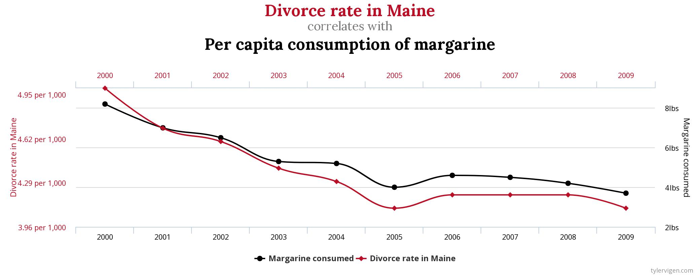

  
```{r setup, include=FALSE}
options(htmltools.dir.version = FALSE)
knitr::knit_hooks$set(crop = knitr::hook_pdfcrop)
knitr::opts_chunk$set(warning = FALSE, message = FALSE,
                      fig.showtext = TRUE)

library(tidyverse) # load tidyverse package
library(MASS)
library(ggplot2)
library(ggthemes)
library(systemfonts)
#devtools::install_github("kupietz/kableExtra")
library(kableExtra)
library(flextable)
library(cowplot)
library(xaringanthemer)
library(xaringan)
#library(gg3D)
library(leaflet)
library(maps)
library(fontawesome)
library(ggrepel)
library(DescTools)
library(renderthis)


## To create pdf version:

# setwd("~/Documents/PSY 208/PSY_207-208_23-24/Lectures")
# renderthis::to_pdf("Correlation.Rmd", complex_slides = TRUE)

## To create PowerPoint version:

# renderthis::to_pptx("Correlation.Rmd", complex_slides = TRUE)
```


```{r xaringan-themer, include=FALSE, warning=FALSE, eval=FALSE}
library(xaringanthemer)
style_mono_dark(
  base_color = "#1e90ff",
#  secondary_color = "#FFFFFF",
  header_font_google = google_font("Jost"),
  text_font_google = google_font("Jost", "400", "400i"),
  code_font_google = google_font("Roboto Mono")
)
```

### Correlation

**Correlation** is a measure of a relationship between **two variables**, *e.g.*:

> Size and mass

> High School GPA and College GPA

> Cardiovascular health and athletic performance

---

### Parametric Correlation

The **Product Moment**, $r$ (also called the correlation coefficient), is a statistic that evaluates correlations

.center[

### $r$ ranges from – 1 to 1.

]

We are interested in two aspects of a correlation: the **direction** (or **sign**) and the **magnitude** (or **size**).
---

### Parametric Correlation

**Direction:** 

> **Direct** or **Positive**: large values for one variable are associated with large values for the other variable, and small values for one are associated with small values for the other

>> one goes up, the other goes up

> **Inverse** or **Negative**: large values for one variable are associated with small values for the other variable (and *vice versa*)

>> one goes up, the other goes down

---

### Parametric Correlation

**Magnitude**: How strong is the correlation?

.pull-left[

This is an example of **guidelines** for an **effect-size statistic**

Guidelines for interpreting effect sizes are **general prescriptions**

It is **important** to interpret effect sizes **in the context of the field you are working in**

]

.pull-right[

Cohen’s (1988) guidelines:

> weak: $.1 \to .3$

> moderate: $.3 \to .5$

> strong: $.5+$

]


---

### Magnitude and Direction of $r$

```{r echo=FALSE, fig.width = 12, fig.height = 7}
set.seed(77)
# create the variance covariance matrix
sigma1<-rbind(c(1, -0.15), c(-0.15, 1))
# create the mean vector
mu<-c(0, 0) 
# generate the multivariate normal distribution
df1<-as.data.frame(mvrnorm(n=1000, mu=mu, Sigma=sigma1)) %>% 
  rename(y = V1,
         x = V2) 

# create the variance covariance matrix
sigma2<-rbind(c(1, -0.4), c(-0.4, 1))
# create the mean vector
mu<-c(0, 0) 
# generate the multivariate normal distribution
df2<-as.data.frame(mvrnorm(n=1000, mu=mu, Sigma=sigma2)) %>% 
  rename(y = V1,
         x = V2) 

# create the variance covariance matrix
sigma3<-rbind(c(1, -0.9), c(-0.9, 1))
# create the mean vector
mu<-c(0, 0) 
# generate the multivariate normal distribution
df3<-as.data.frame(mvrnorm(n=1000, mu=mu, Sigma=sigma3)) %>% 
  rename(y = V1,
         x = V2) 

weakpos<-ggplot(df1, aes(x, -y))+
  geom_point()+
  theme_tufte(base_size = 12, ticks = FALSE)+
  theme_xaringan(css_file = "nighttime_in_the_big_city.css")+
  ggtitle("Weak, Positive")+
  theme(plot.title = element_text(color = "#D2E8FF",
                                  size = 30))+
  ylim(-2.75, 4)+
  labs(x = "x",
       y = "y")

medpos<-ggplot(df2, aes(x, -y))+
  geom_point()+
  theme_tufte(base_size = 12, ticks = FALSE)+
  theme_xaringan()+
  ggtitle("Moderate, Positive")+
  theme(plot.title = element_text(color = "#D2E8FF",
                                  size = 30))+
  ylim(-2.75, 4)+
  labs(x = "x",
       y = "y")

strongpos<-ggplot(df3, aes(x, -y))+
  geom_point()+
  theme_tufte(base_size = 12, ticks = FALSE)+
  theme_xaringan()+
  ggtitle("Strong, Positive")+
  theme(plot.title = element_text(color = "#D2E8FF",
                                  size = 30))+
  ylim(-2.75, 4)+
  labs(x = "x",
       y = "y")

weakneg<-ggplot(df1, aes(x, y))+
  geom_point()+
  theme_tufte(base_size = 12, ticks = FALSE)+
  theme_xaringan()+
  ggtitle("Weak, Negative")+
  theme(plot.title = element_text(color = "#D2E8FF",
                                  size = 30))+
  ylim(-4, 2.75)+
  labs(x = "x",
       y = "y")

medneg<-ggplot(df2, aes(x, y))+
  geom_point()+
  theme_tufte(base_size = 12, ticks = FALSE)+
  theme_xaringan()+
  ggtitle("Moderate, Negative")+
  theme(plot.title = element_text(color = "#D2E8FF",
                                  size = 30))+
  ylim(-4, 2.75)+
  labs(x = "x",
       y = "y")

strongneg<-ggplot(df3, aes(x, y))+
  geom_point()+
  theme_tufte(base_size = 12, ticks = FALSE)+
  theme_xaringan()+
  ggtitle("Strong, Negative")+
  theme(plot.title = element_text(color = "#D2E8FF",
                                  size = 30))+
  ylim(-4, 2.75)+
  labs(x = "x",
       y = "y")

plot_grid(weakpos, medpos, strongpos, weakneg, medneg, strongneg,
          nrow = 2)
```

---

### Covariance

The **covariance** of two variables is a measure of **the extent to which they are related**. 

$$cov_{x, y}=\frac{\sum_{i = 1}^n[(x_i-\bar{x})(y_i-\bar{y})]}{n-1}$$ 

The covariance of **a variable with itself** is simply the **variance** of that variable:

$$\frac{\sum_{i = 1}^n[(x_i-\bar{x})(x_i-\bar{x})]}{n-1}=\frac{\sum_{i = 1}^n (x_i-\bar{x})^2}{n-1}=s^2$$
---

### Covariance and $r$

The **correlation coefficient** is the **standardized form** of the **covariance**

It is **standardized** to be **between $-1$ and $1$** by **dividing by the product of the standard deviations** of ** $x$** and ** $y$**:

$$r = \frac{cov_{x, y}}{sd_x sd_y}$$
---

### Assumptions of $r$

When using $r$ to assess correlation, we make the following **assumptions** about the **population-level data** from which the **observed data** are **sampled**:

> $x$ and $y$ have a **linear relationship**

> $x$ and $y$ are sampled from **normal distributions**

>> or, technically, $x$ and $y$ are sampled from ***one*** **bivariate normal distribution**.


---

### Example Bivariate Data

.pull-left[


```{r echo = FALSE, fig.height = 8.5}
set.seed(12)
# create the variance covariance matrix
sigma<-rbind(c(1,-0.8, 0.7), c(-0.8,1, -0.2), c(0.7, -0.2, 1))
# create the mean vector
mu<-c(10, 5, 2) 
# generate the multivariate normal distribution
df<-as.data.frame(mvrnorm(n=10, mu=mu, Sigma=sigma)) %>% 
  rename(y = V1,
         x1 = V2,
         x2 = V3) %>% 
  arrange(x1)

save(df, file="cor_reg_df.RData")

ggplot(df, aes(x1, y))+
  theme_tufte(base_family="sans", ticks = FALSE)+
  geom_point(color = "#1e90ff",
             size=10)+
  theme_xaringan()+
  scale_xaringan_fill_discrete()+
  labs(x = "x", y = "y")+
  theme(text = element_text(size = 36),
        axis.title = element_text(size = 48))
  
  
```
]


.pull-right[

```{r echo=FALSE}
ex_table<- df %>% 
  dplyr::select(x1, y) %>% 
  kable("html",
        escape = FALSE,
        digits = 2,
        booktabs = TRUE,
        col.names = c("\\(x\\)", "\\(y\\)")) %>% 
  kable_styling(font_size = 22,
                full_width = TRUE,
                bootstrap_options = "none")

ex_table
```

]

---
### Calculating $r$: Definitional Formula


The **mean** and the **variance** - and, by extension, the *standard deviation* - are sometimes referred to as **moments** of a distribution.

** $z$-scores** are functions of *means* and *standard deviations*. 

**Multiplying $z$-scores of one variable by another** provides the **numerator of $r$**. 

The **definitional formula:**

$$r = \frac{\sum_{i-1}^n z_{x_i}z_{y_i}}{n-1}$$
is literally a **product** of **moments** Hence, we call it the **definitional** formula of $r$ because it represents the very definition of the term.

---

### Calculating $r$: Definitional Formula

Each $z$-score is a **deviation from a mean** divided by a **standard deviation**.

Multiplying $z$-scores of $x$ and $y$ gives us:

$$z_{x_i}z_{y_i}=\frac{x_i-\bar{x}}{sd_x} \frac{y_i-\bar{y}}{sd_y}=\frac{(x_i-\bar{x})(y_i-\bar{y})}{sd_x sd_y}$$

Taking the **sum** of those products for each ** $i$** and **dividing by $n-1$** gives us the **standardized covariance**:

$$\frac{\frac{1}{n-1}\sum_{i=1}^n (x_i-\bar{x})(y_i-\bar{y})}{sd_x sd_y}=\frac{cov_{x, y}}{sd_x sd_y}$$

---
### Calculating $r$: Definitional Formula

.pull-left[

In a **perfect positive** correlation, ** $x=y$**, so we can subsitute:


$$r=\frac{\sum z_x z_x}{n-1}=\frac{\sum z^2}{n-1}=1$$
In a **perfect negative** correlation, ** $x = -y$**:


$$r=\frac{\sum -z_x z_x}{n-1}=\frac{-\sum z^2}{n-1}=-1$$

]
.pull-right[

.textbox[

.center[
### Why $\sum z^2 = n-1$

]

$$\sum z^2=\sum \left(\frac{x-\bar{x}}{s}\right)^2=\sum \frac{(x-\bar{x})^2}{s^2}$$
$$=\frac{1}{\frac{\sum (x-\bar{x})^2}{n-1}}\sum (x-\bar{x})^2$$
 
$$\frac{n-1}{\sum(x-\bar{x})^2}\sum(x-\bar{x})^2$$
$$= n-1$$
]
]

**Any other sum of products of $z$-scores** will be **between $-1$ and $1$**\*

.footnote[\*due to the arithmetic-mean geometric-mean inequality, FYI.]
---
### Definitional Formula Calculation

.pull-left[

```{r echo=FALSE}

#options(knitr.kable.NA = "")
ex_table
  
```

]

.pull-right[

**Step 1: Calculate mean and sd for $x$ and $y$**

```{r echo=FALSE}

df<- df %>% 
  mutate(zx = (x1 - mean(x1))/sd(x1)) %>% 
  mutate(zy = (y - mean(y))/sd(y)) %>%
  mutate(zx2 = (x2 - mean(x2))/sd(x2)) %>% 
  mutate(zxzy = zx*zy)
```

.pull-left[
$$\bar{x}= `r round(mean(df$x1), 2)`$$
$$sd_x= `r round(sd(df$x1), 2)`$$
]

.pull-right[

$$\bar{y}= `r round(mean(df$y), 2)`$$
$$sd_y= `r round(sd(df$y), 2)`$$
]
]

---

### Definitional Formula Calculation

.pull-left[

```{r echo=FALSE}

options(knitr.kable.NA = "")
df %>% 
  mutate(zx = (x1 - mean(x1))/sd(x1)) %>% 
  mutate(zy = (y - mean(y))/sd(y)) %>%
  mutate(zxzy = zx*zy) %>% 
  dplyr::select(x1, y, zx, zy) %>% 
  mutate(zx = round(zx, 2)) %>% 
  mutate(zy = round(zy, 2)) %>% 
  mutate(zx = c(zx[1], rep(NA, 9))) %>% 
  mutate(zy = c(zy[1], rep(NA, 9))) %>% 
  mutate(zx = case_when(!is.na(zx) ~cell_spec(zx, 
                        background = c("#0069cf")))) %>%
  mutate(zy = case_when(!is.na(zy) ~cell_spec(zy, 
                        background = c("#0069cf")))) %>%
  kable("html",
        col.names = c("\\(x\\)",
                      "\\(y\\)",
                      "\\(z_x\\)",
                      "\\(z_y\\)"),
        escape = FALSE,
        digits = 2,
        align = rep("c", 4)) %>% 
  kable_styling(font_size = 22,
                full_width = TRUE,
                bootstrap_options = "none") 

  
```


]

.pull-right[

```{r echo=FALSE}

df<- df %>% 
  mutate(zx = (x1 - mean(x1))/sd(x1)) %>% 
  mutate(zy = (y - mean(y))/sd(y)) %>%
  mutate(zx2 = (x2 - mean(x2))/sd(x2)) %>% 
  mutate(zxzy = zx*zy)
```

**Step 2. Calculate $z$-scores**

Using the top row as examples:

$$z_{x1} = \frac{x_1-\bar{x}}{sd_x}=\frac{`r round(df$x1[1], 2)`-`r round(mean(df$x1), 2)`}{`r round(sd(df$x1), 2)`} = `r round(df$zx[1], 2)`$$
$$z_{y1} = \frac{y_1-\bar{y}}{sd_y}=\frac{`r round(df$y[1], 2)`-`r round(mean(df$y), 2)`}{`r round(sd(df$y), 2)`} = `r round(df$zy[1], 2)`$$
***

.pull-left[
$$\bar{x}= `r round(mean(df$x1), 2)`$$
$$sd_x= `r round(sd(df$x1), 2)`$$
]

.pull-right[
$$\bar{y}= `r round(mean(df$y), 2)`$$
$$sd_y= `r round(sd(df$y), 2)`$$
]

]

---

### Definitional Formula Calculation

.pull-left[

```{r echo=FALSE}
df %>% 
  mutate(zx = (x1 - mean(x1))/sd(x1)) %>% 
  mutate(zy = (y - mean(y))/sd(y)) %>%
  mutate(zxzy = zx*zy) %>% 
  dplyr::select(x1, y, zx, zy, zxzy) %>% 
  mutate(zxzy = round(zxzy, 2)) %>% 
  mutate(zxzy = c(zxzy[1], rep(NA, 9))) %>% 
  mutate(zxzy = case_when(!is.na(zxzy) ~cell_spec(zxzy, 
                        background = "#0069cf"))) %>%
  kable("html",
        col.names = c("\\(x\\)",
                      "\\(y\\)",
                      "\\(z_x\\)",
                      "\\(z_y\\)",
                      "\\(z_xz_y\\)"),
        escape = FALSE,
        digits = 2) %>% 
  kable_styling(font_size = 22,
                full_width = TRUE,
                bootstrap_options = "none") 
  
```
]

.pull-right[

**Step 3. find $z_{x_i}z_{y_i}$**

For each row $i$, multiply the $z$ scores for $x$ and $y$ to get $z_{x_i}z_{y_i}$, for example:

$$z_{x_1}z_{y_1} = (`r round(df$zx[1], 2)`)(`r round(df$zy[1], 2)`)=`r round(df$zxzy[1], 2)`$$

]

---
### Definitional Formula Calculation

.pull-left[

```{r echo=FALSE}
df %>% 
  mutate(zx = (x1 - mean(x1))/sd(x1)) %>% 
  mutate(zy = (y - mean(y))/sd(y)) %>%
  mutate(zxzy = zx*zy) %>% 
  dplyr::select(x1, y, zx, zy, zxzy) %>% 
  kable(col.names = c("\\(x\\)",
                      "\\(y\\)",
                      "\\(z_x\\)",
                      "\\(z_y\\)",
                      "\\(z_xz_y\\)"),
        escape = FALSE,
        digits = 2) %>% 
  kable_styling(font_size = 22,
                full_width = TRUE,
                bootstrap_options = "none") %>% 
  column_spec(5, background = "#0069cf")
  
```
]

.pull-right[

**Step 4. find $r$**

$$r = \frac{\sum_{i = 1}^n z_{x_i}z_{y_i}}{n-1}$$
We take the sum of the $z_{x_i}z_{y_i}$ values (the highlighted column) and divide by $n-1$:

$$r = \frac{`r round(sum(df$zxzy), 2)`}{10-1} = `r round (sum(df$zxzy)/9, 2)`$$

]


---
### The Computational Formula:

.pull-left[
The **computational** formula does not require the conversion to $z$-scores. 

$$r = \frac{\sum_{i = 1}^n[(x_i-\bar{x})(y_i-\bar{y})]}{\sqrt{SS_xSS_y}}$$

]

.pull-right[
.textbox[
.center[
### *Sums of Squares* refresher

$$SS_x = \sum(x_i-\bar{x})^2$$
It's the **numerator** of the **variance**.
]
]
]

***

The computational formula is just $r = \frac{Cov_{x, y}}{sd_xsd_y}$ with $n-1$ canceled out of the numerator and the denominator. 

$$\require{cancel}$$

$$r=\frac{Cov_{x, y}}{sd_xsd_y}=\frac{\frac{\sum_{i = 1}^n[(x_i-\bar{x})(y_i-\bar{y})]}{\bcancel{n-1}}}{\frac{\sqrt{SS_xSS_y}}{\bcancel{\sqrt{n-1}\sqrt{n-1}}}}$$

---

### Computational Formula Calculation

.pull-left[

```{r echo=FALSE}
df %>% 
  dplyr::select(x1, y) %>% 
  mutate(xdev = x1 - mean(x1),
         ydev = y - mean(y)) %>% 
  mutate(xdev = round(xdev, 2)) %>% 
  mutate(ydev = round(ydev, 2)) %>% 
  mutate(xdev = c(xdev[1], rep(NA, 9))) %>% 
  mutate(ydev = c(ydev[1], rep(NA, 9))) %>% 
  mutate(xdev = case_when(!is.na(xdev) ~cell_spec(xdev, 
                        background = c("#0069cf")))) %>%
  mutate(ydev = case_when(!is.na(ydev) ~cell_spec(ydev, 
                        background = c("#0069cf")))) %>%
  kable("html",
        col.names = c("\\(x\\)",
                      "\\(y\\)",
                      "\\(x_i-\\bar{x}\\)",
                      "\\(y_i-\\bar{y}\\)"),
        escape = FALSE,
        digits = 2) %>% 
  kable_styling(font_size = 22,
                full_width = TRUE,
                bootstrap_options = "none") 
  
```
]

.pull-right[

**Step 1: Calculate $\bar{x}$ and $\bar{y}$**


.pull-left[
$$\bar{x}= `r round(mean(df$x1), 2)`$$

]

.pull-right[

$$\bar{y}= `r round(mean(df$y), 2)`$$


]

**Step 2: find the deviations**


Using the first row as examples:


$$x_1-\bar{x}= `r round(df$x1[1]-mean(df$x1), 2)`$$


$$y_1-\bar{y}= `r round(df$y[1]-mean(df$y), 2)`$$

]


---

### Computational Formula Calculation

.pull-left[

```{r echo=FALSE}
df %>% 
  dplyr::select(x1, y) %>% 
  mutate(xdev = x1 - mean(x1),
         ydev = y - mean(y)) %>% 
  mutate(xdev2 = xdev^2,
         ydev2 = ydev^2) %>% 
  kable("html",
        col.names = c("\\(x\\)",
                      "\\(y\\)",
                      "\\(x_i-\\bar{x}\\)",
                      "\\(y_i-\\bar{y}\\)",
                      "\\((x_i-\\bar{x})^2\\)",
                      "\\((y_i-\\bar{y})^2\\)"),
        escape = FALSE,
        digits = 2) %>% 
  kable_styling(font_size = 16,
                full_width = TRUE,
                bootstrap_options = "none") %>% 
    column_spec(5:6,
                background = "#0069cf")
  
```
]

.pull-right[

**Step 3: square the deviations**

I recommend using a calculator.

]

---

### Computational Formula Calculation

```{r echo=FALSE}
df %>% 
  dplyr::select(x1, y) %>% 
  mutate(xdev = x1 - mean(x1),
         ydev = y - mean(y)) %>% 
  mutate(xdev2 = xdev^2,
         ydev2 = ydev^2) %>% 
  mutate(xdevydev = xdev*ydev) %>% 
  kable("html",
        col.names = c("\\(x\\)",
                      "\\(y\\)",
                      "\\(x_i-\\bar{x}\\)",
                      "\\(y_i-\\bar{y}\\)",
                      "\\((x_i-\\bar{x})^2\\)",
                      "\\((y_i-\\bar{y})^2\\)",
                      "\\((x_i-\\bar{x})(y_i-\\bar{y})\\)"),
        escape = FALSE,
        digits = 2) %>% 
  kable_styling(font_size = 16,
                full_width = TRUE,
                bootstrap_options = "none") %>% 
    column_spec(7,
                background = "#0069cf")
  
```

.center[

**Step 4: multiply the $x$ deviations by the $y$ deviations**

The result is the highlighted $(x_i-\bar{x})(y_i-\bar{y})$ column.

]

---

### Computational Formula Calculation

.pull-left[

```{r echo=FALSE}
df %>% 
  dplyr::select(x1, y) %>% 
  mutate(xdev = x1 - mean(x1),
         ydev = y - mean(y)) %>% 
  mutate(xdev2 = xdev^2,
         ydev2 = ydev^2) %>% 
  mutate(xdevydev = xdev*ydev) %>%
  dplyr::select(-c(x1, y, xdev, ydev)) %>% 
  kable("html",
        col.names = c("\\((x_i-\\bar{x})^2\\)",
                      "\\((y_i-\\bar{y})^2\\)",
                      "\\((x_i-\\bar{x})(y_i-\\bar{y})\\)"),
        escape = FALSE,
        digits = 2) %>% 
  kable_styling(font_size = 16,
                full_width = TRUE,
                bootstrap_options = "none") %>% 
    column_spec(1:3,
                background = "#0069cf")
  
```
]

.pull-right[

**Step 5: Sum the squared deviations and $(x_i-\bar{x})(y_i-\bar{y})$.**

```{r echo=FALSE}
xdevsum<-sum((df$x1-mean(df$x1))^2)

ydevsum<-sum((df$y-mean(df$y))^2)

xydevsum<-sum((df$x1-mean(df$x1))*(df$y-mean(df$y)))
```

$$\sum_{i=1}^n(x_i-\bar{x})^2=`r round(xdevsum, 2)`$$


$$\sum_{i=1}^n(y_i-\bar{y})^2=`r round(ydevsum, 2)`$$

$$\sum_{i=1}^n(x_i-\bar{x})(y_i-\bar{y})=`r round(xydevsum, 2)`$$

]

---
### Computational Formula Calculation

$$r = \frac{\sum_{i=1}^n[(x_i-\bar{x})(y_i-\bar{y})]}{\sqrt{SS_xSS_y}}$$

$$=\frac{`r round(xydevsum, 2)`}{\sqrt{(`r round(xdevsum, 2)`)(`r round(ydevsum, 2)`)}}$$

$$=`r round(xydevsum/sqrt(xdevsum*ydevsum), 2)`$$

...which is **exactly the same $r$ value** as we calculated using the definitional formula.

---
### `cor(x, y)`

$$r= `r round(cor(df$x1, df$y), 2)`$$

We can **replace** all those steps above with a simple `R` command:

```{r}
x <- c(3.16, 4.52, 4.78, 5.40, 5.41, 5.72, 5.72, 5.76, 5.93, 6.42)

y <- c(11.86, 10.48, 9.71, 9.90, 9.20, 9.39, 9.05, 8.58, 9.63, 7.89)

cor(x, y, method = "pearson") #"pearson" is the default
```

Note: this is a *strong, negative* correlation, but that **doesn't matter** if the correlation is not **significant**.

---

### Testing for significance

An **inference about $r$** is an inference about the **population-level covariance and correlation.**

> In the **null model**, the data are sampled from a **bivariate normal distribution** with ** $\sigma_{x, y}=0$**

>> therefore the **population-level correlation $\rho = 0$**\*

***

**1-tailed test**: **the correlation is positive** or **the correlation is negative**

**2-tailed test**: the **correlation $\ne 0$** (*i.e.*, *either* positive *or* negative)

***

.footnote[
\* sorry in advance but there's another $\rho$ coming up that's *not* a parameter.
]


---

### Testing for Significance

The **test statistic** for ** $r$** is a ** $t$-statistic with $df=n-2$**:

$$t=r\sqrt{\frac{n-2}{1-r^2}}$$

> why ** $df= n-2$**? because there are **two** sample means used to calculate $r$.

> why a ** $t$**? It's a **sample** from a **bivariate normal**.

---

### Testing for Significance

.pull-left[
For our **example data**:

$$t_{obs} = r\sqrt{\frac{n-2}{1-r^2}}\\=`r round(cor(df$x1, df$y), 2)`\sqrt{\frac{10-2}{1-(`r round(cor(df$x1, df$y), 2)`)^2 }}$$
$$t_{obs}= `r round(cor(df$x1, df$y)*sqrt(8/(1-(cor(df$x1, df$y))^2)), 2)`$$
]

.pull-right[

If ** $H_1: \rho <0$**, the **one-tailed $p$-value is:**

```{r}
pt(-6.8, df = 8)
```

***

If ** $H_1: \rho \ne 0$**, the **two-tailed $p$-value is:**

```{r}
pt(-6.8, df = 8)+
  pt(6.8, df = 8, lower.tail = FALSE)
```

]

---

### Testing for Significance

.pull-left[
**One-tailed test**

```{r}
cor.test(x, y, alternative = "less")
```

]

.pull-right[
**Two-tailed test**:

```{r}
cor.test(x, y, alternative = "two.sided")
```

]


---

### Nonparametric Correlations

**Nonparametric** = no inferences made about **parameters**

Nonparametric tests assess the cumulative likelihood of the **pattern** of data.

*** 

There are three Major Nonparametric Correlation Methods:

> Rank Correlation ** $\rho$**\*

> **Kendall's** Rank Correlation ** $\tau$**

> **Goodman & Kruskal's Gamma** (for some reason abbreviated ** $G$**, not $\gamma$) Correlation

.footnote[
\* I warned you
]
---

### Nonparametric Correlation

.left-column[

```{r echo=FALSE}
data.frame(x = 1:6,
           y = 1:6) %>% 
  kable("html",
        col.names = c(x = "\\(x\\)",
                      y = "\\(y\\)")) %>% 
  kable_styling(font_size = 22,
                full_width = TRUE,
                bootstrap_options = "none")
```

]

.right-column[

Example: In the data on the left, **every increase in $x$** is paired with an **equal increase in $y$**.

Does this **pattern** provide convincing evidence that $x$ and $y$ might be related? 

> ***without saying anything about the population covariance***

Would we **reject the idea that there is no relationship between $x$ and $y$**?

Or, is it just a **basic** pattern?

]

---

### Nonparametric Correlation

.left-column[

```{r echo=FALSE}
data.frame(x = 1:6,
           y = 1:6) %>% 
  kable("html",
        col.names = c(x = "\\(x\\)",
                      y = "\\(y\\)")) %>% 
  kable_styling(font_size = 22,
                full_width = TRUE,
                bootstrap_options = "none")
```

]

.right-column[


**The probability of $x$ and $y$ lining up the way they do** (assuming there is **no reason for there to be a pattern** -- that's ** $H_0$**) is a **permutation problem**: How to permute $y$ things $x$ at a time.

If we have a *1-tailed* test, with $H_1: \rho>0$, this is the **most extreme possible combination**. The $p$-value is:

$$p=\frac{1}{720}=0.0014$$

]


---

### Nonparametric Correlation

.left-column[

```{r echo=FALSE}
data.frame(x = 1:6,
           y = 1:6) %>% 
  kable("html",
        col.names = c(x = "\\(x\\)",
                      y = "\\(y\\)")) %>% 
  kable_styling(font_size = 22,
                full_width = TRUE,
                bootstrap_options = "none")
```

]

.right-column[For a **2-tailed** test, with $H_1: \rho\ne0$:

This is one of the **two most extreme possible combinations** (the other would be if $x$ and $y$ were *oppositely arranged*). The $p$-value is:

$$p=\frac{2}{720}=0.0028$$
]


---

### Rank Correlation $\rho$

We have just calculated the $p$-values for 1- and 2-tailed tests of the $\rho$ statistic:

```{r echo = FALSE}
x <- 1:6
y<- 1:6
```

.pull-left[
```{r}
cor.test(x, y, method="spearman", 
         alternative="greater")
```
]

.pull-right[

```{r}
cor.test(x, y, method="spearman", 
         alternative="two.sided")
```
]
---

### Rank Correlation $\rho$

The rank correlation $\rho$ is the correlation of the *ranks of the data* within each variable (*i.e.*, $x$ is ranked from 1 to $n$ and $y$ is also ranked from 1 to $n$).

.pull-left[

```{r echo=FALSE}
df %>% 
  dplyr::select(x1, y) %>% 
  mutate(xrank = rank(x1),
         yrank = rank(y)) %>% 
  kable("html",
        col.names = c("\\(x\\)",
                      "\\(y\\)",
                      "\\(rank(x)\\)",
                      "\\(rank(y)\\)"),
        escape = FALSE,
        digits = 2) %>% 
  kable_styling(font_size = 16,
                full_width = TRUE,
                bootstrap_options = "none") %>% 
  add_footnote(label = "sample data from earlier",
               notation = "none")
```


]

.pull-right[

```{r echo=FALSE}
x<-rank(df$x1)
y<-rank(df$y)
```

```{r tidy=FALSE}
cor.test(rank(x), rank(y), method = "pearson")$estimate
```


```{r tidy=FALSE}
cor.test(x, y, method = "spearman")$estimate
```


and the $p$-value is based on the permutation probability.
]
---

### Kendall's Rank Correlation $\tau$

.pull-left[

**Kendall's $\tau$** is *also* based on the observed pattern of agreement.

The idea is: if we connect the dots on a scatterplot two at a time, **how many lines would be going in the** ***same*** **direction** (**concordant**) and **how many would be going in the** ***other*** **direction** (**discordant**)?

]

.pull-right[

```{r echo=FALSE, fig.height = 9, fig.align='center'}
unlined <- data.frame(x=1:5,
           y=c(1, 5, 2, 4, 7),
           label=LETTERS[1:5]) %>% 
  ggplot(aes(x, y, label=label))+
  geom_point(size=6)+
  theme_tufte(base_size=16, ticks=FALSE)+
  theme_xaringan()+
  geom_text_repel(color="white",
                  size=24/.pt, 
                  nudge_y = -1,
                  segment.color = "transparent")

lined<-data.frame(x=1:5,
           y=c(1, 5, 2, 4, 7),
           label=LETTERS[1:5]) %>% 
  ggplot(aes(x, y, label=label))+
  geom_point(size=6)+
  theme_tufte(base_size=16, ticks=FALSE)+
  theme_xaringan()+
  geom_text_repel(color="white",
                  size=24/.pt, 
                  nudge_y = -1,
                  segment.color = "transparent")+
  geom_segment(x=1,y=1,xend=2,yend=5)+
  geom_segment(x=1,y=1,xend=3,yend=2)+
  geom_segment(x=1,y=1,xend=4,yend=4)+
  geom_segment(x=1,y=1,xend=5,yend=7)+
  geom_segment(x=2,y=5,xend=3,yend=2, color = "gold")+
  geom_segment(x=2,y=5,xend=4,yend=4, color = "gold")+
  geom_segment(x=2,y=5,xend=5,yend=7)+
  geom_segment(x=3,y=2,xend=4,yend=4)+
  geom_segment(x=3,y=2,xend=5,yend=7)+
  geom_segment(x=4,y=4,xend=5,yend=7)+
  ylim(0, NA)

keygrob <- ggplot()+
#  geom_blank()+
  theme_tufte()+
  theme_xaringan()+
  geom_segment(aes(x=1.5, y = 2, xend = 2.5, yend = 2), linewidth = 2, color = "#ffffff")+
  geom_segment(aes(x=1.5, y = 1, xend = 2.5, yend = 1), linewidth = 2, color = "gold")+
  xlim(0, 5)+
  ylim(0, 3)+
  annotate("text",
           x=3,
           y=c(2, 1),
           label=c("concordant", "discordant"),
           hjust=0,
           size=18/.pt)+
  theme(axis.text = element_blank(),
        axis.title = element_blank())

plot_grid(unlined, lined, keygrob, nrow = 3, rel_heights = c(2, 2, 1))
```

]
---

### Kendall's Rank Correlation $\tau$

.pull-left[

```{r echo=FALSE}
data.frame(x=1:5,
           y=c(1, 5, 2, 4, 7),
           label=LETTERS[1:5]) %>% 
  ggplot(aes(x, y, label=label))+
  geom_point(size=6)+
  theme_tufte(base_size=16, ticks=FALSE)+
  theme_xaringan()+
  geom_segment(x=1,y=1,xend=2,yend=5)+
  geom_segment(x=1,y=1,xend=3,yend=2)+
  geom_segment(x=1,y=1,xend=4,yend=4)+
  geom_segment(x=1,y=1,xend=5,yend=7)+
  geom_segment(x=2,y=5,xend=3,yend=2, color = "gold")+
  geom_segment(x=2,y=5,xend=4,yend=4, color = "gold")+
  geom_segment(x=2,y=5,xend=5,yend=7)+
  geom_segment(x=3,y=2,xend=4,yend=4)+
  geom_segment(x=3,y=2,xend=5,yend=7)+
  geom_segment(x=4,y=4,xend=5,yend=7)
```
]

.pull-right[

The $\tau$ coefficient is given by:

$$\tau = \frac{n_c-n_d}{n_c+n_d}$$
where $n_c$ is the number of **concordant pairs** and $n_d$ is the number of **discordant pairs**.

.slightly-smaller[

(There are also corrections for ties but that's a whole thing we don't really have time for.)

]
]

---
### Kendall's Rank Correlation $\tau$


.left-column[


```{r echo=FALSE}
df %>% 
  dplyr::select(x1, y) %>% 
  kable("html",
        col.names = c("\\(x\\)",
                      "\\(y\\)"),
        escape = FALSE,
        digits = 2) %>% 
  kable_styling(font_size = 16,
                full_width = TRUE,
                bootstrap_options = "none") %>% 
  add_footnote(label = "sample data from earlier",
               notation = "none")
```

]

.right-column[

```{r}
cor.test(x, y, method = "kendall")
```

]

---

### Kruskal & Goodman's $G$

Kruskal & Goodman's gamma $(G)$ is a **categorical correlation**.

It is a **measure of agreement** between $x$ and $y$ where both values are **sorted into categories** (*e.g.*, terciles, quartiles, *etc.*)

Large values of $G$ indicate that **category membership is correlated**, *e.g.*, the categories that the $x$ values fall into track with the categories that their $y$ counterparts fall into.

> Note: **the category divisions for $x$ and $y$ don't have to be the same**, *e.g.*, you could have terciles of $x$ and quintiles of $y$.

---

### Kruskal & Goodman's $G$

> Example: Imagine we want to know if there is a **relationship between letter grades in two high school classes**. Here are the cross-tabulated data:

```{r echo=FALSE}
Class1grade<-c(
"A",
"B",
"C",
"D",
"F")

A<-c(6, 2, 1, 1, 0)
B<-c(2, 6, 1, 1, 0)
C<-c(1, 2, 7, 0, 0)
D<-c(2, 1, 1, 6, 0)
F<-c(0, 1, 1, 3, 5)

data.frame(Class1grade, A, B, C, D, F) %>% 
  kable("html",
        col.names = c("Class 1\ngrade", "A", "B", "C", "D", "F"),
        escape=FALSE,
        align = c("l", rep("c", 5))) %>% 
  kable_styling(font_size = 22,
                full_width = TRUE,
                bootstrap_options = "none") %>% 
  add_header_above(c(" "= 1,
                     "Class 2 grade" = 5)) %>% 
  column_spec(1:6, width = "2cm", bold=TRUE)

```


---

### Kruskal & Goodman's $G$

In this example, if there were a **perfect $G$ correlation** that would mean that *everybody gets the same grade in both courses*. In that case, all the observations would be **on the diagonal**:

```{r echo=FALSE}
Class1grade<-c(
"A",
"B",
"C",
"D",
"F")

A<-rep(1, 5)
B<-rep(2, 5)
C<-rep(3, 5)
D<-rep(4, 5)
F<-rep(5, 5)

data.frame(Class1grade, A, B, C, D, F) %>%
  mutate(across(A:F, ~ case_when(row_number() ==.x ~ "______"))) %>%
  mutate(across(A:F, ~ case_when(.x == "______" ~cell_spec(.x, 
                        background = "#0069cf")))) %>% 
  kable("html",
        col.names = c("Class 1\ngrade", "A", "B", "C", "D", "F"),
        escape=FALSE,
        align = c("l", rep("c", 5))) %>% 
  kable_styling(font_size = 16,
                full_width = TRUE,
                bootstrap_options = "none") %>% 
  add_header_above(c(" "= 1,
                     "Class 2 grade" = 5)) 

```

The $G$ assesses how near or far the data are to a fully-diagonal situation.

---

### Kruskal & Goodman's $G$

.pull-left[

For each cell, the **pro-association** cases (** $s^+$**) are the counts in cells that are **down** and **right** of that cell.

```{r echo=FALSE}

A<-c(6, 2, 1, 1, 0)
B<-c(2, 6, 1, 1, 0)
C<-c(1, 2, 7, 0, 0)
D<-c(2, 1, 1, 6, 0)
F<-c(0, 1, 1, 3, 5)

data.frame(A, B, C, D, F) %>% 
  mutate(B = case_when(row_number() == 2 ~ cell_spec(B, background = "#0069cf"),
                       TRUE ~ cell_spec(B, background = "transparent"))) %>% 
  mutate(across(C:F, ~ case_when(row_number() >2 ~cell_spec(.x, background = "#ffd70050"),
                                 TRUE ~ cell_spec(.x, background = "transparent")))) %>%  
  kable("html",
        col.names = NULL,
        escape=FALSE,
        align = "c") %>% 
  kable_styling(font_size = 16,
                full_width = TRUE,
                bootstrap_options = "none") %>% 
  column_spec(1:5, width = "2cm")

```


]

.pull-right[
```{r echo=FALSE}
A<-c(6, 2, 1, 1, 0)
B<-c(2, 6, 1, 1, 0)
C<-c(1, 2, 7, 0, 0)
D<-c(2, 1, 1, 6, 0)
F<-c(0, 1, 1, 3, 5)

data.frame(A, B, C, D, F) %>% 
  mutate(B = case_when(row_number() == 2 ~ cell_spec(B, background = "#0069cf"),
                       TRUE ~ cell_spec(B, background = "transparent"))) %>% 
  mutate(A = case_when(row_number() > 2 ~ cell_spec(A, background = "#ffd70050"),
                       TRUE ~ cell_spec(A, background = "transparent"))) %>%  
  kable("html",
        col.names = NULL,
        escape=FALSE,
        align = "c") %>% 
  kable_styling(font_size = 16,
                full_width = TRUE,
                bootstrap_options = "none") %>% 
  column_spec(1:5, width = "2cm")
```

The **anti-association** cases (** $s^-$**) are the counts in cells that are **down** and **left** of that cell.

]

***

$$G=\frac{\sum s^+ - \sum s^-}{\sum s^+ + \sum s^-}$$

---

### Kruskal & Goodman's $G$

.pull-left[
```{r echo=FALSE}

A<-c(6, 2, 1, 1, 0)
B<-c(2, 6, 1, 1, 0)
C<-c(1, 2, 7, 0, 0)
D<-c(2, 1, 1, 6, 0)
F<-c(0, 1, 1, 3, 5)

data.frame(A, B, C, D, F) %>% 
  mutate(B = case_when(row_number() == 2 ~ cell_spec(B, background = "#0069cf"),
                       TRUE ~ cell_spec(B, background = "transparent"))) %>% 
  mutate(across(C:F, ~ case_when(row_number() >2 ~cell_spec(.x, background = "#ffd70050"),
                                 TRUE ~ cell_spec(.x, background = "transparent")))) %>%  
  kable("html",
        col.names = NULL,
        escape=FALSE,
        align = "c") %>% 
  kable_styling(font_size = 16,
                full_width = TRUE,
                bootstrap_options = "none") %>% 
  column_spec(1:5, width = "2cm")

```

Pro-association Cases for Cell $[2,~2]$:
$\begin{aligned}s_{2, 2}^+=6(7+1+1+0+6+\\6+3+0+0+5)\\=`r 6*(7+1+1+0+6+6+3+0+0+5)`\end{aligned}$

]

.pull-right[
```{r echo=FALSE}
A<-c(6, 2, 1, 1, 0)
B<-c(2, 6, 1, 1, 0)
C<-c(1, 2, 7, 0, 0)
D<-c(2, 1, 1, 6, 0)
F<-c(0, 1, 1, 3, 5)

data.frame(A, B, C, D, F) %>% 
  mutate(B = case_when(row_number() == 2 ~ cell_spec(B, background = "#0069cf"),
                       TRUE ~ cell_spec(B, background = "transparent"))) %>% 
  mutate(A = case_when(row_number() > 2 ~ cell_spec(A, background = "#ffd70050"),
                       TRUE ~ cell_spec(A, background = "transparent"))) %>%  
  kable("html",
        col.names = NULL,
        escape=FALSE,
        align = "c") %>% 
  kable_styling(font_size = 16,
                full_width = TRUE,
                bootstrap_options = "none") %>% 
  column_spec(1:5, width = "2cm")
```

Anti-association Cases for Cell $[2,~2]$:
$s_{2, 2}^-=6(1+1+0)=`r 6*(1+1+0)`$


]


---

### Goodman & Kruskal's $G$

$G=\frac{\sum s^+ - \sum s^-}{\sum s^+ + \sum s^-}$, but that takes **a really long time**.

```{r}
Grades<-matrix(c(
     6, 2, 1, 1, 0,
     2, 6, 1, 1, 0,
     1, 2, 7, 0, 0,
     2, 1, 1, 6, 0,
     0, 1, 1, 3, 5), nrow=5)

GoodmanKruskalGamma(Grades,
                    conf.level = 0.95)
```

---

### Nonlinear Correlation

.pull-left[
The following $x$ and $y$ data:

```{r echo=FALSE}
x<-1:5
y<-10^x

options(scipen = 999)
data.frame(x, y) %>% 
  kable("html") %>% 
  kable_styling(font_size = 22,
                full_width = TRUE,
                bootstrap_options = "none")
```

Have a **nonlinear** relationship 
]
.pull-right[
```{r echo=FALSE}

x<-1:5
y<-10^x

ggplot(data.frame(x, y), aes(x, y))+
  geom_point(size=6)+
  theme_tufte(base_size = 16, ticks = FALSE)+
  theme_xaringan()

```
]

.center[
But $r$ assumes a **linear** relationship.
]
---

### Nonlinear Correlation

We can **linearize** the relationship and *then* find $r$: that's the **correlation of the nonlinear relationship**.

.pull-left[
```{r echo=FALSE}
x<-1:5
y<-10^x

data.frame(x, y, x1=x) %>%
  mutate(logy = log10(y)) %>% 
  kable("html",
        col.names = c("\\(x\\)",
                      "\\(y\\)",
                      "\\(x\\)",
                      "\\(log_{10}(y)\\)"),
        escape=FALSE) %>% 
  kable_styling(font_size = 22,
                full_width = TRUE,
                bootstrap_options = "none") %>% 
  add_header_above(c("Raw Data"=2,
                     "Transformed Data" = 2))
```
]

.pull-right[

.slightly-smaller[

The $r$ value for the linearized data is 1.

Thus, we can say that the correlation between $x$ and the transformed $y$ is $r=1$.

Note: This requires figuring out the proper way to transform the data -- it can be less obvious than it is in this example.

]

]
---

### Nonlinear Correlation

.left-column[
```{r echo=FALSE}
x<-1:5
y<-10^x

data.frame(x, y) %>%
  kable("html",
        col.names = c("\\(x\\)",
                      "\\(y\\)"),
        escape=FALSE) %>% 
  kable_styling(font_size = 22,
                full_width = TRUE,
                bootstrap_options = "none")
```
]

.right-column[

Another option would be simply to **use a nonparametric correlation**: nonparametric correlations *do not make assumptions* like linearity.

```{r echo=FALSE}
options(scipen = 0)
```

```{r}
cor.test(x, y, method = "spearman")
```

]
---

### Correlation Does Not Imply Causation

Just because two variables are related **does not mean** that one has an impact on the other! A significant correlation that exists between two variables that actually have no relationship with each other is called a **spurious correlation** (it’s also a **Type-I error**) 

```{r echo=FALSE, fig.align = "center", out.width="75%"}

```

.footnote[source: https://www.tylervigen.com/spurious-correlations]

---
### Correlation Does Not Imply Causation

While I am required by stats-teacher law to repeat ***correlation does not imply causation*** until the phrase loses all meaning...

> A relationship between two variables **may itself be scientifically important**.

> A correlation can provide a **starting point for a causal investigation** (*e.g.*, a controlled experiment).

> Not all correlations are because of causal relationships **but** if there's a causal relationship there is probably a correlation!


