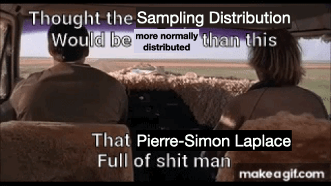

```{r setup, include=FALSE}
options(htmltools.dir.version = FALSE)
knitr::knit_hooks$set(crop = knitr::hook_pdfcrop)
knitr::opts_chunk$set(warning = FALSE, message = FALSE,
                      fig.showtext = TRUE)
library(tidyverse) # load tidyverse package
library(MASS)
library(ggplot2)
library(ggthemes)
library(kableExtra)
library(flextable)
library(ftExtra)
library(cowplot)
library(xaringan)
library(xaringanthemer)
#library(gg3D)
library(leaflet)
library(maps)
library(fontawesome)
library(ggrepel)
library(DescTools)
library(renderthis)
library(wesanderson)
library(DiagrammeR)
library(patchwork)

load("Sampling_Data_for_CLT_Demo.RData")

## Function to sample from a Chi Squared Distribution
samplingchi<-function(n,size,df){
sampmean<-rep(NA,n)	                #create an empty vector where 
                                    #we will store the mean values

sampsd<-rep(NA,n)                   #create an empty vector where 
                                    #we will store our sd values

for (i in 1:n){		                  #indicate that we are repeating 
                                    #the operation n times
  
samp<-rchisq(size,df)	              #sample 'size' number of random (r) 
                                    #scores from a chi squared (chisq) 
                                    #distribution with df = df 

sampmean[i]<-mean(samp)			        #take the mean of those scores

sampsd[i]<-sd(samp)}			          #take the sd of those scores

sampdf<-data.frame(sampmean,sampsd)	#make a data frame out of the means 
                                    #and the standard deviations 

return(sampdf)}	                    #the output of the function 
                                    #is the data frame

## To create pdf version:

# setwd("~/Documents/PSY 208/PSY_207-208_23-24/Lectures")
# renderthis::to_pdf("Probability_Distributions_II.Rmd", complex_slides = TRUE)

## To create PowerPoint version:

# renderthis::to_pptx("Probability_Distributions_II.Rmd", complex_slides = TRUE)

```

### Normal Approximation to the Binomial

Calculating binomial likelihood gets tricky thanks to the **Combinatorial Explosion:**

.slightly-smaller[

> 3! = 6

> 5! = 120

> 10! = 3,628,800

> 20! = 2.43 sextillion

> 60! > the number of atoms in the known universe

]

Luckily, we don't need to use the binomial likelihood function for large samples


---

### Normal Approximation to the Binomial

.pull-left[

**Rule of thumb:** it's a good approximation if ** $N\pi>5$** and ** $N(1-\pi)>5$**

.slightly-smaller[

> otherwise, the binomial is too blocky and/or skewed

]


We take the characteristics of the **binomial** and apply them to a **normal**.

]

.pull-right[

```{r echo = FALSE}
binom <- data.frame(x = 0:20) %>% 
  mutate(y = dbinom(x, 20, prob = 0.5))

norm <- data.frame(x = seq(0, 20, 20/1000)) %>% 
  mutate(y = dnorm(x, mean = 10, sd = sqrt(20*0.5*0.5)))

ggplot()+
  geom_bar(data = binom,
           aes(x, y),
           stat = "identity",
           fill = "#FFA400")+
  geom_line(data = norm,
            aes(x, y),
            linewidth = 2)+
  theme_tufte()+
  theme_xaringan(css_file = "autumnleaves.css")+
  labs(x = "s", y = "probability mass")
```

]

---


### Normal Approximation to the Binomial

.pull-left[

The **mean** and **standard deviations** of the two distributions overlaid on the right are the same.

> ** $\text{E}(x)=N\pi$**

> ** $\text{V}(x)=N\pi(1-\pi)$**

> ** $SD=\sqrt{N\pi(1-\pi)}$**
]

.pull-right[

```{r echo = FALSE}
binom <- data.frame(x = 0:20) %>% 
  mutate(y = dbinom(x, 20, prob = 0.5))

norm <- data.frame(x = seq(0, 20, 20/1000)) %>% 
  mutate(y = dnorm(x, mean = 10, sd = sqrt(20*0.5*0.5)))

ggplot()+
  geom_bar(data = binom,
           aes(x, y),
           stat = "identity",
           fill = "#FFA400")+
  geom_line(data = norm,
            aes(x, y),
            linewidth = 2)+
  theme_tufte()+
  theme_xaringan(css_file = "autumnleaves.css")+
  labs(x = "s", y = "probability mass")
```

]

---


### Normal Approximation to the Binomial

.pull-left[

The **tricky part**:

Each $s$ is represented by a **piece of the $x$-axis** starting at ** $s-0.5$** and ending at **$s+0.5$**.

> Each **midpoint is $s$**

> Each piece is 1 unit wide

]

.pull-right[

```{r echo = FALSE}
binom <- data.frame(x = 0:20) %>% 
  mutate(y = dbinom(x, 20, prob = 0.5))

norm <- data.frame(x = seq(0, 20, 20/1000)) %>% 
  mutate(y = dnorm(x, mean = 10, sd = sqrt(20*0.5*0.5)))

ggplot()+
  geom_bar(data = binom,
           aes(x, y),
           stat = "identity",
           fill = "#FFA400")+
  geom_line(data = norm,
            aes(x, y),
            linewidth = 2)+
  theme_tufte()+
  theme_xaringan(css_file = "autumnleaves.css")+
  scale_x_continuous(limits = c(10, 15),
                     breaks = c(10.5,
                                11.5,
                                12.5,
                                13.5,
                                14.5,
                                15.5))+
  ylim(0, 0.2)+
  labs(x = "s", y = "probability mass")
```

]

---


### Normal Approximation to the Binomial

.slightly-smaller[
(we'll just do **one example** because software has **almost** obviated the need for this method)
]


What is the probability of ** $19\le s \le 25$** *given* ** $N=100,~\pi=\frac{1}{3}$**?


```{r echo = FALSE, fig.width = 12, fig.height = 5}
binom <- data.frame(x = 0:100) %>% 
  mutate(y = dbinom(x, 100, prob = 1/3),
         fill = case_when(x < 19 ~ "no",
                          x <= 25 ~ "yes",
                          x > 25 ~ "no"))

norm <- data.frame(x = seq(0, 100, 100/1000)) %>% 
  mutate(y = dnorm(x, mean = 100*(1/3), sd = sqrt(100*(1/3)*(1/3))))

ggplot()+
  geom_bar(data = binom,
           aes(x, y, fill = fill),
           stat = "identity")+
  scale_fill_manual(values = c("#8f010b",
                               "#ffd200"))+
  theme_tufte()+
  theme_xaringan(css_file = "autumnleaves.css")+
  labs(x = "s", y = "probability mass")+
  theme(legend.position = "none")
```

---

### Normal Approximation to the Binomial

What is the probability of ** $19\le s \le 25$** *given* ** $N=100,~\pi=\frac{1}{3}$**?


$$\text{E}(x)=N\pi = 100\left(\frac{1}{3}\right)$$

$$SD=\sqrt{N\pi(1-\pi)} = \sqrt{100\left(\frac{1}{3}\right)\left(\frac{2}{3}\right)}\approx4.71$$
***

.pull-left[

$$z_{18.5}=\frac{18.5-33.3}{4.71}=-3.14$$

]

.pull-right[

$$z_{25.5}=\frac{25.5-33.3}{4.71}=-1.66$$

]

---

### Normal Approximation to the Binomial

.pull-left[

.slightly-smaller[
$$z_{18.5}=\frac{18.5-33.3}{4.71}=-3.14$$
.center[
**Area to mean $= 0.4992$**
]

]

]

.pull-right[

.slightly-smaller[

$$z_{25.5}=\frac{25.5-33.3}{4.71}=-1.66$$
.center[
**Area to mean $= 0.4515$**
]

]
]


** $$0.4992-0.4515=0.0477$$**

***

```{r}
pbinom(25, 100, prob = 1/3) - pbinom(19, 100, prob = 1/3)
```

The approximation is **pretty good**. Not **perfect**. But now we are familiar with the valuable concept of **approximations**.

---


### The $\chi^2$ Distribution

.slightly-smaller[

This is a whole bunch of numbers from a **standard normal distribution**:

```{r echo = FALSE, fig.height = 2, fig.width = 12}
normhist <-data.frame(x = rnorm(1000))

normhist %>% 
  filter(x >= -3 & x <= 3) %>% 
  ggplot(aes(x))+
  geom_histogram(linewidth = 1.5,
            fill = "#ffd200",
            color = "#8f010b")+
  theme_tufte()+
  theme_xaringan(css_file = "autumnleaves.css")

```

Here's what happens when we **square** all of those numbers:

```{r echo = FALSE, fig.height = 2, fig.width = 12}
normhist %>% 
  filter(x >= -3 & x <= 3) %>% 
  ggplot(aes(x = x^2))+
  geom_histogram(linewidth = 1.5,
            fill = "#ffd200",
            color = "#8f010b")+
  theme_tufte()+
  theme_xaringan(css_file = "autumnleaves.css")+
    labs(x = bquote(x^2))
```

The bottom data are **modeled** using a ** $\chi^2$ distribution with $1$ degree of freedom**.

]
---

### The $\chi^2$ Distribution

.pull-left[


If we took: 

.slightly-smaller[

> **five numbers at a time** 

> from a **standard normal distribution** 

> **square** each number

> and **add up** each group of **five**

]

]

.pull-right[

```{r echo = FALSE, fig.height = 5}

normhist5 <- data.frame(x = replicate(1000,
                                      sum(rnorm(5)^2)))

normhist5 %>% 
  ggplot(aes(x = x))+
  geom_histogram(linewidth = 1.5,
            fill = "#ffd200",
            color = "#8f010b", binwidth = 1)+
  theme_tufte()+
  theme_xaringan(css_file = "autumnleaves.css")+
    labs(x = bquote(x^2))
```

]

*those* data would be modeled by a ** $\chi^2$ distribution with 5 degrees of freedom.**

---

### The $\chi^2$ Distribution

The ** $\chi^2$ distribution** is the **sums of squares** of $\nu$ (*nu*) values from a **normal distribution**, where $\nu$ is the **degrees of freedom (df)**.

```{r echo = FALSE, fig.height = 4, fig.width = 12}
data.frame(x = rep(seq(0, 10, 10/1000), 5),
           df = rep(1:5, each = 1001),
           dflabel = rep(c("1", "2", "3", "4", "5"), each = 1001)) %>% 
  mutate(y = dchisq(x, df)) %>% 
  ggplot(aes(x, y, color = dflabel))+
  geom_line(linewidth = 1.5)+
  scale_color_viridis_d(option = "inferno", name = "df")+
  theme_tufte()+
  ylim(0, 0.5)+
  theme_xaringan(css_file = "autumnleaves.css")+
  theme(legend.position = c(0.9, 0.6))+
  labs(y = "probability\ndensity")

```

The **mean** of a $\chi^2$ distribution is **equal to the $df$**; the **variance** is **equal to $2df$**: ** $df$ is the sufficient statistic**.
---

### The $\chi^2$ Distribution

Why care about the **distribution of sums of squares?**

1. **Variances** comprise **sums of squares**

$$\text{V}(x)=\frac{\sum(x-\bar{x})^2}{n-1}$$
<ol start = "2">
  <li>

The ** $\chi^2$ test of statistical independence** is based on **sums of squared values**.

  </li>
</ol>
$$\chi^2_{obs}=\sum\frac{(f_e-f_o)^2}{f_e}$$
---

### Degrees of Freedom

The **Degrees of Freedom** (** $df$** or ** $\nu$** [but almost always ** $df$**]) associated with a statistic are the **number of values used to calculate that statistic** that are **free to vary given another observed statistic**, *e.g.*:

> Sample means: ** $n – 1$**

> Cell frequencies: ** $k – 1$**

---

### Degrees of Freedom

.slightly-smaller[
The ** $df$** for a **sample mean** are ** $n-1$** because if the mean is known, **only $n-1$ of the numbers that comprise the mean** are **free to vary**.

> Example: The **mean of 5 numbers is $3$**. You know that the first ** $4$** numbers are ** $\{1, 2, 3, 4\}$**.

>>The **fifth number** ***must*** be ** $5$**!

The ** $df$** for a **set of frequencies** are ** $k - 1$** because if the frequencies in $k-1$ of the cells are known, **the frequency in cell $k$ is not free to vary.**

> Example: 25 people are at a house party in **a kitchen, a living room, and a porch**. **Six** people are in the kitchen and ** $9$ are in the living room**.

>> There ***must*** be **10** people on the porch!


]

---

### The $F$-Distribution

.slightly-smaller[


** The $F$-distribution** is the **ratio** of **two $\chi^2$ distributions**, so it models **ratios of variances**.

```{r echo = FALSE, fig.height = 4.55, fig.width = 12}

chi3<-data.frame(x = seq(0, 8, 8/1000)) %>% 
  mutate(y = dchisq(x, df = 3)) %>% 
  ggplot(aes(x, y))+
  geom_line(linewidth = 1.5)+
  theme_tufte()+
  theme_xaringan(css_file = "autumnleaves.css")+
  labs(y = "density",
       title = bquote(chi^2~(3)))+
  scale_y_continuous(breaks = c(0, 0.2))+
  theme(axis.title.y = element_text(size = 18))

chi27<-data.frame(x = seq(0, 50, 50/1000)) %>% 
  mutate(y = dchisq(x, df = 27)) %>% 
  ggplot(aes(x, y))+
  geom_line(linewidth = 1.5)+
  theme_tufte()+
  theme_xaringan(css_file = "autumnleaves.css")+
  labs(y = "density",
       title = bquote(chi^2~(27)))+
  scale_y_continuous(breaks = c(0, 0.04))+
  theme(axis.title.y = element_text(size = 18))

f327 <- data.frame(x = seq(0, 7, 7/1000)) %>% 
  mutate(y = df(x, df1 = 3, df2 = 27)) %>% 
  ggplot(aes(x, y))+
  geom_line(linewidth = 1.5)+
  theme_tufte()+
  theme_xaringan(css_file = "autumnleaves.css")+
  labs(y = "density",
       title = bquote(F~(3~", "~27)))+
  theme(axis.title.y = element_text(size = 18))

plot_grid(
  plot_grid(chi3, chi27, nrow = 2),
  f327, nrow = 1
)+
  theme(plot.background = element_rect(fill = "#380001"))
```


The **sufficient statistics** are the ** $df$ of the numerator $\chi^2$** (** $df_{numerator}$**) and the ** $df$ of the denominator $\chi^2$** (** $df_{denominator}$**)

]
---

### The Uniform Distribution

A **uniform distribution** is one in which **all outcomes over the range are equally likely**.

Uniform distributions can be **discrete** or **continuous**.

.pull-left[
```{r echo = FALSE, fig.height = 5}
data.frame(x = 1:6) %>%
  mutate(y = 1/6) %>% 
  ggplot(aes(x, y))+
  geom_bar(stat = "identity")+
  theme_tufte()+
  theme_xaringan(css_file = "autumnleaves.css")+
  labs(x = "x",
       y = "Probability\nMass",
       title = "Discrete")
```

]

.pull-right[
```{r echo = FALSE, fig.height = 5}
data.frame(x = seq(0, 1, 1/1000)) %>%
  mutate(y = dunif(x)) %>% 
  ggplot(aes(x, y))+
  geom_line(linewidth = 1.5,
            color = "#ffd200")+
  theme_tufte()+
  theme_xaringan(css_file = "autumnleaves.css")+
  labs(x = "x",
       y = "Probability\nDensity",
       title = "Continuous")+
  ylim(0, 2)
```
]
---

### The Beta Distribution

**The beta distribution** describes variables in the ** $[0, 1]$ range**

> That makes it **ideal** for describing **proportions**.

***

```{r echo = FALSE, fig.height = 5, fig.width = 12}
data.frame(x = rep(seq(0, 1, 1/1000), 6),
           alpha = rep(c(1, 1:5), each = 1001),
           beta = rep(c(1, seq(5, 1, -1)), each = 1001)) %>% 
  mutate(y = dbeta(x, alpha, beta),
         ablabel = paste0("\U03B1 = ", alpha,
                          ", \U03B2 = ", beta))%>% 
  ggplot(aes(x, y, color = ablabel))+
  geom_line(linewidth = 1.5)+
  scale_color_viridis_d(option = "inferno", name = "shape\nparameters")+
  theme_tufte()+
  theme_xaringan(css_file = "autumnleaves.css")+
 # theme(legend.position = c(0.9, 0.6))+
  labs(y = "probability\ndensity",
       title = bquote("Beta Distributions with Selected "~alpha~"and"~beta))

```

---

### The Beta Distribution

.pull-left[

The **sufficient statistics** for the beta distribution are ** $\alpha$ and $\beta$** (*a.k.a.* the **shape parameters**).

$$\mu=\frac{\alpha}{\alpha + \beta}$$
$$\sigma^2=\frac{\alpha\beta}{(\alpha+\beta)^2(\alpha+\beta+1)}$$
]

.pull-right[
```{r echo = FALSE, fig.height = 8}
pos<-data.frame(x = seq(0, 1, 1/1000)) %>% 
  mutate(y = dbeta(x, 2, 7)) %>% 
  ggplot(aes(x, y))+
  geom_line(linewidth = 1.5,
            color = "#ffd200")+
  theme_tufte()+
  theme_xaringan(css_file = "autumnleaves.css")+
 # theme(legend.position = c(0.9, 0.6))+
  labs(y = "probability\ndensity",
       title = bquote(~alpha==2~", "~beta==7),
       subtitle = "positive skew")

neg<-data.frame(x = seq(0, 1, 1/1000)) %>% 
  mutate(y = dbeta(x, 7, 2)) %>% 
  ggplot(aes(x, y))+
  geom_line(linewidth = 1.5,
            color = "#ffd200")+
  theme_tufte()+
  theme_xaringan(css_file = "autumnleaves.css")+
 # theme(legend.position = c(0.9, 0.6))+
  labs(y = "probability\ndensity",
       title = bquote(~alpha==7~", "~beta==2),
       subtitle = "negative skew")

plot_grid(pos, neg, nrow = 2)
```
]

---
### The Logistic Distribution


The **logistic distribution** models **probability** of **binary events**.

.pull-left[


It looks **a lot** like the **normal distribution**

.slightly-smaller[
> That's kind of the whole reason we use it.
]

Forms the basis for **regression models** involving **binary outcomes**.


]

.pull-right[

```{r echo = FALSE}
logd<-data.frame(x = seq(-3, 3, 6/1000)) %>% 
  mutate(y = dlogis(x)) %>% 
  ggplot(aes(x, y))+
  geom_line(linewidth = 1.5,
            color = "#ffd200")+
  theme_tufte()+
  theme_xaringan(css_file = "autumnleaves.css")+
 # theme(legend.position = c(0.9, 0.6))+
  labs(y = "density",
       title = "Density")

logiscumulative<-data.frame(x = seq(-3, 3, 6/1000)) %>% 
  mutate(y = plogis(x)) %>% 
  ggplot(aes(x, y))+
  geom_line(linewidth = 1.5,
            color = "#ffd200")+
  theme_tufte()+
  theme_xaringan(css_file = "autumnleaves.css")+
 # theme(legend.position = c(0.9, 0.6))+
  labs(y = bquote(p(x)),
       title = "Cumulative")

plot_grid(logd,
          logiscumulative,
          nrow = 2)
```

]
---
### The Negative Binomial Distribution

The **negative binomial likelihood function** answers a different question about binomial data than the regular function:


> What is the probability of observing $f$ failures before $s$ successes occur?

The negative binomial likelihood - or **probability mass** - is given by:

$$p(f|s, \pi)= {{f+s-1}\choose f} \pi^s(1-\pi)^f$$

---

### The Negative Binomial Distribution

The result is a **positively-skewed discrete distribution**.

.pull-left[

```{r echo = FALSE}
data.frame(f = 0:10) %>% 
  mutate(y = dnbinom(f, 3, prob = 0.5)) %>% 
  ggplot(aes(f, y))+
  geom_bar(stat = "identity")+
  theme_tufte()+
  theme_xaringan(css_file = "autumnleaves.css")+
  labs(title = bquote("s = 3, "~pi==0.5),
       x = "f",
       y = "Probability\nMass")
```
]

.pull-right[

.slightly-smaller[

That **shape** makes the **negative binomial** useful for modeling **things with small counts**

> e.g., vacations or hospitalizations

The **sufficient statistics** are ** $s$** and ** $\pi$**

]

> $$\text{E}(x)=\frac{f(1-\pi)}{\pi}$$

> $$\text{V}(x)=\frac{f(1-\pi)}{\pi^2}$$


]

---

### The Poisson Distribution

.slightly-smaller[

When the **mean** and **variance** of the negative binomial are **equal**, it is **identical** to the **Poisson Distribution**.


The Poisson is **also** good for modeling **things with small counts**.


> but the restriction that ** $\text{E}(x)=\text{V}(x)$** can *limit its usefulness*


The **Poisson Likelihood** or **PMF** is given by:

$$p(k|\lambda)=\frac{\lambda^ke^{-k}}{k!}$$
where ** $k$** is **the number of things happening** and ** $\lambda$** is the **average number of times the things happen** over a fixed interval.

]

---

### The Poisson Distribution

.pull-left[

The **sufficient statistic** for the Poisson is ** $\lambda$**

> $$\text{E}(x)=\text{V}(x)=\lambda$$

.slightly-smaller[
If ** $\text{E}(x)\ne \text{V}(x)$** for a variable, the variable is **not Poisson-distributed**.

> much like how if a variable has a skewed distribution, it is **not normally distributed**.

]

]

.pull-right[

```{r echo = FALSE, fig.height = 8}
data.frame(x = 1:10) %>% 
  mutate(y = dpois(x, lambda = 3)) %>% 
  ggplot(aes(x, y))+
  geom_bar(stat = "identity")+
  theme_tufte()+
  theme_xaringan(css_file = "autumnleaves.css")+
  labs(x = "k",
       y = "Probability Mass",
       title = bquote("Poisson with "~lambda==3))
```

]

---

### Sampling

We rarely have access to all the data in a **population**

Instead, we usually take **samples**

In order to use those **samples** to make **inferences** to the **population**, we need to know something about the **sampling distribution**

> *e.g.*, What values of a sampling distribution would lead us to reject the null hypothesis?


---

### The Central Limit Theorem .slightly-smaller[(LaPlace, 1810)]

### $$\bar{x} \sim N\left(\mu, \frac{\sigma^2}{n} \right)$$

The **means** of **samples** taken from a **parent distribution** are **normally distributed**.

> That's **regardless of the shape of the parent**

> There have to be **a lot of samples** before it starts working.

---

### The Central Limit Theorem

.pull-left[
The **sample means** are distributed as a **normal** $(N)$ with a mean of $\mu$ (the mean of the parent distribution) and a variance of $\frac{\sigma^2}{n}$.

]

.pull-right[


### $$\bar{x} \sim N\left(\mu, \frac{\sigma^2}{n} \right)$$

]

***

The **standard deviation** of this distribution is $\sqrt{\frac{\sigma^2}{n}}=\frac{\sigma}{\sqrt{n}}$, which is called the **standard error** (or **sampling error**).
---

### The Central Limit Theorem

.pull-left[

Example: sampling from a non-normal distribution (right) with:

> $\mu = 3, \sigma^2=6$

Let's take the mean of ** $10$ samples** of ** $30$ values each** from this distribution.
]

.pull-right[

```{r echo=FALSE}

x<-seq(0, 10, 10/10000)
y<-dchisq(x, df=3)

ggplot(data.frame(x, y),
       aes(x, y))+
    geom_line(color="#ffd200",
            size=3)+
  theme_tufte(ticks=FALSE, base_size=16)+
  theme_xaringan(css_file = "autumnleaves.css")+
  labs(y="Probability Density")

```


]

---

### The Central Limit Theorem

.pull-left[

.slightly-smaller[


A histogram of the means of 10 samples of 30 numbers each is quite blocky.

The skew here is *positive*, like its parent $\chi^2$.

]

```{r echo=FALSE}

```

]

.pull-right[

```{r echo=FALSE, fig.height=8}
set.seed(2)

samplingchi(10, 30, 3) %>% 
  ggplot(aes(sampmean))+
  geom_histogram(binwidth = 0.2, color="#8f010b")+
  theme_tufte(base_size=18, ticks=FALSE)+
  theme_xaringan(css_file = "autumnleaves.css")+
  labs(x="sample means", y="frequency", title="10 samples")
```

]

---

### The Central Limit Theorem

.pull-left[

```{r echo=FALSE, fig.height = 8}
set.seed(2)

samplingchi(50, 30, 3) %>% 
  ggplot(aes(sampmean))+
  geom_histogram(binwidth = 0.1, color="#8f010b")+
  theme_tufte(base_size=18, ticks=FALSE)+
  theme_xaringan(css_file = "autumnleaves.css")+
  labs(x="sample means", y="frequency", title="50 samples")
```

]

.pull-right[

As we take **more samples**, the sample means start to **more closely resemble** a normal curve.

```{r echo=FALSE, fig.out = "50%"}

```


]

---

### The Central Limit Theorem

```{r echo=FALSE, fig.height = 3.5, fig.width = 12, fig.align='center'}
set.seed(77)

#millionsamps<-samplingchi(1000000, 30, 3)

#millionsampsmean<-mean(millionsamps$sampmean)
#millionsampsvar<-var(millionsamps$sampmean)
#millionsampssd<-sd(millionsamps$sampmean)
#
#save(millionsamps, millionsampsmean, millionsampsvar, millionsampssd,
#     file="Sampling_Data_for_CLT_Demo.RData")

millionsamps%>% 
  ggplot(aes(sampmean))+
  geom_histogram(binwidth = 0.1, color="#8f010b")+
  theme_tufte(base_size=12, ticks=FALSE)+
  theme_xaringan(css_file = "autumnleaves.css")+
  labs(x="sample means", y="frequency", title="1,000,000 samples")+
  theme(axis.title = element_text(size=22),
        title = element_text(size=28)) 
```


.left-column[
```{r echo=FALSE, out.width = "300px"}
knitr::include_graphics("images/pure-poetry-john-oliver-pure-poetry.gif")
```
]

.right-column[
```{r echo=FALSE}
stat<-c("mean", "variance", "sd")
Parent<-c(3, 
          6, 
          round(sqrt(6),2))
Sampling_Dist<-c(round(millionsampsmean, 2),
                 round(millionsampsvar, 2),
                 round(millionsampssd, 2))

Mathnotes<-c("\\(3=3\\)",
             "\\(6/30 = 0.2\\)",
             "\\(\\sqrt{6}/\\sqrt{30} = 0.45\\)")

data.frame(stat,
           Parent,
           Sampling_Dist,
           Mathnotes) %>% 
  kable("html",
        col.names = c("Statistic",
                      "Parent",
                      "Sampling",
                      "Notes"),
        escape=TRUE,
        align = c("l", "c", "c", "c")) %>% 
  kable_styling(font_size=20)
```

]
---

### Rules of Linear Functions

When the parent distribution is a **normal**, **linear transformations** of that distribution are **also normal**

```{r echo=FALSE,eval=FALSE}
rules<-c("\\(x_1 \\sim N\\left(\\mu_1, \\sigma^2_1 \\right)\\)",
         "\\(x_2 \\sim N\\left(\\mu_2, \\sigma^2_2 \\right)\\)",
         "\\(L = x_1 - x_2\\)",
         "\\(L\\sim N \\left(\\mu_1 - \\mu_2, \\sigma^2_1+\\sigma^2_2 \\right)\\)"
         )

descriptions<-c("\\(x_1\\) is a normally-distributed variable, with mean \\(\\mu_1\\) and variance \\(\\sigma^2_1.\\)",
                "\\(x_2\\) is another normally-distributed variable, with mean \\(\\mu_2\\) and variance \\(\\sigma^2_2.\\)",
                "Distribution \\(L\\) represents the difference of \\(x_1\\) and \\(x_2.\\)",
                "\\(L\\) is *also* a normal distribution; its mean is the difference of the two means, and its variance is the sum of the two variances")

data.frame(rules, descriptions) %>% 
  kable("html",
        col.names=NULL,
        escape=FALSE) %>% 
  kable_styling(font_size = 22)
```
.slightly-smaller[
|        |         |
|:-------:|:--------|
|\\(x_1 \\sim N\\left(\\mu_1, \\sigma^2_1 \\right)\\)|\\(x_1\\) is a normally-distributed variable, with mean \\(\\mu_1\\) and variance \\(\\sigma^2_1.\\)|
|\\(x_2 \\sim N\\left(\\mu_2, \\sigma^2_2 \\right)\\)|\\(x_2\\) is another normally-distributed variable, with mean \\(\\mu_2\\) and variance \\(\\sigma^2_2.\\)|
|\\(L = x_1 - x_2\\)|Distribution \\(L\\) represents the difference of \\(x_1\\) and \\(x_2.\\)|
|\\(L\\sim N \\left(\\mu_1 - \\mu_2, \\sigma^2_1+\\sigma^2_2 \\right)\\)|\\(L\\) is *also* a normal distribution; its mean is the **difference** of the two means, and its variance is the **sum** of the two variances|
|   |   |
]

---

### The $t$-distribution

> The **Central Limit Theorem** tells us about the expectations of **sample means**.

> The **Rules of Linear Functions** tells us what happens when we look at **differences** between normally-distributed variables.

Those two concepts facilitate the use of **the $t$-distribution** to make statistical inferences about **sample means**, **mean differences**, and **differences of means**.

---

### The $t$-distribution

.pull-left[
The $t$-distribution has one **sufficient statistic**: ** $df = n-1$**

The **kurtosis** is **large** for **small $df$** and **small** for **large $df$**

When $df$ is real big $(\approx 120+)$, the $t$ is approximated by a **standard normal**
]
.pull-right[
```{r echo=FALSE, fig.height = 8}
x<-rep(seq(-6, 6, 12/10000), 5)
df<-rep(c(1, 2, 4, 20, 120), each = 10001)
y<-dt(x, df=df)

data.frame(x, df, y) %>% 
  ggplot(aes(x=x, y=y, color=as.factor(df)))+
  geom_line(linewidth=1.5)+
  theme_tufte(ticks=FALSE)+
  theme_xaringan(css_file="autumnleaves.css")+
  scale_color_viridis_d(name="df", option = "inferno")+
  theme(legend.position = c(0.9, 0.5))
```

]

---

### Proportions

**Proportions** are **ratios** of ** binomial outcomes to trials**\*

An **observed proportion $p$** is a **summary statistic**: the **mean** of a **sample** of **binomial data**:

$$p = \frac{s}{n}=\hat{\pi}$$

We use the term ** $\hat{\pi}$** (*pi hat*) to indicate that the observed ** $p$** is an **estimate** of the **population parameter $\pi$**.
.footnote[
\* A defined experiment that can **only** result in **success** or **failure** is also called a **Bernoulli** or **binomial** trial.
]
---

### Proportions


When we **estimate $\pi$** from an **observed proportion**, we are indicating that the **parent population** was a **binomial distribution** with all the ** $s$ divided by $n$**:

.pull-left[

The **mean** and the **variance** are the ** $\text{E}(x)$** and ** $\text{V}(x)$** from the binomial **divided by $n$**:

> $$\hat{\pi}=\frac{s}{n}$$

> $$\text{V}(\hat{\pi})=\hat{\pi}(1-\hat{\pi})$$

]

.pull-right[

```{r echo = FALSE, fig.height=5}
data.frame(x = 0:20) %>% 
  mutate(y = dbinom(x, 20, prob = 12/20),
         xlabs = round(x/20, 2)) %>% 
  ggplot(aes(xlabs, y))+
  geom_bar(stat = "identity")+
  theme_tufte()+
  theme_xaringan(css_file = "autumnleaves.css")+
  labs(x = "p",
       y = "mass",
       title = "s = 12, n = 20",
       subtitle = "p = 0.6")
```


]

---

### Proportions

Combining what we know about **binomial likelihood** with the **central limit theorem**\*, the **standard error of a proportion** is given by:

$$SE(p)=SE(\hat{\pi})=\sqrt{\frac{\text{V}(\hat{\pi})}{n}}=\sqrt{\frac{\hat{\pi}(1-\hat{\pi})}{n}}$$

.footnote[
\*which implies that this estimate works best when the parent binomial is approximated by a **normal distribution**
]
