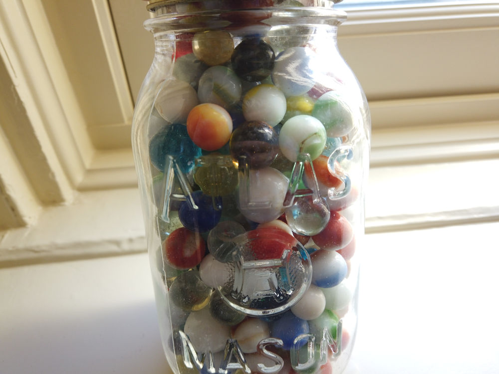

```{r setup, include=FALSE}
options(htmltools.dir.version = FALSE)
knitr::opts_chunk$set(warning = FALSE, message = FALSE)
library(tidyverse) # load tidyverse package
library(MASS)
library(ggplot2)
library(ggthemes)
library(kableExtra)
library(flextable)
library(cowplot)
library(xaringanthemer)
#library(gg3D)
library(leaflet)
library(maps)
library(fontawesome)
library(ggrepel)
library(DescTools)
library(renderthis)
library(wesanderson)
library(DiagrammeR)


## To create pdf version:

# setwd("~/Documents/PSY 208/PSY_207-208_23-24/Lectures")
# renderthis::to_pdf("Probability_Theory_I.Rmd", complex_slides = TRUE)

## To create PowerPoint version:

# renderthis::to_pptx("Probability_Theory_I.Rmd", complex_slides = TRUE)
```


# Probability Terminology

**Event**: a thing that happens (also called an **outcome**)

**Defined experiment**: An occurrence or set of occurrences where events can happen with some probability.

> *1 flip of a coin* is a **defined experiment**; *heads* is an **event**

> *2 rolls of a six-sided die* is a **defined experiment**; *7* is an **event**


---

## Probability Terminology

**Elementary event**: An event that can happen only one way

> *e.g.*, the probability that it will rain on Tuesday and Friday this week

**Composite** (or **compound**) **event**: An event that can happen multiple ways

> *e.g.*, the probability that it will rain on any two days this week 

---

### Probability Terminology

**Sample space** ( $\mathscr{S}$ or $\Omega$): all possible outcomes of a defined experiment

***

.pull-left[

**1 flip of a coin:**

$$\Omega = \{Heads,~Tails\}$$

]

.pull-right[

**2 Flips of a coin**

> composite events:

$$\Omega = \{2~H, 1H1T, 2T\}$$
> elementary events:

$$\Omega = \{HH, HT, TH, TT\}$$
]

---

### Probability Terminology

.pull-left[

**Intersection** $(\cap)$: *and*

the probability of event A **AND** event B happening

```{r echo=FALSE, fig.height=6, fig.width = 12, fig.align='center'}
inteuler<-data.frame(x=c(0.1, 0.9), 
                  y=c(0, 0),
                  color = c("A", "B"),
                  size = c("A", "B"))
ggplot(inteuler,
       aes(x=x, y=y, color=color, size=size))+
  geom_point()+
  theme_tufte(ticks=FALSE)+
  theme_xaringan(css_file = "chevalier.css")+
 scale_color_manual(values=c("#F03F3C50", "#FDD26250"))+
  scale_size_manual(values=c(175, 150))+
  coord_cartesian(xlim=c(-1, 2),
                  ylim=c(-0.5, 0.5))+
  theme(legend.position = "none",
        axis.text=element_blank(),
        axis.title = element_blank())+
  annotate("text",
           x=-0.25,
           y=0,
           label="A",
           size=28/.pt,
           color="#D3DDDC")+
  annotate("text",
           x=1.25,
           y=0,
           label="B",
           size=28/.pt,
           color="#D3DDDC")+
  annotate("text",
           x=0.55,
           y=0,
           label="A AND B",
           size=36/.pt,
           color="#D3DDDC")
```

]

.pull-right[

**Union** $(\cup)$: *or*

the probability of event A **OR** event B happening

```{r echo=FALSE, fig.height=6, fig.width = 12, fig.align='center'}
uneuler<-data.frame(x=c(0.1, 0.9), 
                  y=c(0, 0),
                  color = c("A", "B"),
                  size = c("A", "B"))
ggplot(uneuler,
       aes(x=x, y=y, color=color, size=size))+
  geom_point()+
  theme_tufte(ticks=FALSE)+
    geom_segment(x=-1,
                   xend=2,
                   y=-0.5,
                   yend=-0.5,
               color="#D3DDDC",
               size=1)+
      geom_segment(x=-1,
                   xend=1,
                   y=0.5,
                   yend=0.5,
               color="#D3DDDC",
               size=1)+
        geom_segment(x=1.5,
                   xend=2,
                   y=0.5,
                   yend=0.5,
               color="#D3DDDC",
               size=1)+
      geom_segment(x=-1,
                   xend=-1,
                   y=0.5,
                   yend=-0.5,
               color="#D3DDDC",
               size=1)+
        geom_segment(x=2,
                   xend=2,
                   y=0.5,
                   yend=-0.5,
               color="#D3DDDC",
               size=1)+
  theme_xaringan(css_file = "chevalier.css")+
 scale_color_manual(values=c("#F03F3C50", "#FDD26250"))+
  scale_size_manual(values=c(175, 150))+
  coord_cartesian(xlim=c(-1, 2),
                  ylim=c(-0.5, 0.5))+
  theme(legend.position = "none",
        axis.text=element_blank(),
        axis.title = element_blank())+
  annotate("text",
           x=0.1,
           y=0,
           label="A",
           size=28/.pt,
           color="#D3DDDC")+
    annotate("text",
           x=0.9,
           y=0,
           label="B",
           size=28/.pt,
           color="#D3DDDC")+
  annotate("text",
           x=1.25,
           y=0.5,
           label="A OR B",
           size=36/.pt,
           color="#D3DDDC")
  
```


]
---

### Probability Terminology


**Mutual Exclusivity**: events can't happen at the same time

$$p(A\cap B)=0, A \cap B = \emptyset$$


**Collective Exhaustivity**: the events cover all the things 

$$A \cup B \cup C = \Omega$$

> Events can be **either**, **neither**, or **both**


---

# Expressing probabilities

.pull-left[

.slightly-smaller[

There are 100 marbles in this jar. Thirty-three are blue.
```{r echo=FALSE}

```

]
]

.pull-right[

.slightly-smaller[

We can say that $p(blue)=$

> $33$ out of $100$

> $\frac{33}{100}$

> 0.33

> 33%

and each way is **totally and equally correct** (although try to be consistent)

]

]


---

### Probability Axioms .slightly-smaller[(Kolmogorov, 1933)]

.slightly-smaller[

**Non-negativity**: The probability $p$ of an event is a non-negative real number

$$p(A)\ge 0$$
**Normalization**: The sum of the probabilities of all possible elementary events in a sample space $=1$

$$p(\Omega)=1$$
**Finite additivity**: The probability of mutually exclusive events occurring equals the sum of the probabilities of each event

$$p(A\cup B)=p(A)+p(B)~for~all~A, B \in \mathscr{S}~where~A \cap B = \emptyset$$
]
---

### Objective Probability Assignment

.slightly-smaller[

**Equal assignment**: Each elementary event in the sample space has the same probability

**Relative frequency**: The probability of an event is the frequency that event has occurred relative to the number of defined experiments

$$p(A)=\frac{times~A~has~happened}{times~A~could~have~happened}$$

]

```{r echo=FALSE, fig.align = 'center', fig.cap = "-Frequentists", out.width = "50%"}

```


---
### Subjective Probability Assignment

Expressing probability as a degree of belief

May use objective information when forming a subjective probability

> *i.e.*, it's not entirely feelings-based

```{r echo=FALSE, fig.align='center'}
knitr::include_graphics("images/this_is_the_way.gif")
```

.center[
-*Bayesians*
]

---

# Independent Events

.slightly-smaller[
If two events are **independent**, then the outcome of one event **does not depend on the outcome of the other**.

$$p(A|B)=p(A);~ p(B|A)=p(B)$$
]

***

.pull-left[

.slightly-smaller[
**Example:** *throwing two six-sided dice*

The outcome on *die A* **does not affect the outcome** on *die B*

Each of the $36$ outcomes on the right are **equally likely**
]
]

.pull-right[

```{r echo=FALSE}
Die1<-1:6
Die21<-2:7
Die22<-3:8
Die23<-4:9
Die24<-5:10
Die25<-6:11
Die26<-7:12

kable(data.frame(Die1, Die21, Die22, Die23, Die24, Die25, Die26),
      col.names = c("Die 1", "1", "2", "3", "4", "5", "6")) %>% 
  kable_styling(font_size = 14) %>% 
  add_header_above(c(" "=1, "Die 2"=6)) %>% 
  column_spec(1, background = "#F03F3C") %>% 
  column_spec(2:7, width = "8em")
  
```

]

---


### Intersections of Independent Events


**Intersection probability** $p(A~and~B)$; $p(A \cap B)$

$$p(A\cap B)=p(A)p(B)$$

```{r echo=FALSE, fig.height=6, fig.width = 12, fig.align='center'}
euler<-data.frame(x=c(0.1, 0.9), 
                  y=c(0, 0),
                  color = c("A", "B"),
                  size = c("A", "B"))
ggplot(euler,
       aes(x=x, y=y, color=color, size=size))+
  geom_point()+
  theme_tufte(ticks=FALSE)+
  theme_xaringan(css_file = "chevalier.css")+
 scale_color_manual(values=c("#F03F3C50", "#FDD26250"))+
  scale_size_manual(values=c(175, 150))+
  coord_cartesian(xlim=c(-1, 2),
                  ylim=c(-0.5, 0.5))+
  theme(legend.position = "none",
        axis.text=element_blank(),
        axis.title = element_blank())+
  annotate("text",
           x=-0.25,
           y=0,
           label="A",
           size=56/.pt,
           color="#D3DDDC")+
  annotate("text",
           x=1.25,
           y=0,
           label="B",
           size=56/.pt,
           color="#D3DDDC")+
  annotate("text",
           x=0.55,
           y=0,
           label="A&B",
           size=56/.pt,
           color="#D3DDDC")
```

---
### Intersections of Independent Events

.pull-left[

> Example: roll one die and flip one coin. What's the probability of *tails* **and** $3$?

$$p(tails)=\frac{1}{2}$$

$$p(3)=\frac{1}{6}$$

$$p(tails \cap 3)=\frac{1}{2} \times \frac{1}{6} = \frac{1}{12}$$
]

.pull-right[
```{r echo=FALSE}
euler<-data.frame(x=c(0, 1), 
                  y=c(0, 0),
                  color = c("A", "B"),
                  size = c("A", "B"))
ggplot(euler,
       aes(x=x, y=y, color=color, size=size))+
  geom_point()+
  theme_tufte(ticks=FALSE)+
  theme_xaringan(css_file = "chevalier.css")+
 scale_color_manual(values=c("#F03F3C50", "#FDD26250"))+
  scale_size_manual(values=c(125, 100))+
  coord_cartesian(xlim=c(-1, 2),
                  ylim=c(-0.5, 0.5))+
  theme(legend.position = "none",
        axis.text=element_blank(),
        axis.title = element_blank())+
  annotate("text",
           x=-0.25,
           y=0,
           label="A",
           size=36/.pt,
           color="#D3DDDC")+
  annotate("text",
           x=1.25,
           y=0,
           label="B",
           size=36/.pt,
           color="#D3DDDC")+
  annotate("text",
           x=0.55,
           y=0,
           label="A&B",
           size=36/.pt,
           color="#D3DDDC")
```
]

---

### Intersections of Independent Events

.pull-left[

The **intersection probability formula** simply adds **more multiplicative terms** for **more events**.

$$p(A\cap B \cap C)=p(A)p(B)p(C)$$

]

.pull-right[
```{r echo=FALSE}
euler<-data.frame(x=c(0, 1, 0.5), 
                  y=c(0, 0, -0.4),
                  color = c("A", "B", "C"),
                  size = c("A", "B", "C"))
ggplot(euler,
       aes(x=x, y=y, color=color, size=size))+
  geom_point()+
  theme_tufte(ticks=FALSE)+
  theme_xaringan(css_file = "chevalier.css")+
 scale_color_manual(values=c("#F03F3C50", "#FDD26250", "#4b008250"))+
  scale_size_manual(values=c(125, 100, 110))+
  coord_cartesian(xlim=c(-1, 2),
                  ylim=c(-0.75, 0.5))+
  theme(legend.position = "none",
        axis.text=element_blank(),
        axis.title = element_blank())+
  annotate("text",
           x=-0.25,
           y=0,
           label="A",
           size=36/.pt,
           color="#D3DDDC")+
  annotate("text",
           x=1.25,
           y=0,
           label="B",
           size=36/.pt,
           color="#D3DDDC")+
  annotate("text",
           x=0.55,
           y=-0.5,
           label="C",
           size=36/.pt,
           color="#D3DDDC")
```
]

---

### Intersections of Independent Events

.pull-left[

.slightly-smaller[

> There are 10 digits on each wheel

> Each wheel spins independently

> **What is the probability of getting all $4$ digits correct?**

]
]

.pull-right[
```{r echo=FALSE}

```

]

.slightly-smaller[

$$\left(\frac{1}{10}\right)\left(\frac{1}{10}\right)\left(\frac{1}{10}\right)\left(\frac{1}{10}\right)=\frac{1}{10,000}$$

NOTE: the $4$ digits make one $4$-digit number between $0$ and $9,999$. There are exactly $10,000$ of those!

]
---
### Intersections of Independent Events

If $A$ and $B$ are **mutually exclusive**, then:

$$p(A \cap B)=0$$
```{r echo=FALSE, fig.height=6, fig.width = 12, fig.align='center'}
euler<-data.frame(x=c(-0.25, 1.25), 
                  y=c(0, 0),
                  color = c("A", "B"),
                  size = c("A", "B"))
ggplot(euler,
       aes(x=x, y=y, color=color, size=size))+
  geom_point()+
  theme_tufte(ticks=FALSE)+
  theme_xaringan(css_file = "chevalier.css")+
 scale_color_manual(values=c("#F03F3C50", "#FDD26250"))+
  scale_size_manual(values=c(175, 150))+
  coord_cartesian(xlim=c(-1, 2),
                  ylim=c(-0.5, 0.5))+
  theme(legend.position = "none",
        axis.text=element_blank(),
        axis.title = element_blank())+
  annotate("text",
           x=-0.25,
           y=0,
           label="A",
           size=56/.pt,
           color="#D3DDDC")+
  annotate("text",
           x=1.25,
           y=0,
           label="B",
           size=56/.pt,
           color="#D3DDDC")
```

---

### Unions of Independent Events

**Union probability**: $p(A~or~B)$; $p(A \cup B)$

$$p(A \cup B)=p(A)+p(B)-p(A\cap B)$$


```{r echo=FALSE, fig.height=6, fig.width = 12, fig.align='center'}
euler<-data.frame(x=c(0.1, 0.9), 
                  y=c(0, 0),
                  color = c("A", "B"),
                  size = c("A", "B"))
ggplot(euler,
       aes(x=x, y=y, color=color, size=size))+
  geom_point()+
  theme_tufte(ticks=FALSE)+
    geom_segment(x=-1,
                   xend=2,
                   y=-0.5,
                   yend=-0.5,
               color="#D3DDDC",
               size=1)+
      geom_segment(x=-1,
                   xend=1,
                   y=0.5,
                   yend=0.5,
               color="#D3DDDC",
               size=1)+
        geom_segment(x=1.5,
                   xend=2,
                   y=0.5,
                   yend=0.5,
               color="#D3DDDC",
               size=1)+
      geom_segment(x=-1,
                   xend=-1,
                   y=0.5,
                   yend=-0.5,
               color="#D3DDDC",
               size=1)+
        geom_segment(x=2,
                   xend=2,
                   y=0.5,
                   yend=-0.5,
               color="#D3DDDC",
               size=1)+
  theme_xaringan(css_file = "chevalier.css")+
 scale_color_manual(values=c("#F03F3C50", "#FDD26250"))+
  scale_size_manual(values=c(175, 150))+
  coord_cartesian(xlim=c(-1, 2),
                  ylim=c(-0.5, 0.5))+
  theme(legend.position = "none",
        axis.text=element_blank(),
        axis.title = element_blank())+
  annotate("text",
           x=0.1,
           y=0,
           label="A",
           size=50/.pt,
           color="#D3DDDC")+
    annotate("text",
           x=0.9,
           y=0,
           label="B",
           size=50/.pt,
           color="#D3DDDC")+
  annotate("text",
           x=1.25,
           y=0.5,
           label="A or B",
           size=50/.pt,
           color="#D3DDDC")
  
```

---

### Unions of Independent Events

.slightly-smaller[

**Example:** *What is the probability of rolling 3 or higher on one die* **OR** *5 or higher on the other?*

]

***
.pull-left[

.slightly-smaller[

$$p(A)=\frac{4}{6},~p(B)=\frac{2}{6}$$

$p(A)+p(B)=1$ is **too big**: that *double-counts* the $A\cap B$ cases:

$$p(A\cap B)=p(A)p(B)=\frac{8}{36}$$
]
]

.pull-right[

```{r echo=FALSE}
Die1 <- 1:6
Die21<-2:7
Die22<-3:8
Die23<-4:9
Die24<-5:10
Die25<-6:11
Die26<-7:12

kable(data.frame(Die1, Die21, Die22, Die23, Die24, Die25, Die26),
      col.names = c("Die 1", "1", "2", "3", "4", "5", "6")) %>% 
  kable_styling(font_size = 12) %>% 
  add_header_above(c(" "=1, "Die 2"=6), background = "transparent") %>% 
  column_spec(1:7, width = "8em") %>% 
  row_spec(0:2, background = "transparent") %>% 
  row_spec(3:6, background = "#FDD26275") %>% 
      column_spec(6:7, 
                  background = c(rep("#F03F3C75", 2),
                                 rep("#f6814d75", 4)))%>% 
    column_spec(1, background = "transparent") 
  
```

]
***
$$p(A\cup B)=\frac{4}{6}+\frac{2}{6}-\frac{8}{36}=\frac{28}{36}=\frac{7}{9}$$

---

### Unions of Independent Events

.slightly-smaller[

With more than $2$ events, we have to keep track of double-counting *and* triple-counting (and quadruple-counting, *etc*.). For example:

]
.pull-left[
.slightly-smaller[

$$\begin{aligned} p(A\cup B\cup C)=\\ p(A) +p(B)+p(C)\\ -p(A\cap B) \\ - p(A \cap C) \\ -p(B \cap C) \\ +p(A \cap B \cap C)\end{aligned}$$

Just something to be aware of.

No need to lose sleep over it.

]
]
.pull-right[
```{r echo=FALSE}
euler<-data.frame(x=c(0, 1, 0.5), 
                  y=c(0, 0, -0.4),
                  color = c("A", "B", "C"),
                  size = c("A", "B", "C"))
ggplot(euler,
       aes(x=x, y=y, color=color, size=size))+
  geom_point()+
  theme_tufte(ticks=FALSE)+
  theme_xaringan(css_file = "chevalier.css")+
 scale_color_manual(values=c("#F03F3C50", "#FDD26250", "#4b008250"))+
  scale_size_manual(values=c(125, 100, 110))+
  coord_cartesian(xlim=c(-1, 2),
                  ylim=c(-0.75, 0.5))+
  theme(legend.position = "none",
        axis.text=element_blank(),
        axis.title = element_blank())+
  annotate("text",
           x=-0.25,
           y=0,
           label="A",
           size=36/.pt,
           color="#D3DDDC")+
  annotate("text",
           x=1.25,
           y=0,
           label="B",
           size=36/.pt,
           color="#D3DDDC")+
  annotate("text",
           x=0.55,
           y=-0.5,
           label="C",
           size=36/.pt,
           color="#D3DDDC")+
      geom_segment(x=-1,
                   xend=2,
                   y=-0.75,
                   yend=-0.75,
               color="#D3DDDC",
               size=1)+
      geom_segment(x=-1,
                   xend=0.75,
                   y=0.5,
                   yend=0.5,
               color="#D3DDDC",
               size=1)+
        geom_segment(x=1.75,
                   xend=2,
                   y=0.5,
                   yend=0.5,
               color="#D3DDDC",
               size=1)+
      geom_segment(x=-1,
                   xend=-1,
                   y=0.5,
                   yend=-0.75,
               color="#D3DDDC",
               size=1)+
        geom_segment(x=2,
                   xend=2,
                   y=0.5,
                   yend=-0.75,
               color="#D3DDDC",
               size=1)+
  annotate("text",
           x=1.25,
           y=0.5,
           label="A or B or C",
           size=28/.pt,
           color="#D3DDDC")
```

]

---

### Unions of Independent Events

If $A$ and $B$ are **mutually exclusive**, their union is simply **the sum of their probabilities.**

$$p(A\cup B)=p(A)+p(B)-p(A\cap B)$$

$$p(A \cap B)=0,~\therefore p (A \cup B)=p(A)+p(B)$$

```{r echo=FALSE, fig.height=4, fig.width = 12, fig.align='center'}
euler<-data.frame(x=c(-0.25, 1.25), 
                  y=c(0, 0),
                  color = c("A", "B"),
                  size = c("A", "B"))
ggplot(euler,
       aes(x=x, y=y, color=color, size=size))+
  geom_point()+
  theme_tufte(ticks=FALSE)+
  theme_xaringan(css_file = "chevalier.css")+
 scale_color_manual(values=c("#F03F3C50", "#FDD26250"))+
  scale_size_manual(values=c(100, 80))+
  coord_cartesian(xlim=c(-1, 2),
                  ylim=c(-0.5, 0.5))+
  theme(legend.position = "none",
        axis.text=element_blank(),
        axis.title = element_blank())+
  annotate("text",
           x=-0.25,
           y=0,
           label="A",
           size=28/.pt,
           color="#D3DDDC")+
  annotate("text",
           x=1.25,
           y=0,
           label="B",
           size=28/.pt,
           color="#D3DDDC")+
    geom_segment(x=-1,
                   xend=2,
                   y=-0.5,
                   yend=-0.5,
               color="#D3DDDC",
               size=1)+
      geom_segment(x=-1,
                   xend=1,
                   y=0.5,
                   yend=0.5,
               color="#D3DDDC",
               size=1)+
        geom_segment(x=1.5,
                   xend=2,
                   y=0.5,
                   yend=0.5,
               color="#D3DDDC",
               size=1)+
      geom_segment(x=-1,
                   xend=-1,
                   y=0.5,
                   yend=-0.5,
               color="#D3DDDC",
               size=1)+
        geom_segment(x=2,
                   xend=2,
                   y=0.5,
                   yend=-0.5,
               color="#D3DDDC",
               size=1)+
  annotate("text",
           x=1.25,
           y=0.5,
           label="A or B",
           size=28/.pt,
           color="#D3DDDC")
```

---

### Psychology of Independent Events

**The Law of Independent Events**

> Over the course of **many** defined experiments, the **observed** relative frequency of events will tend towards the **expected** relative frequency of events.

**The Gambler’s Fallacy** 

> The **mistaken** idea that a given outcome can be determined from a previous pattern of outcomes of **independent events**

