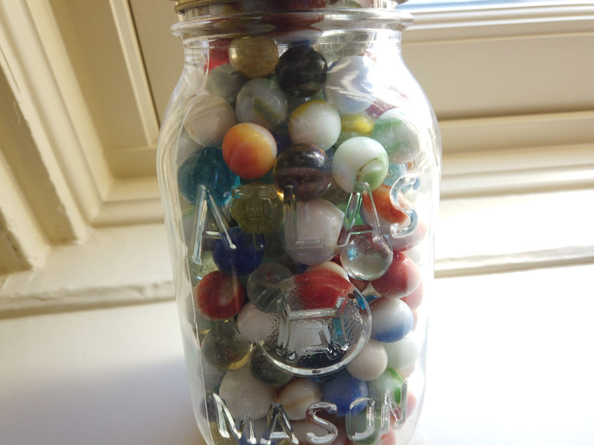
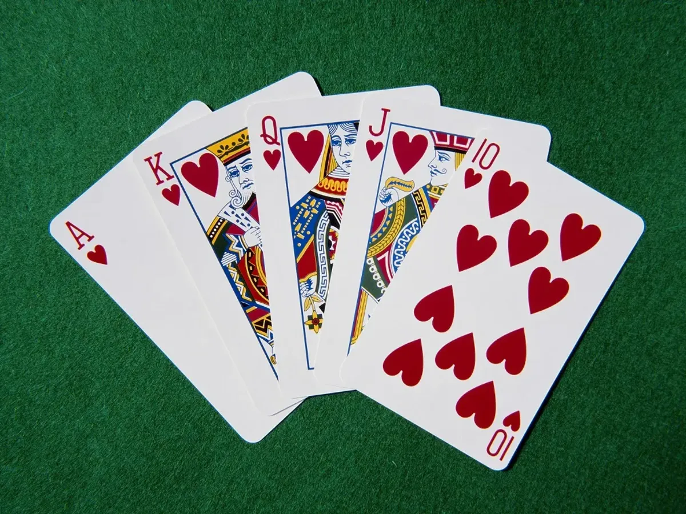

```{r setup, include=FALSE}
options(htmltools.dir.version = FALSE)
knitr::opts_chunk$set(warning = FALSE, message = FALSE)
library(tidyverse) # load tidyverse package
library(MASS)
library(ggplot2)
library(ggthemes)
library(kableExtra)
library(flextable)
library(cowplot)
library(xaringan)
library(xaringanthemer)
#library(gg3D)
library(leaflet)
library(maps)
library(fontawesome)
library(ggrepel)
library(DescTools)
library(renderthis)
library(wesanderson)
library(DiagrammeR)


## To create pdf version:

# setwd("~/Documents/PSY 208/PSY_207-208_23-24/Lectures")
# renderthis::to_pdf("Probability_Theory_II.Rmd", complex_slides = TRUE)

## To create PowerPoint version:

# renderthis::to_pptx("Probability_Theory_II.Rmd", complex_slides = TRUE)
```


### Replacement

.pull-leftcolumn[
```{r echo=FALSE, out.height="130px", out.width = "200px", fig.align = "center"}

```

]

.pull-rightcolumn[

.center[
.slightly-smaller[
100 marbles; 33 of them are .blue[blue]: 
]

$$p(blue)=\frac{33}{100}$$

]

]


.pull-left[

.slightly-smaller[
**Sampling** *with* **replacement**

> draw blue marble, put it back

$$p(blue)=\frac{33}{100}$$
]

.center[
.slightly-smaller[
$p(Blue)$ on the second draw is **independent of** the first draw.

]
]
]

.pull-right[

.slightly-smaller[

**Sampling** *without* **replacement**

> draw blue marble, **don't** put it back

$$p(blue)=\frac{32}{99}$$
]


.center[

.slightly-smaller[
$p(Blue)$ on the second draw **depends** on the first draw.

]
]
]

---
### Dependent Events

Event $A$ is **dependent** on event $B$ if:

$$p(A|B)\ne p(A)$$

Sampling without replacement, for example, **reconditions the sample space**

> *i.e.* **the sample space is different** when you take something out of it

When we're dealing with dependent events we're talking about **conditional probability**.

---

### Dependent Events

.pull-leftcolumn[
```{r echo=FALSE, out.width = "75%", fig.align='right'}

```

]

.pull-rightcolumn[

.slightly-smaller[
> *What is the probability of being dealt four consecutive Aces from a well-shuffled deck of 52 cards?*

]
]

***

.slightly-smaller[
.pull-left[
$$p(Ace_1)=\frac{4}{52}$$

$$p(Ace_2)=\frac{3}{51}$$

$$p(Ace_3)=\frac{2}{50}$$

$$p(Ace_4)=\frac{1}{49}$$
]

.pull-right[
$$p(Ace_1\cap Ace_2 \cap Ace_3 \cap Ace_4)=$$

$$\left(\frac{4}{52}\right)\left(\frac{3}{51}\right)\left(\frac{2}{50}\right)\left(\frac{1}{49}\right)$$
$$=\frac{24}{6,497,400}\approx 3.67\times 10^{-6}$$

...not super-high.

]
]
---

### Dependent Events

.pull-leftcolumn[
```{r echo=FALSE, out.width = "75%", fig.align='center'}

```

]

.pull-rightcolumn[

.slightly-smaller[

$$p(Ace_1\cap Ace_2 \cap Ace_3 \cap Ace_4)=$$

$$\left(\frac{4}{52}\right)\left(\frac{3}{51}\right)\left(\frac{2}{50}\right)\left(\frac{1}{49}\right)$$
$$=\frac{24}{6,497,400}\approx 3.67\times 10^{-6}$$
]

]

***

.slightly-smaller[

$p(Ace_2)$ is the $p(Ace)$ on the second draw **given** an Ace on the first draw.

The **complete** formula for *and* probabilities is:

$$p(A\cap B)=p(A)p(B|A)$$

When $A$ and $B$ are **independent**, the right side **simplifies** to $p(A)p(B)$.
]
---

### Probability Trees

A helpful way to visualize probabilities. **Events** are placed on **nodes**, **probabilities** are placed on **edges** (aka **branches**).

```{r echo=FALSE, fig.align='center'}
DiagrammeR::grViz("
  digraph graph2 {
  
  graph [layout = dot, rankdir = LR, bgcolor = none, fontname = Helvetica, arrowhead=none]
  
  # node definitions with substituted label text
  node [shape = oval, fontname=Helvetica, color=white, fontcolor=white]
  edge [color=white, arrowhead=none, fontcolor=white, fontname=Helvetica]
 # bgcolor = #446455
  
  a [shape = 'point']
  b [label = 'node']
  c [label = 'node']

  a -> b [label = 'edge']
  a -> c [label = 'edge']

  }
  
#  [1]: names(iris)[1]
#  [2]: names(iris)[2]
#  [3]: names(iris)[3]
#  [4]: names(iris)[4]
  ",
width = 800,
height=400)

# p_1 - 'p\u2081'
```

---

### Probability Trees

Connected edges represent *and* probabilities, so we **multiply across**

```{r echo=FALSE, fig.align='center'}
DiagrammeR::grViz("
  digraph graph2 {
  
  graph [layout = dot, rankdir = LR, bgcolor = none, fontname = Helvetica, arrowhead=none]
  
  # node definitions with substituted label text
  node [shape = oval, fontname=Helvetica, color=white, fontcolor=white]
  edge [color=white, arrowhead=none, fontcolor=white, fontname=Helvetica]
 # bgcolor = #446455
  
  a0 [shape = 'point']
  a [label = 'A']
  b [label = 'B']
  c [label = 'C']
  d [label = 'D']
  e [label = 'E']
  f [label = 'F']
  h [shape = 'rectangle', label = 'p(C) = p(C|A)p(A)', color=blue]

  a0 -> a [label = 'p(A)', color = blue]
  a0 -> b 
  a -> c [label = 'p(C|A)', color=blue]
  a -> d
  b -> e
  b -> f
  c -> h [color=none]
  }
  
  ",
width = 800,
height=400)

```

---
### Probability Trees

Separate edges represent *or* probabilities, so we **add down**

```{r echo=FALSE, fig.align='center'}
DiagrammeR::grViz("
  digraph graph2 {
  
  graph [layout = dot, rankdir = LR, bgcolor = none, fontname = Helvetica, arrowhead=none]
  
  # node definitions with substituted label text
  node [shape = oval, fontname=Helvetica, color=white, fontcolor=white]
  edge [color=white, arrowhead=none, fontcolor=white, fontname=Helvetica]
 # bgcolor = #446455
  
  a0 [shape = 'point']
  a [label = 'A']
  b [label = 'B']
  c [label = 'C']
  d [label = 'D']
  e [label = 'E']
  f [label = 'F']
  h [shape = 'rectangle', label = 'p(C) = p(C|A)p(A)', color=blue]
  i [shape= 'rectangle', label = 'p(E) = p(E|B)p(B)', color=red]
  j [shape= 'rectangle' label = 'p(C or E) = p(C) + p(E)', color=purple]

  a0 -> a [label = 'p(A)', color = blue]
  a0 -> b [label = 'p(B)', color = red]
  a -> c [label = 'p(C|A)', color=blue]
  a -> d
  b -> e [color=red, label ='p(E|B)']
  b -> f
  c -> h [color=blue]
  e -> i [color=red]
  h -> j [color = blue]
  i -> j [color=red]
  }
  
  ",
width = 800,
height=400)

# p_1 - 'p\u2081'
```

---

### Conditional Probability

.pull-left[
Imagine that you have been granted entry to the **secret room** where stats teachers keep all the **jars** filled with **marbles** of different **colors**. 

**None of the jars are labeled.**

]

.pull-right[
```{r echo=FALSE, fig.align='center'}

```

]

---

### Conditional Probability

.pull-left[
.slightly-smaller[
42% of the jars are $A$ jars and 58% of the jars are *not* $A$ jars.

$A$ jars have 2 .red[red] marbles and 4 .blue[blue] Marbles.Other jars have 3 .red[red] marbles and 1 .blue[blue] marble.
]
]

.pull-right[
```{r echo=FALSE, out.height="175px"}

```
]

.pull-left[

```{r echo=FALSE, fig.height = 4}

A<-data.frame(x = rep(c(1, 2), each = 3),
              y = rep(c(1, 2, 3), 2),
              color = c(rep("R", 2),
                        rep("B", 4)))

B<-data.frame(x = rep(c(1, 2), each = 2),
              y = rep(c(1, 2), 2),
              color = c(rep("R", 3),
                        "B"))

Ajar<-ggplot(A, aes(x=x, y=y, color=color))+
  geom_point(size=25)+
  scale_color_manual(values = c("dodgerblue4",
                                "#F03F3C"))+
  coord_cartesian(xlim=c(0.5, 2.5),
                  ylim=c(0.5, 3.5))+
  theme_xaringan(css_file = "chevalier.css")+
  theme(legend.position = "none",
        axis.title = element_blank(),
        axis.text = element_blank(),
        panel.grid = element_blank(),
        axis.ticks = element_blank())+
  geom_segment(x=0.51,
               xend=0.51,
               y=0.51,
               yend=3.51,
               color="white")+
    geom_segment(x=0.51,
               xend=2.51,
               y=0.51,
               yend=0.51,
               color="white")+
    geom_segment(x=2.51,
               xend=2.51,
               y=0.51,
               yend=3.51,
               color="white")+
  ggtitle("A Jar")
  
Bjar<-ggplot(B, aes(x=x, y=y, color=color))+
  geom_point(size=25)+
  scale_color_manual(values = c("dodgerblue4",
                                "#F03F3C"))+
  coord_cartesian(xlim=c(0.5, 2.5),
                  ylim=c(0.5, 3.5))+
  theme_xaringan(css_file = "chevalier.css")+
  theme(legend.position = "none",
        axis.title = element_blank(),
        axis.text = element_blank(),
        panel.grid = element_blank(),
        axis.ticks = element_blank())+
  geom_segment(x=0.51,
               xend=0.51,
               y=0.51,
               yend=3.51,
               color="white")+
    geom_segment(x=0.51,
               xend=2.51,
               y=0.51,
               yend=0.51,
               color="white")+
    geom_segment(x=2.51,
               xend=2.51,
               y=0.51,
               yend=3.51,
               color="white")+
  ggtitle("Other Jars")
plot_grid(Ajar, Bjar, nrow=1)
```

]

.pull-right[
.slightly-smaller[
You pick a jar and draw one marble from it.

What is the probability that you draw a .blue[blue] marble?

]
]

---

### Conditional Probability

$p$(.blue[blue]) is based on the sum of the ways that .blue[blue] can happen.

There are two ways in this example - *via* $A$ or **not** A $(\neg A)$:


```{r echo=FALSE, fig.align='center'}
DiagrammeR::grViz("
  digraph graph2 {
  
  graph [layout = dot, rankdir = LR, bgcolor = none, fontname = Helvetica, arrowhead=none]
  
  # node definitions with substituted label text
  node [shape = oval, fontname=Helvetica, color=white, fontcolor=white]
  edge [color=white, arrowhead=none, fontcolor=white, fontname=Helvetica]
 # bgcolor = #446455
  
  a0 [shape = 'point']
  a [label = 'A Jar']
  b [label = 'Other Jar']
  c [label = 'Blue', color=blue]
  d [label = 'Red', color=red]
  e [label = 'Blue', color=blue]
  f [label = 'Red', color=red]


  a0 -> a [label = '0.42', color=yellow]
  a0 -> b [label = '1-0.42', color=yellow]
  a -> c [label = '2/3', color=yellow]
  a -> d [label = '1/3']
  b -> e [label ='1/4', color=yellow]
  b -> f [label = '3/4']
  }
  
  ",
width = 800,
height=250)

# p_1 - 'p\u2081'
```

.slightly-smaller[

$$p(Blue)=p(A)p(Blue|A)+p(\neg A)p(Blue| \neg A)$$

$$p(Blue)=(0.42)(2/3)+(0.58)(1/4)=`r (0.42)*(2/3)+(0.58)*(1/4)`$$
]

---

### Permutations

.center[

Imagine you have six books and a bookshelf

]

.pull-left[
```{r echo = FALSE, out.width="50%", fig.align='center'}

```

]

.pull-right[
```{r echo=FALSE}

```

]

.center[

How many **possible ways** can you **arrange** your six books?

]
---

### Permutations

```{r echo=FALSE, fig.height = 3, fig.width = 12}
ggplot(data.frame(x=seq(0,15, 15/10), y=seq(0, 0.25, 0.25/10)))+
  geom_blank()+
  theme_xaringan(css_file = "chevalier.css")+
  annotate("text",
           x = (1:6)*2,
           y=1,
           label = c("6", 
                     "5", 
                     "4", 
                     "3", 
                     "2", 
                     "1"),
           size = c(6, 5, 4, 3, 2, 1)*7,
           vjust = 0)+
    annotate("text",
           x = (1:6)*2,
           y=0.5,
           label = c(rep("choices", 5), "choice"),
           size = 8,
           vjust = 0)+
  geom_segment(aes(x=1,
               xend = 13,
               y=0,
               yend=0),
               color="white",
              linewidth = 2)+
  coord_cartesian(xlim=c(1, 13), ylim = c(0, 2.75))+
  theme(axis.line = element_blank(),
        axis.text = element_blank(),
        axis.title = element_blank(),
        panel.grid = element_blank(),
        axis.ticks = element_blank())
```

There are **six possibilities** for the **first spot** on the bookshelf.

Once you have placed a book on that spot, there are now **five books** left for the **second spot**.

In total, there are $6\times 5\times 4\times 3\times 2\times 1=720$ - or, ** $6!$** - possible **permutations**

---

### Permutations

.pull-left[

```{r echo=FALSE, fig.height = 3, fig.width = 6}
ggplot(data.frame(x=seq(0,15, 15/10), y=seq(0, 0.25, 0.25/10)))+
  geom_blank()+
  theme_xaringan()+
  annotate("text",
           x = (1:2)*2,
           y=1,
           label = c("6", 
                     "5" 
                     ),
           size = c(6, 5)*7,
           vjust = 0)+
    annotate("text",
           x = (1:2)*2,
           y=0.5,
           label = rep("choices", 2),
           size = 8,
           vjust = 0)+
  geom_segment(aes(x=1,
               xend = 5,
               y=0,
               yend=0),
               color="white",
              linewidth = 2)+
  coord_cartesian(xlim=c(1, 6), ylim = c(0, 2.75))+
  theme(axis.line = element_blank(),
        axis.text = element_blank(),
        axis.title = element_blank(),
        panel.grid = element_blank(),
        axis.ticks = element_blank())
```

]

.pull-right[

.slightly-smaller[
Let's temporarily pretend that there is only space for **two books.**

In that case, there are $6\times 5=30$ possible pairs: we have removed $4\times 3\times 2\times 1$ -- or $4!$ -- from the calculation.
]
]

***
The general formula for ** $n$** things **Permuted** ** $r$** at a time is:

$$nPr=\frac{n!}{(n-r)!}$$

---

### Permutations

> Somebody placed 6 books on the shelf **without looking at the titles**. 

> what is the **probability** that the books are placed in *either* **ascending** or **descending** **alphabetical order**?

There are $_6P_6=\frac{6!}{(6-6)!}=\frac{720}{1}$ **possible permutations**

There is ** $1$** *ascending* order and ** $1$** *descending* order. So:

$$p = \frac{1}{720}+\frac{1}{720}=\frac{2}{720}$$
---

### Combinations


A **combination** is a way of grouping things where *the order does not matter*

The number of **combinations** of the items - relative to the number of permutations - is **reduced by a factor of the number of possible orders**.

> The number of orders for $r$ things is $r!$

***

The number of ways ** $n$** things can be **Combined** ** $r$** at a time is given by:

$$nCr=\frac{n!}{(n-r)!r!}$$

---

### Combinations

> **Example:** *you have 5 books, and you can only take 3 with you on vacation. How many sets of three books can you bring?*


There are $\frac{5!}{2!}$ possible permutations; we divide those by the $3!$ possible orders:

$$\left(\frac{\frac{5!}{2!}}{3!}\right)=\left(\frac{5!}{2!}\right)\left(\frac{1}{3!}\right)=10$$


---

### Odds

**Odds** are an expression of **relative probabilities**

.slightly-smaller[

> The odds **in favor** of event A:

>>The number of times event A **will happen**:the number of times it **will not** (*e.g.*, **3:1**)\*


> Odds **against** event A:

>>The number of times event A **will not happen**:the number of times it **will happen** (*e.g.*, **1:3**)

]

Odds **in favor** is always the opposite of odds **against**
.footnote[
\*The colon (**:**) is a symbol for ***to***
]
---

### Odds

Consider **a bet** with a friend on a **contest** with **two outcomes**: event A and event B 

> Assume that event A is **twice as likely to happen** than event B

>> Odds in favor of event A – **2:1**

>> Odds in favor of event B – **1:2**

Your friend bets on event A, you bet on event B

Your friend should **pay twice as much** to win the same amount!

---

### Odds and Probability

If the **odds in favor** of event A are 2:1, then A will happen **twice** for every **once** it doesn't

> That implies that **A happens 2 out of 3 times**: a **relative frequency** of ** $2/3$**

Example: Gambling odds are expressed in terms of **odds against**

*e.g.*, American Pharaoh was 5:2 to win the Kentucky Derby in 2015.

> Those odds imply **a probability of 2/7 of winning**

---

### Expected Value

The **expected value** of a defined experiment ** $\text{E}(x)$** is the **long-term average expectation** of an **outcome** over **repeated experiments**.

$$\text{E}(x)=\sum_{i=1}^Nx_ip(x_i)$$

*i.e.*: the **value** of each event ** $x$** multiplied by the **probability** of that event where there are ** $i = 1, 2, 3, ..., N$** events


---

### Expected Value

> Example 1: What is the **expected number** of **Tails** in **4 flips** of a fair coin?

$$x_i = 1$$

.center[
.slightly-smaller[
(We're counting the number of *tails*; each *tails* is a count of 1)
]
]

$$p_i=\frac{1}{2}$$
.center[
.slightly-smaller[
(the probability of *tails* is always $1/2$)
]
]

$$\text{E}(x)=\sum_{i=1}^N=1\left(\frac{1}{2}\right)=\frac{1}{2}+\frac{1}{2}+\frac{1}{2}+\frac{1}{2}=2$$
---

### Expected Value

> Example 2: What is the **expected value** of **one roll** of a six-sided die?

$$\text{E}(x)=\sum_{i=1}^Nx_ip(x_i)=1\left(\frac{1}{6}\right)+2\left(\frac{1}{6}\right)+\ldots+6\left(\frac{1}{6}\right)$$

$$=3.5$$

---

### Expected Value and Variance

If each $x_i$ is **equally likely**, then the $p_i$ for all $i$ is ** $\frac{1}{N}$**:


$$\text{E}(x)=\sum_{i=1}^Nx_i\left(\frac{1}{N}\right)=\frac{1}{N}\sum_{i=1}^Nx_i$$

.center[
that is the **mean** formula.
]

---

### Variance

The **variance** of a defined experiment is a measure of the expected range of the outcomes in a defined experiment.

$$\text{V}(x)=\text{E}\left[\left(x-\mu\right)^2\right]=\text{E}\left[x^2\right]-\text{E}\left[x\right]^2$$


---

### Variance

> What is the **variance** of *tails* in **4 flips**?

$$\text{V}(x)=\text{E}\left[x^2\right]-\text{E}\left[x\right]^2$$
$$\text{E}\left[x^2\right]=1^2\left(\frac{1}{2}\right)+1^2\left(\frac{1}{2}\right)+1^2\left(\frac{1}{2}\right)+1^2\left(\frac{1}{2}\right)=2$$
$$\text{E}\left[x\right]^2=\left[1\left(\frac{1}{2}\right)\right]^2+\left[1\left(\frac{1}{2}\right)\right]^2+\left[1\left(\frac{1}{2}\right)\right]^2+\left[1\left(\frac{1}{2}\right)\right]^2=1$$

$$\text{V}(x)=2-1=1$$

.center[
(FYI: there's an **easier way** to do this that we'll learn soon)
]


---

### Variance

Another way to express the **variance** of a defined experiment is:

$$\text{V}(x)=\text{E}\left[x^2\right]-\text{E}\left[x\right]^2=\sum_{i=1}^N\left(x-\text{E}(x)\right)^2p_i$$

Again, if every $x_i$ is **equally likely** and $p_i=\frac{1}{N}$, *and* we define the **population mean** ** $\mu=\text{E}(x)$**:

$$\text{V}(x)=\sum_{i=1}^N\left(x-\mu\right)^2\left(\frac{1}{N}\right)=\frac{1}{N}\sum_{i=1}^N\left(x-\mu\right)^2$$

.center[
and *that* is the **population variance** formula.


]

---

### Probability, Likelihood, & Odds


A **conditional probability** is a **likelihood**

> as in, What is the **likelihood of event B** given event A?

Note: in conversation, we use the terms **probability**, **odds**, and **likelihood** *interchangeably*

In statistics:

> **Probability** is a supercategory for everything stochastic 

> **Likelihood** is a conditional probability

> **Odds** are relative probabilities

