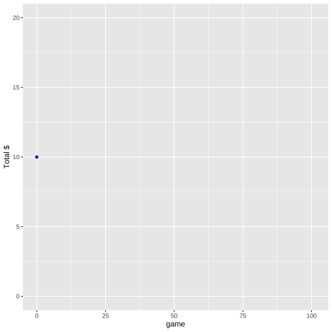
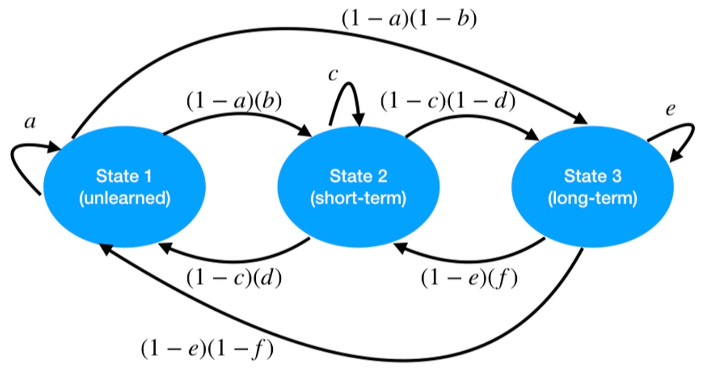

```{r setup, include=FALSE}
options(htmltools.dir.version = FALSE)
knitr::opts_chunk$set(warning = FALSE, message = FALSE)
library(tidyverse) # load tidyverse package
library(MASS)
library(ggplot2)
library(ggthemes)
library(kableExtra)
library(flextable)
library(cowplot)
library(xaringanthemer)
#library(gg3D)
library(leaflet)
library(maps)
library(fontawesome)
library(ggrepel)
library(DescTools)
library(renderthis)
library(wesanderson)
library(DiagrammeR)


## To create pdf version:

# setwd("~/Documents/PSY 208/PSY_207-208_23-24/Lectures")
# renderthis::to_pdf("Probability_Theory_III.Rmd", complex_slides = TRUE)

## To create PowerPoint version:

# renderthis::to_pptx("Probability_Theory_III.Rmd", complex_slides = TRUE)
```


### Conditional Probability


.pull-left[

We return now to the legendary **room full of unlabeled jars full of marbles**.


Reminder: 42% of the jars are $A$ jars and 58% of the jars are *not* $A$ jars.

]

.pull-right[
```{r echo=FALSE, out.height="175px"}
knitr::include_graphics("images/jars.jpeg")
```
]

.pull-left[

```{r echo=FALSE, fig.height = 4}

A<-data.frame(x = rep(c(1, 2), each = 3),
              y = rep(c(1, 2, 3), 2),
              color = c(rep("R", 2),
                        rep("B", 4)))

B<-data.frame(x = rep(c(1, 2), each = 2),
              y = rep(c(1, 2), 2),
              color = c(rep("R", 3),
                        "B"))

Ajar<-ggplot(A, aes(x=x, y=y, color=color))+
  geom_point(size=25)+
  scale_color_manual(values = c("dodgerblue4",
                                "#F03F3C"))+
  coord_cartesian(xlim=c(0.5, 2.5),
                  ylim=c(0.5, 3.5))+
  theme_xaringan(css_file = "chevalier.css")+
  theme(legend.position = "none",
        axis.title = element_blank(),
        axis.text = element_blank(),
        panel.grid = element_blank(),
        axis.ticks = element_blank())+
  geom_segment(x=0.51,
               xend=0.51,
               y=0.51,
               yend=3.51,
               color="white")+
    geom_segment(x=0.51,
               xend=2.51,
               y=0.51,
               yend=0.51,
               color="white")+
    geom_segment(x=2.51,
               xend=2.51,
               y=0.51,
               yend=3.51,
               color="white")+
  ggtitle("A Jar")
  
Bjar<-ggplot(B, aes(x=x, y=y, color=color))+
  geom_point(size=25)+
  scale_color_manual(values = c("dodgerblue4",
                                "#F03F3C"))+
  coord_cartesian(xlim=c(0.5, 2.5),
                  ylim=c(0.5, 3.5))+
  theme_xaringan(css_file = "chevalier.css")+
  theme(legend.position = "none",
        axis.title = element_blank(),
        axis.text = element_blank(),
        panel.grid = element_blank(),
        axis.ticks = element_blank())+
  geom_segment(x=0.51,
               xend=0.51,
               y=0.51,
               yend=3.51,
               color="white")+
    geom_segment(x=0.51,
               xend=2.51,
               y=0.51,
               yend=0.51,
               color="white")+
    geom_segment(x=2.51,
               xend=2.51,
               y=0.51,
               yend=3.51,
               color="white")+
  ggtitle("Other Jars")
plot_grid(Ajar, Bjar, nrow=1)
```

]

.pull-right[
You pick a jar and draw one marble from it. It is .blue[blue].

What is the probability that you are holding an $A$ jar?
]
---
### Bayes's Theorem

When we are given a fully-specified sample space, it is relatively straightforward to calculate probabilities.

.pull-left[
> E.g.: what is $p(blue|A)?$

> Answer: $p(blue)=\frac{4}{6}= \frac{2}{3}$
]

.pull-right[
```{r echo=FALSE, fig.align='center', fig.height=4}
Ajar
```

]

When we have several different sources, each with their own sample spaces, it can be trickier.

That's when we use **Bayes's Theorem**.
---

### Bayes's Theorem

As noted before, **the probability of $A$ and $B$** is the **product** of ** $p(A)$** and ** $p(B|A)$**:

$$p(A \cap B)=p(A)p(B|A)$$
The designation of the names $A$ and $B$ is arbitrary, so it is also true that:

$$p(B\cap A)=p(B)p(A|B)$$
and therefore:

$$p(A)p(B|A)=p(B)p(A|B)$$
---

### Bayes's Theorem

If we divide both sides by $p(B)$, we get **Bayes's Theorem**:

## $$p(A|B)=\frac{p(A)p(B|A)}{p(B)}$$
---

### Bayes's Theorem

What is the probability that we have an $A$ jar *given* that we have drawn a .blue[blue] marble?


.pull-left[

> Event $A$: **A Jar**

> Event $B$: **Blue marble**

]


.pull-right[
```{r echo=FALSE, fig.height = 2, fig.width = 4, fig.align='center'}
Ajarsmall<-ggplot(A, aes(x=x, y=y, color=color))+
  geom_point(size=12)+
  scale_color_manual(values = c("dodgerblue4",
                                "#F03F3C"))+
  coord_cartesian(xlim=c(0.5, 2.5),
                  ylim=c(0.5, 3.5))+
  theme_xaringan(css_file = "chevalier.css")+
  theme(legend.position = "none",
        axis.title = element_blank(),
        axis.text = element_blank(),
        panel.grid = element_blank(),
        axis.ticks = element_blank(),
        title = element_text(size=18))+
  geom_segment(x=0.51,
               xend=0.51,
               y=0.51,
               yend=3.51,
               color="white")+
    geom_segment(x=0.51,
               xend=2.51,
               y=0.51,
               yend=0.51,
               color="white")+
    geom_segment(x=2.51,
               xend=2.51,
               y=0.51,
               yend=3.51,
               color="white")+
  ggtitle("A Jar")
  
Bjarsmall<-ggplot(B, aes(x=x, y=y, color=color))+
  geom_point(size=12)+
  scale_color_manual(values = c("dodgerblue4",
                                "#F03F3C"))+
  coord_cartesian(xlim=c(0.5, 2.5),
                  ylim=c(0.5, 3.5))+
  theme_xaringan(css_file = "chevalier.css")+
  theme(legend.position = "none",
        axis.title = element_blank(),
        axis.text = element_blank(),
        panel.grid = element_blank(),
        axis.ticks = element_blank(),
        title = element_text(size=18))+
  geom_segment(x=0.51,
               xend=0.51,
               y=0.51,
               yend=3.51,
               color="white")+
    geom_segment(x=0.51,
               xend=2.51,
               y=0.51,
               yend=0.51,
               color="white")+
    geom_segment(x=2.51,
               xend=2.51,
               y=0.51,
               yend=3.51,
               color="white")+
  ggtitle("Other Jars")
plot_grid(Ajarsmall, Bjarsmall, nrow=1)
```

]


This problem is asking for the **probability of $A$** ***given*** ** $B$** $(p(A|B))$:

$$p(Jar~A|Blue~marble)=\frac{p(Jar~A)p(Blue~marble|Jar A)}{p(Blue~marble)}$$

---

### Bayes's Theorem

$p(A)$ is the probability that we selected an $A$ jar
> $p(A)=0.42$

$p(B|A)$ is the probability of drawing a blue marble from an $A$ jar
> $p(B|A)=\frac{4}{6}=\frac{2}{3}$

$p(B)$ is the *overall* probability of drawing a blue marble (next slide).
---

### Bayes's Theorem

$p(B)$ is based on the **sum of all the ways that $B$ can happen**.

There are two ways in this example - *via* $A$ or not A $(\neg A)$ - so:

$$p(B)=p(A)p(B|A)+p(\neg A)p(B| \neg A)$$

```{r echo=FALSE, fig.align='center'}
DiagrammeR::grViz("
  digraph graph2 {
  
  graph [layout = dot, rankdir = LR, bgcolor = none, fontname = Helvetica, arrowhead=none]
  
  # node definitions with substituted label text
  node [shape = oval, fontname=Helvetica, color=white, fontcolor=white]
  edge [color=white, arrowhead=none, fontcolor=white, fontname=Helvetica]
 # bgcolor = #446455
  
  a0 [shape = 'point']
  a [label = 'A Jar']
  b [label = 'Other Jar']
  c [label = 'Blue', color=blue]
  d [label = 'Red', color=red]
  e [label = 'Blue', color=blue]
  f [label = 'Red', color=red]


  a0 -> a [label = '0.42', color=yellow]
  a0 -> b [label = '1-0.42', color=yellow]
  a -> c [label = '2/3', color=yellow]
  a -> d [label = '1/3']
  b -> e [label ='1/4', color=yellow]
  b -> f [label = '3/4']
  }
  
  ",
width = 800,
height=250)

# p_1 - 'p\u2081'
```

$$p(B)=(0.42)(2/3)+(0.58)(1/4)=`r (0.42)*(2/3)+(0.58)*(1/4)`$$
---
### Bayes's Theorem

```{r echo=FALSE}
p1<-0.42*(2/3)/((0.42)*(2/3)+(0.58)*(1/4))
```

Now that we know $p(A)$, $p(B|A)$, and $p(B)$, we can calculate $p(A|B)$:

$$p(A|B)=\frac{p(A)p(B|A)}{p(B)}=\frac{(0.42)(2/3)}{`r (0.42)*(2/3)+(0.58)*(1/4)`}=`r round((0.42)*(2/3)/((0.42)*(2/3)+(0.58)*(1/4)),3)`$$

**The probability that we have an $A$ jar is therefore $\approx 66\%$**.

The probability that we have a non- $A$ jar is $\approx 34\%$.
---
### Bayes's Theorem

Here's a more visual way to think of Bayes's Theorem: $p(A|B)$ is the **probability** of **reaching $B$ through $A$** divided by **all the ways to get to $B$**

```{r echo=FALSE, fig.align='center'}
DiagrammeR::grViz("
  digraph graph2 {
  
  graph [layout = dot, rankdir = LR, bgcolor = none, fontname = Helvetica, arrowhead=none]
  
  # node definitions with substituted label text
  node [shape = oval, fontname=Helvetica, color=white, fontcolor=white]
  edge [color=white, arrowhead=none, fontcolor=white, fontname=Helvetica]
 # bgcolor = #446455
  
  a0 [shape = 'point']
  a [label = 'A']
  b [label = '\u00AC A']
  c [label = 'B', color=blue]
  d [label = '\u00AC B', color=red]
  e [label = 'B', color=blue]
  f [label = '\u00AC B', color=red]
  g [label = 'p(B)', shape = 'none', fontsize = 36]


  a0 -> a [label = 'p(A)', color=yellow, fontsize = 36]
  a0 -> b [label = 'p(\u00AC A)', color=yellow]
  a -> c [label = 'p(B|A)', color=yellow, fontsize = 36]
  a -> d [label = 'p(\u00AC B|A)']
  b -> e [label ='p(B|\u00AC A)', color=yellow]
  b -> f [label = 'p(\u00AC B|\u00AC A)']
  c -> g [color = blue, style = 'dashed', arrowhead = 'normal']
  e -> g [color = blue, style = 'dashed', arrowhead = 'normal']
  }
  
  ",
width = 800,
height=350)

# p_1 - 'p\u2081'
```


---

### Bayes's Theorem


.pull-left[

Let's imagine that you are not satisfied, and want **more information**.

You put the marble back into the jar and shake it up.

You draw another .blue[blue] marble.

]

.pull-right[
```{r echo=FALSE, fig.align='center', fig.height=5}
plot_grid(Ajar, Bjar, nrow=1)
```

]

> **Now** what is the probability that you have an $A$ jar?
---

### Bayes's Theorem

.pull-left[
The probability of drawing a blue marble is **unchanged**.

But now we have a **new $p(A)$**
]

.pull-right[
```{r echo=FALSE, fig.align='center', fig.height=3}
plot_grid(Ajarsmall, Bjarsmall, nrow=1)
```

]

$p(A)$ is the probability that we selected an $A$ jar
> $p(A)=`r round(p1, 3)`$

$p(B|A)$ is the probability of drawing a blue marble from an $A$ jar
> $p(B|A)=\frac{4}{6}=\frac{2}{3}$

$p(B)$ is the *overall* probability of drawing a blue marble.

---
### Bayes's Theorem

$p(A)$ and $p(\neg A)$ have been **updated**, otherwise **the tree remains the same**:

```{r echo=FALSE, fig.align='center'}
DiagrammeR::grViz("
  digraph graph2 {
  
  graph [layout = dot, rankdir = LR, bgcolor = none, fontname = Helvetica, arrowhead=none]
  
  # node definitions with substituted label text
  node [shape = oval, fontname=Helvetica, color=white, fontcolor=white]
  edge [color=white, arrowhead=none, fontcolor=white, fontname=Helvetica]
 # bgcolor = #446455
  
  a0 [shape = 'point']
  a [label = 'A Jar']
  b [label = 'Other Jar']
  c [label = 'Blue', color=blue]
  d [label = 'Red', color=red]
  e [label = 'Blue', color=blue]
  f [label = 'Red', color=red]


  a0 -> a [label = '0.659', color=yellow]
  a0 -> b [label = '1-0.659', color=yellow]
  a -> c [label = '2/3', color=yellow]
  a -> d [label = '1/3']
  b -> e [label ='1/4', color=yellow]
  b -> f [label = '3/4']
  }
  
  ",
width = 800,
height=250)

# p_1 - 'p\u2081'
```

```{r echo=FALSE}
p2<-p1*(2/3)/((p1*2/3)+((1-p1)*1/4))
```

$$p(B)=(`r round(p1, 3)`)(2/3)+(`r round((1-p1), 3)`)(1/4)=`r round(((p1*2/3)+((1-p1)*1/4)), 3)`$$
---

### Bayes's Theorem

Our **updated** probability that we have an $A$ Jar is:

$$p(A|B)=\frac{p(A)p(B|A)}{p(B)}\approx `r round(p2,3)`$$
---

### Bayes's Theorem

.pull-left[
>Bayes's Theorem applies for sample spaces of **any size**.

>We will (later) use Bayes's Theorem to evaluate **lots** of conditional probabilities


]


.pull-right[
```{r echo=FALSE, fig.align='center'}
DiagrammeR::grViz("
  digraph graph2 {
  
  graph [layout = dot, rankdir = LR, bgcolor = none, fontname = Helvetica, arrowhead=none]
  
  # node definitions with substituted label text
  node [shape = oval, fontname=Helvetica, color=white, fontcolor=white]
  edge [color=white, arrowhead=none, fontcolor=white, fontname=Helvetica]
 # bgcolor = #446455
  
  a0 [shape = 'point']
  a [label = 'A']
  b [label = 'B']
  c [label = 'C']
  d [label = 'X']
  e [label = 'Y']
  f [label = 'Z']
  g [label = 'X']
  h [label = 'Y']
  i [label = 'Z']
  j [label = 'X']
  k [label = 'Y']
  l [label = 'Z']


  a0 -> a [label = 'p(A)']
  a0 -> b [label = 'p(B)']
  a0 -> c [label = '1-p(A)-p(B)']
  a -> d [label = 'p(X|A)']
  a -> e [label ='p(Y|A)']
  a -> f [label = 'p(X|A)']
  b -> g [label = 'p(X|B)']
  b -> h [label = 'p(Y|B)']
  b -> i [label = 'p(Z|B)']
  c -> j [label = 'p(X|C)']
  c -> k [label = 'p(Y|C)']
  c -> l [label = 'p(Z|C)']
  }
  
  ",
width = 400,
height=350)

# p_1 - 'p\u2081'
```

]
---

### The Metaphor

Each jar we hold represents a **hypothesis**. 

Drawing a marble represents an *observation*. That's **data**.

In the context of scientific reasoning and inference, we replace $A$ with $H$ (for *hypothesis*) and $B$ with $D$ (for *data*):

## $$p(H|D)=\frac{p(H)p(D|H)}{p(D)}$$
---

### Bayesian Inference

> $p(H)$: **prior probability**. 

A **starting point** for the **degree of belief in a hypothesis**. 

> In the first part of our example, we started with the relative frequency of $A$ jars (42%). In the second part, we started with the updated probability we calculated in the first part (66%).

---

### Bayesian Inference

> $p(D|H)$: **likelihood**.

The **likelihood** is the **conditional probability** of obtaining the result **given** the hypothesis. 

> In this case, we knew that if we had an $A$ jar, the probability of a blue marble would be $\frac{2}{3}$.

---
### Bayesian Inference

> $p(D)$: **base rate**. 

The **base rate** is the **overall probability of observing the data**. It is the **sum** of all the Bayes's Theorem numerators $p(H)p(D|H)$ for each $H$.

Having the sum of all numerators as the denominator ensures that all of the $p(H|D)$ values add up to 1.

> In the example, $p(D)$ is the probability of drawing a blue marble in any way.

---

### Bayesian Inference

> $p(H|D)$: **posterior probability**

The **posterior probability** is the probability we find for the hypothesis $H$ given the data $D$. It incorporates the **prior**, the **likelihood**, and the base rate. 

The **posterior** from one experiment can be used as the **prior** probability for the **next** trial.

> In this example, the **posterior** was the answer to the question *what is the probability we have Jar A given that we observed a blue marble?*

---

### Bayesian Inference

A rare disease strikes **four out of every one thousand** people. 

There is a test for the disease that is 98% **sensitive**, meaning that people who **do have the disease** test positive 98% of the time. 

The test is also 96% **specific**, that is, if people who **do not have the disease** test positive 4% of the time. 

***

A person chosen at random is given the test and tests positive. **What is the probability that he actually has the disease?**

---

### Bayesian Inference

The **hypothesis** that a clinician may have is that the person **has the disease** 

> *has disease* = $H$

The **data** is a **positive test** 

>*positive test* = $D$

The clinician therefore is looking for **the probability that the person has the disease given a positive test** 

> $p(has~disease|positive~test)=p(H|D)$

---

### Bayesian Inference

The **prior probability** $p(H)$ is the **overall prevalence of the disease**:

$$p(H)=\frac{4}{1000}=0.004$$

The **likelihood** $p(D|H)$ is the **probability of a positive test if someone has the disease**:

$$p(D|H)=0.98$$

---
### Bayesian Inference

The **base rate** $p(D)$ is the **overall probability of testing positive**

> either *via* a **true positive** or a **false positive**.

```{r echo=FALSE, fig.align='center'}
DiagrammeR::grViz("
  digraph graph2 {
  
  graph [layout = dot, rankdir = LR, bgcolor = none, fontname = Helvetica, arrowhead=none]
  
  # node definitions with substituted label text
  node [shape = oval, fontname=Helvetica, color=white, fontcolor=white]
  edge [color=white, arrowhead=none, fontcolor=white, fontname=Helvetica]
 # bgcolor = #446455
  
  a0 [shape = 'point']
  a [label = 'H']
  b [label = '\u00AC H']
  c [label = 'D', color=blue]
  d [label = '\u00AC D', color=red]
  e [label = 'D', color=blue]
  f [label = '\u00AC D', color=red]
  g [label = 'p(D)', shape = 'none', fontsize = 36]


  a0 -> a [label = 'p(H)', color=yellow]
  a0 -> b [label = 'p(\u00AC H)', color=yellow]
  a -> c [label = 'p(D|H)', color=yellow]
  a -> d [label = 'p(\u00AC D|H)']
  b -> e [label ='p(D|\u00AC H)', color=yellow]
  b -> f [label = 'p(\u00AC D|\u00AC H)']
  c -> g [color = blue, style = 'dashed', arrowhead = 'normal']
  e -> g [color = blue, style = 'dashed', arrowhead = 'normal']
  }
  
  ",
width = 800,
height=350)

# p_1 - 'p\u2081'
```


---

### Bayesian Inference

$$p(D)=p(H)p(D|H)+p(\neg H)p(D|\neg H)$$

```{r echo=FALSE, fig.align='center'}
DiagrammeR::grViz("
  digraph graph2 {
  
  graph [layout = dot, rankdir = LR, bgcolor = none, fontname = Helvetica, arrowhead=none]
  
  # node definitions with substituted label text
  node [shape = oval, fontname=Helvetica, color=white, fontcolor=white]
  edge [color=white, arrowhead=none, fontcolor=white, fontname=Helvetica]
 # bgcolor = #446455
  
  a0 [shape = 'point']
  a [label = 'H']
  b [label = '\u00AC H']
  c [label = 'D', color=blue]
  d [label = '\u00AC D', color=red]
  e [label = 'D', color=blue]
  f [label = '\u00AC D', color=red]
  g [label = 'p(D)', shape = 'none', fontsize = 36]


  a0 -> a [label = 'p(H) = 0.004', color=yellow]
  a0 -> b [label = 'p(\u00AC H) = 0.996', color=yellow]
  a -> c [label = 'p(D|H) = 0.98', color=yellow]
  a -> d [label = 'p(\u00AC D|H) = 0.02']
  b -> e [label ='p(D|\u00AC H) = 0.04', color=yellow]
  b -> f [label = 'p(\u00AC D|\u00AC H) = 0.96']
  c -> g [color = blue, style = 'dashed', arrowhead = 'normal']
  e -> g [color = blue, style = 'dashed', arrowhead = 'normal']
  }
  
  ",
width = 800,
height=350)

```

$$p(D)=(0.004)(0.98)+(0.996)(0.04)=0.04376$$
---

### Bayesian Inference

Now we have all of the terms needed to calculate the **posterior probability** $p(H|D)$ that a person **has the disease** ***given*** **a positive test**

$$p(H|D)=\frac{p(H)p(D|H)}{p(D)}$$

$$p(H|D)=\frac{(0.004)(0.98)}{0.04376}=0.0896$$
There's about a **9%** chance that the person has the disease.

---
### Bayesian Inference

.slightly-smaller[

A $9\%$ chance of having the disease might seem low: the probability that a positive person tests positive is $98\%$! Two points to consider:

> The **prior probability** was ** $0.4\%$** 

The posterior probability is $\frac{0.0896}{0.004}=22.4$ times greater.That's a **big increase** in the **certainty** of the diagnosis.

> False positives are rare but **most people** don't have the disease 

```{r echo = FALSE, fig.height = 3, fig.width = 12}
data.frame(PN = c("Positive",
                  "Positive",
                  "Negative",
                  "Negative"),
           Test = c("Positive",
                    "Negative",
                    "Positive",
                    "Negative"),
           n = c(4*0.98,
                 4*0.02,
                 996*0.04,
                 996*0.96)) %>% 
  ggplot(aes(x=PN, y = n, fill = Test))+
  geom_bar(stat = "identity", 
           position = "stack")+
  theme_tufte(ticks = FALSE)+
  theme_xaringan()+
  coord_flip()+
  scale_fill_manual(values = c("#283399", "#913831"))+
  labs(x = "disease\n status")+
  theme(legend.position = "bottom")+
  annotate("text",
           x = 2,
           y = 500,
           label = "most of the positive tests are false positives",
           size = 9,
           color = "#ffffff")
```


]
---

### Belaboring the Inference Metaphor

Here's a normal distribution.

```{r echo=FALSE, fig.align='center', fig.height=2, fig.width = 8}
x<-seq(-3, 3, 6/10000)
y<-dnorm(x)
normdf<-data.frame(x, y)

ggplot(normdf, aes(x, y))+
  geom_line(linewidth = 2)+
  theme_tufte(ticks=FALSE)+
  theme_xaringan(css_file = "chevalier.css")+
  theme(axis.text.y = element_blank(),
        axis.title.y = element_blank())
```

For some reason, we might be interested in the **largest** and the **smallest** 5% of the distribution. Let's highlight the **top 2.5%** and the bottom **2.5%**:

```{r echo=FALSE, fig.align='center', fig.height=2, fig.width = 8}
x<-seq(-3, 3, 6/10000)
y<-dnorm(x)
normdf<-data.frame(x, y)

ggplot(normdf, aes(x, y))+
  theme_tufte(ticks=FALSE)+
  theme_xaringan(css_file = "chevalier.css")+
    geom_area(data=subset(normdf, normdf$x>=1.96),
            fill="#F21A00")+
      geom_area(data=subset(normdf, normdf$x<=-1.96),
            fill="#4b0082")+
        geom_area(data=subset(normdf, normdf$x>-1.96&normdf$x<1.96),
            fill="#D3DDDC")+
    geom_line(linewidth = 2)+
  annotate("text",
           x=1.96,
           y=0.2,
           hjust=0,
           label= "Top 2.5%",
           size = 16/.pt)+
  annotate("text",
           x=-1.96,
           y=0.2,
           hjust=1,
           label= "Bottom 2.5%",
           size = 16/.pt)+
  theme(axis.text.y = element_blank(),
        axis.title.y = element_blank())
```

---

### Belaboring the Metaphor

Now let's turn the normal curve upside-down and shake it up:

```{r echo=FALSE, fig.align='center', fig.height=2, fig.width = 8}
set.seed(77)

x<-seq(-3, 3, 6/1000)
y<-dnorm(x)
xdots<-sample(seq(-3, 3, 6/1000), replace = TRUE, prob = y)
ydots<-rep(NA, length(xdots))

for (i in 1:length(xdots)){
  ydots[i]<-(runif(1, 0, dnorm(xdots[i])))
}

color<-sample(c(rep("Red", 25),
         rep("Indigo", 25),
         rep("White", 951)))

normdf<-data.frame(x, y,
                   xdots, ydots,
                   color)

ggplot(normdf)+
  geom_point(aes(xdots, -ydots, color=color), size = 2)+
  geom_line(aes(x, -y), linewidth = 2)+
  scale_color_manual(values=c("#4b0082", "#F21A00", "#D3DDDC"))+
  theme_tufte(ticks=FALSE)+
  theme_xaringan(css_file = "chevalier.css")+
    theme(legend.position = "none",
        axis.title = element_blank(),
        axis.text = element_blank(),
        panel.grid = element_blank(),
        axis.ticks = element_blank())
```

Now we have a weird-ass jar full of numerical marbles. 

We'll apply that principle to *both* frequentist and Bayesian inference.

---

### Simulating Stochastic Events

**Monte Carlo Methods** are ways to use **randomly-generated data** to investigate **stochastic processes**\*


Two examples: 

> Random Walks 

> Markov Chains


.footnote[\*or, some deterministic processes that are not easily handled with analytic methods]
---

### Random Walk Models

.pull-left[

.slightly-smaller[

A **random walk** (less sensitively and more colorfully known as a **drunkard's walk**) is a way of drawing **random numbers** to update a **state**

The figure on the right tracks a **gambler's endowment** as they either win money or lose money.

> Analyzing the **paths** of wins and losses provides information that a simple **expected value** cannot

]

]
.pull-right[
```{r echo = FALSE}

```

]

---

### Markov Chain Models

.pull-left[

**Markov Chain** is the term for **stochastic processes** (including random walks) where the **next step** in the process depends only on the **current state**.


]

.pull-right[
```{r echo = FALSE}

```
]

It doesn't matter **how you got to the state you are in**. Just that you are there and there are **probabilities that predict you going somewhere else from there**.

That's the key feature of **Markov Chains**: ***memorylessness***

---

### Markov Chain Monte Carlo

When we combine **Markov Chains** with **repeated random sampling** we get **Markov Chain Monte Carlo (MCMC)** Methods.


MCMC methods are frequently used to obtain **parameter estimates**

> *e.g.* in complex regression models

> They do the jobs that algebra, trigonometry, and/or calculus can’t or won’t do.

MCMC methods are a key technique in **Bayesian statistics**.


