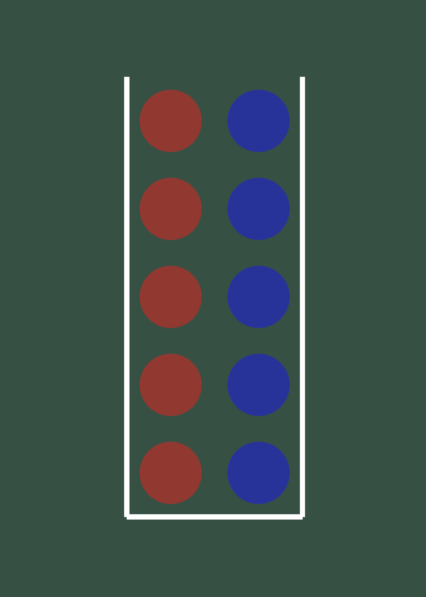

```{r setup, include=FALSE}
options(htmltools.dir.version = FALSE)
knitr::opts_chunk$set(warning = FALSE, message = FALSE)
library(tidyverse) # load tidyverse package
library(MASS)
library(ggplot2)
library(ggthemes)
library(kableExtra)
library(flextable)
library(cowplot)
library(xaringan)
library(xaringanthemer)
#library(gg3D)
library(leaflet)
library(maps)
library(fontawesome)
library(ggrepel)
library(DescTools)
library(renderthis)
library(wesanderson)
library(DiagrammeR)


## To create pdf version:

# setwd("~/Documents/PSY 208/PSY_207-208_23-24/Lectures")
# renderthis::to_pdf("Probability_Theory_IV.Rmd", complex_slides = TRUE)

## To create PowerPoint version:

# renderthis::to_pptx("Probability_Theory_IV.Rmd", complex_slides = TRUE)
```


### Binomial Probability

**Binomial**: *Two names*

> Used when we have *Nominal* data (*categorical* outcomes) with 2 possibilities

**Binomial Trial**: a defined experiment with 2 possible outcomes

**Binomial problem:** how likely is it to get a given number of certain outcomes given $n$ binomial trials with replacement\*?


.footnote[\*binomial probability is always **with replacement**. we use **hypergeometric** probability for binary outcomes **without replacement**]
---

### Binomial Probability

The two binomial outcomes are defined as:

> $s$: \# of **successes**

> $f$: \# of **failures**, where

> ** $s + f = N$**

**Either** outcome can be $s$ (and either outcome can be $f$) - it's an **arbitrary designation**

.slightly-smaller[

> *success* and *failure* are, to be fair, a little judgmental-sounding. But, they are more descriptive than the alternative: $x$ and $N-x$.
]

---

### Binomial Probability

**Example**: *One flip of a fair coin*

.pull-left[
```{r echo=FALSE, fig.align='center', fig.height = 4}
DiagrammeR::grViz("
  digraph graph2 {
  
  graph [layout = dot, rankdir = LR, bgcolor = none, fontname = Helvetica, arrowhead=none]
  
  # node definitions with substituted label text
  node [shape = oval, fontname=Helvetica, color=white, fontcolor=white]
  edge [color=white, arrowhead=none, fontcolor=white, fontname=Helvetica]
 # bgcolor = #446455
  
  a0 [shape = 'point']
  a [label = 'Heads']
  b [label = 'Tails']

  a0 -> a [label = '0.5']
  a0 -> b [label = '0.5']

  }
  
  ",
width = 400,
height=250)

# p_1 - 'p\u2081'
```
]

.pull-right[

```{r echo=FALSE, fig.height = 4}
heads<-c(0, 1)
pheads<-dbinom(heads, 1, 0.5)

ggplot(data.frame(heads, pheads), aes(heads, pheads))+
  geom_bar(stat="identity")+
  theme_tufte(ticks=FALSE)+
  theme_xaringan(css_file = "chevalier.css")+
  labs(x="Heads",
       y="Probability")+
  scale_x_continuous(breaks = c(0, 1))
```

]

---

### Binomial Probability

> **Example**: *Two flips of a fair coin*

.pull-left[
```{r echo=FALSE, fig.align='center'}
DiagrammeR::grViz("
  digraph graph2 {
  
  graph [layout = dot, rankdir = LR, bgcolor = none, fontname = Helvetica, arrowhead=none]
  
  # node definitions with substituted label text
  node [shape = oval, fontname=Helvetica, color=white, fontcolor=white]
  edge [color=white, arrowhead=none, fontcolor=white, fontname=Helvetica]
 # bgcolor = #446455
  
  a0 [shape = 'point']
  a [label = 'Heads']
  b [label = 'Tails']
  c [label = 'Heads']
  d [label = 'Tails']
  e [label = 'Heads']
  f [label = 'Tails']

  a0 -> a [label = '0.5']
  a0 -> b [label = '0.5']
  a -> c [label = '0.5']
  a -> d [label = '0.5']
  b -> e [label = '0.5']
  b -> f [label = '0.5']

  }
  
  ",
width = 350,
height=400)

# p_1 - 'p\u2081'
```
]

.pull-right[

```{r echo=FALSE}
heads<-c(0, 1, 2)
pheads<-dbinom(heads, max(heads), 0.5)

ggplot(data.frame(heads, pheads), aes(heads, pheads))+
  geom_bar(stat="identity")+
  theme_tufte(ticks=FALSE)+
  theme_xaringan(css_file = "chevalier.css")+
  labs(x="Heads",
       y="Probability")
```

]

---
### Binomial Probability

> **Example**: *Three flips of a fair coin*

.pull-left[
```{r echo=FALSE, fig.align='center'}
DiagrammeR::grViz("
  digraph graph2 {
  
  graph [layout = dot, rankdir = LR, bgcolor = none, fontname = Helvetica, arrowhead=none]
  
  # node definitions with substituted label text
  node [shape = oval, fontname=Helvetica, color=white, fontcolor=white]
  edge [color=white, arrowhead=none, fontcolor=white, fontname=Helvetica]
 # bgcolor = #446455
  
  a0 [shape = 'point']
  a [label = 'Heads']
  b [label = 'Tails']

  c [label = 'Heads']
  d [label = 'Tails']
  e [label = 'Heads']
  f [label = 'Tails']

  g [label = 'Heads']
  h [label = 'Tails']
  i [label = 'Heads']
  j [label = 'Tails']
  k [label = 'Heads']
  l [label = 'Tails']
  m [label = 'Heads']
  n [label = 'Tails']

  a0 -> a [label = '0.5']
  a0 -> b [label = '0.5']
  a -> c [label = '0.5']
  a -> d [label = '0.5']
  b -> e [label = '0.5']
  b -> f [label = '0.5']
  c -> g [label = '0.5']
  c -> h [label = '0.5']
  d -> i [label = '0.5']
  d -> j [label = '0.5']
  e -> k [label = '0.5']
  e -> l [label = '0.5']
  f -> m [label = '0.5']
  f -> n [label = '0.5']

  }
  
  ",
width = 350,
height=400)

# p_1 - 'p\u2081'
```
]

.pull-right[

```{r echo=FALSE}
heads<-c(0, 1, 2, 3)
pheads<-dbinom(heads, max(heads), 0.5)

ggplot(data.frame(heads, pheads), aes(heads, pheads))+
  geom_bar(stat="identity")+
  theme_tufte(ticks=FALSE)+
  theme_xaringan(css_file = "chevalier.css")+
  labs(x="Heads",
       y="Probability")
```

]

---

### Binomial Likelihood Function

There is a **pattern** to the probabilities generated by binomial probability.

> The probability of $s$ successes is **conditional** on the **number of trials** $N$ and the **probability of success on each trial** $\pi$. Thus, we call it **the binomial likelihood function**


> There are two parts to the **Binomial Likelihood Function**: the **kernel probability** and the **combinatorial**

.textbox[
**Note:** the binomial **likelihood function** is also known as the binomial **Probability Mass Function (PMF)**
]

---

### Binomial Likelihood Function

.pull-left[
```{r echo=FALSE, fig.align='left'}
DiagrammeR::grViz("
  digraph rmarkdown {
  
  graph [layout = dot, rankdir = LR, bgcolor = none, fontname = Helvetica, arrowhead=none]
  
  # node definitions with substituted label text
  node [shape = oval, fontname=Helvetica, color=white, fontcolor=white]
  edge [color=white, arrowhead=none, fontcolor=white, fontname=Helvetica]
 # bgcolor = #446455
  
  a0 [shape = 'point']
  a [label = 's']
  b [label = 'f']

  c [label = 's']
  d [label = 'f']
  e [label = 's']
  f [label = 'f']

  g [label = 's']
  h [label = 'f']
  i [label = 's']
  j [label = 'f']
  k [label = 's']
  l [label = 'f']
  m [label = 's']
  n [label = 'f']

  a0 -> a [label = '\u03c0', color=yellow]
  a0 -> b [label = '1-\u03c0', color=yellow]
  a -> c [label = '\u03c0', color=yellow]
  a -> d [label = '1-\u03c0', color=yellow]
  b -> e [label = '\u03c0', color=yellow]
  b -> f [label = '1-\u03c0']
  c -> g [label = '\u03c0']
  c -> h [label = '1-\u03c0', color=yellow]
  d -> i [label = '\u03c0', color = yellow]
  d -> j [label = '1-\u03c0']
  e -> k [label = '\u03c0', color=yellow]
  e -> l [label = '1-\u03c0']
  f -> m [label = '\u03c0']
  f -> n [label = '1-\u03c0']

  }
  
  ",
width = 350,
height=400)

# p_1 - 'p\u2081'
```
]

.pull-right[
The **kernel probability** is the probability of **each individual combination** that results in a given $s$.

The probability of each combination is:

$$p(s)=\pi^s (1-\pi)^f$$

For example, to get ** $s=2$** and ** $f=1$**, you have to go across **2 $\pi$ edges** and **1 $(1-\pi)$ edge**.

]
---

### Binomial Likelihood Function


The **combinatorial** counts **all the paths** that get to a given combination of $s$ and $f$. 

The **order** of events doesn't matter! So we will use the **combination formula**.

> How many ways can $N$ things be combined $s$ at a time?

### $$\frac{N!}{s!f!}$$

Note: the combinatorial is also written as $N \choose s$, so ${N \choose s} =\frac{N}{s!f!}$

---

### Binomial Likelihood Function

.slightly-smaller[

Therefore, **the probability of observing $s$ successes given $n$ trials and probability $\pi$ of success on each trial** is:

> the probability of each way of observing $s$ successes in $n$ trials

>> times

> the number of ways $s$ successes can be observed in $n$ trials.

]

### $$p(s|n, \pi)=\frac{n!}{s!f!}\pi^s(1-\pi)^f$$

---

### Binomial Likelihood Function

> **Example 1**: *What is the probability of getting 3* Heads *in 4 flips of a fair coin?*

$$p(s|n, \pi)=\frac{n!}{s!f!}\pi^s(1-\pi)^f$$

$$p(s=3|N=4, \pi=0.5)=\frac{4!}{3!1!}0.5^3(0.5)^1=`r dbinom(3, 4, 0.5)`$$

---

### Binomial Likelihood Function

> **Example 2**: There are 3 doors; 7 people walk through one of them.

> Each door is equally likely to be chosen.

> *What is the probability that 5 or more of the 7 choose door B?* 

```{r echo=FALSE, fig.align = 'center', fig.height = 4, fig.width = 10}
ggplot(data.frame(x=c(1, 2, 3), y = rep(0, 3), label=c("A", "B", "C")), aes(x, y))+
  geom_label(aes(label=label), size=100, family="mono")+
  theme_xaringan(css_file = "chevalier.css")+
  coord_cartesian(xlim=c(0.5, 3.5), ylim = c(-0.5, 0.5))+
  theme(axis.line = element_blank(),
        axis.text = element_blank(),
        axis.title = element_blank(),
        panel.grid = element_blank(),
        axis.ticks = element_blank())
```

---

### Binomial Likelihood Function

Although there are three doors, there are only **two events** we are interested in: **Door B** and ***not*** **Door B**

$$p(Door~B)=\pi=\frac{1}{3}$$

$$\begin{aligned} p\left(s\ge 5|n=7, \pi=\frac{1}{3}\right)=\frac{7!}{5!2!}\left(\frac{1}{3}\right)^5 \left(\frac{2}{3}\right)^2 \\  +\frac{7!}{6!1!}\left(\frac{1}{3}\right)^6 \left(\frac{2}{3}\right)^1 \\ +\frac{7!}{7!0!}\left(\frac{1}{3}\right)^7 \left(\frac{2}{3}\right)^0 \end{aligned}$$

$$=`r round(dbinom(5, 7, (1/3)), 4)`+`r round(dbinom(6, 7, (1/3)), 4)`+`r round(dbinom(7, 7, (1/3)), 4)`=`r round(pbinom(4, 7, (1/3), lower.tail=FALSE), 4)`$$
---

### Binomial: Expected Value and Variance

The **expected value** of the **binomial distribution**\* is:

$$\text{E}(x)=N\pi$$
The **variance** of the **binomial distribution** is:

$$\text{V}(x)=N\pi(1-\pi)$$
**All you need** to calculate $\text{E}(x)$ and $\text{V}(x)$ are ** $N$** and ** $\pi$**

> That means that ** $N$** and ** $\pi$** are the **sufficient statistics** for binomial data (we'll use that term a lot).

.footnote[
\*which we will discuss extensively later
]

---

### Binomial: Expected Value and Variance

For example, if we flip a fair coin ** $1,000$ times**:

> ** $N = 1,000$**

> ** $\pi = 0.5$**


$$\text{E}(x)=(1000)(0.5)=500$$

$$\text{V}(x)=(1000)(0.5)(0.5)=250$$
.footnote[

(remember how I said there would be a **much** easier way to calculate the variance of a binary outcome? There it is!)
]
---
### Hypergeometric Probability

As noted above, **binomial probability** is strictly about **sampling** ***with*** **replacement**.

**Binary data** that are **sampled** ***without*** **replacement** are governed by **hypergeometric probability**.

.textbox[
Note: the name **hypergeometric** comes from its relationship to a **hypergeometric series**

> geometric series

$$a + ar + ar^2 + ...$$
> **hypergeometric** series:

$$1+\frac{a\times b}{c\times1}z+\frac{a(a+1)b(b+1)}{c(c+1)\times1\times2}z^2+...$$


]
---

### Hypergeometric Probability

.pull-leftcolumn[

```{r echo = FALSE, fig.width = 5}

hypermarbles<-data.frame(x = rep(c(1,2), each = 5),
           y = rep(c(1:5), 2),
           color = c(rep("Red", 5),
                    rep("Blue", 5))) %>% 
  ggplot(aes(x = x,
             y = y,
             color = color))+
  geom_point(size = 24)+
  theme_tufte()+
  theme_xaringan()+
  scale_color_manual(values = c("#283399",
                               "#913831"))+
  geom_segment(x = 0.5,
               xend = 0.5,
               y = 0.5,
               yend = 5.5,
               color = "#ffffff",
               linewidth = 2)+
    geom_segment(x = 2.5,
               xend = 2.5,
               y = 0.5,
               yend = 5.5,
               color = "#ffffff",
               linewidth = 2)+
    geom_segment(x = 0.5,
               xend = 2.5,
               y = 0.5,
               yend = 0.5,
               color = "#ffffff",
               linewidth = 2)+
  coord_fixed(xlim = c(0, 3),
              ylim = c(0, 6))+
  theme(axis.text = element_blank(),
        axis.title = element_blank(),
        axis.ticks = element_blank(),
        legend.position = "none")

ggsave("images/hypermarbles.png")


```


]

.pull-rightcolumn[

Let's draw some more **marbles** out of a **jar** 

(specifically, the one on the left)

What's the probability of drawing **two consecutive** .red[red] **marbles without replacement?**

]

There are two things we need to know: 

1. How many **possible combinations of 2** .red[red] **marbles** are there? 

2. How many **possible combinations of** any **2 marbles** are there?
---

### Hypergeometric Probability

We are going to use the **combinatorial** formula again:

> number of 2-red marble combinations:

$$_nC_r=_5C_2={5 \choose 2}=\frac{5!}{3!2!}=10$$
> total number of 2 marble combinations:

$$_nC_r=_{10}C_2={10 \choose 2}=\frac{10!}{8!2!}=45$$
.center[

$\therefore$ the probability is ** $\frac{10}{45}$**

]

---
### Hypergeometric Probability

.pull-leftcolumn[
```{r echo = FALSE, out.width = "75%"}


```

]

.pull-rightcolumn[

What's the probability of drawing **two** .red[red] **marbles** ***and*** **two** .blue[blue] **marbles without replacement?**


]

Now there are two new things we need to know: 

1. How many **possible combinations of 2** .red[red] **AND** **2** .blue[blue] **marbles** are there? 

2. How many **possible combinations of** any **4 marbles** are there?

---

### Hypergeometric Probability

By the same logic that we derived the **combination** formula, the **combined number of combinations** of .red[red] and .blue[blue] marbles is the product of the two **combinatorials**:

$$(_5C_2)(_5C_2)={5 \choose 2}{5 \choose 2}=\left(\frac{5!}{3!2!}\right)\left(\frac{5!}{3!2!}\right)=100$$
The total number of 4-marble combinations is given by a single **combinatorial**:

$$_{10}C_4={10 \choose 4}=\frac{10!}{6!4!}=210$$
.center[

$\therefore$ the probability is ** $\frac{100}{210}$**

]

---


### Hypergeometric Probability

Let's define some **symbols**:


> ** $N$** = the total number of things

> ** $n$** = the number of things drawn

***

> ** $S$** = the total number of *successes* in the population

> ** $s$** = the number of *successes* drawn

***

> ** $F$** = the total number of *failures* in the population

> ** $f$** = the total number of *failures* drawn

---

### Hypergeometric Probability


The **hypergeometric probability mass function** is the product of the **combinatorials** for ** $s$** and ** $f$** divided by the **combinatorial** for ** $n$**

### $$p(s)=\frac{{S \choose s}{F \choose f}}{N \choose n}=\frac{\left(\frac{S!}{s!(S-s)!}\right)\left(\frac{F!}{f!(F-f)!}\right)}{\frac{N!}{n!(N-n)!}}$$

---

### Binomial *v.* Hypergeometric Models

.slightly-smaller[
**Hypergeometric models** imply populations of **finite** and **knowable** size. 


> Sampling **with replacement** only meaningfully differs from sampling **without replacement** when the **sample size** is large enough relative to the **population size** to make a difference.


**Fixed-population** analyses are appropriate when:

1. The population size is **known**

2. The population is ** $\ge 20$** times as large as the sample\*.

Otherwise, we assume an **infinite** population.

]

.footnote[
\*that's a rule-of-thumb. always take rules-of-thumb with grains-of-salt.
]

---

### Binomial *v.* Hypergeometric Models

The **binomial model** is **much** more frequently used and important to statistical analysis in general.

The **hypergeometric model** is used in:

> fields with **large samples** (*e.g.*, epidemiology, public health, survey statistics)

> some of the **nonparametric tests**

