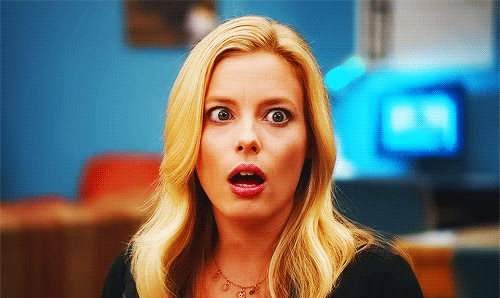
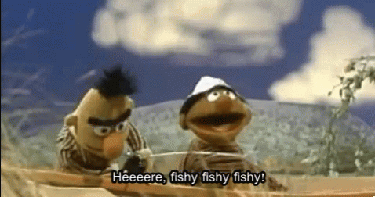

  
```{r setup, include=FALSE}
options(htmltools.dir.version = FALSE)
knitr::opts_chunk$set(warning = FALSE, message = FALSE)

set.seed(77)

library(tidyverse) # load tidyverse package
library(MASS)
library(ggplot2)
library(ggthemes)
library(kableExtra)
library(flextable)
library(cowplot)
library(xaringan)
library(xaringanthemer)
#library(gg3D)
library(leaflet)
library(maps)
library(fontawesome)

# Sample Data
load("~/Documents/PSY 208/Spring 2023/PSY207_208/cor_reg_df.RData")

# NBA Data
NBA<-data.frame(read.csv("~/Documents/PSY 208/Spring 2023/PSY207_208/nbahomenoOT.csv"))
NBAsummary<-data.frame(read.csv("~/Documents/PSY 208/Spring 2023/PSY207_208/NBAHomeWinNoOT.csv"))

# Poisson Data
fish_df<-data.frame(cost=sort(rnorm(1000, mean=180, sd=30))+runif(1000, min=-70, max=-10),
                    fish=sort(rpois(1000, 1)))

# Negbinom Data
overfish_df<-data.frame(cost=sort(rnorm(1000, mean=180, sd=30))+runif(1000, min=-70, max=-10),
                    fish=sort(rnbinom(1000, 2, 0.5)))

## To create pdf version:
# setwd("~/Documents/PSY 208/PSY_207-208_23-24/Lectures")
# renderthis::to_pdf("Regression_I.Rmd", complex_slides = TRUE)

## To create PowerPoint version:

# renderthis::to_pptx("Regression_I.Rmd", complex_slides = TRUE)

```


### Data for our example


.pull-left[


```{r echo = FALSE, fig.height = 8}
set.seed(12)
# create the variance covariance matrix
sigma<-rbind(c(1,-0.8, 0.7), c(-0.8,1, -0.2), c(0.7, -0.2, 1))
# create the mean vector
mu<-c(10, 5, 2) 
# generate the multivariate normal distribution
df<-as.data.frame(mvrnorm(n=10, mu=mu, Sigma=sigma)) %>% 
  rename(y = V1,
         x1 = V2,
         x2 = V3) %>% 
  arrange(x1)

ggplot(df, aes(x1, y))+
  theme_tufte(base_size = 24, base_family="sans", ticks = FALSE)+
  geom_point(color = "#1e90ff",
             size=8)+
  theme_xaringan(css_file = "nighttime_in_the_big_city.css")+
  scale_xaringan_fill_discrete()+
  annotate("text",
           x = 5,
           y = 12,
           label = bquote(r==.(round(cor(df$x1, df$y), 2))),
           size = 48/.pt)+
  labs(x = "x", y = "y")
  
  
```
]


.pull-right[

```{r echo=FALSE}
df %>% 
  dplyr::select(x1, y) %>% 
  kable("html",
        escape = FALSE,
        digits = 2,
        booktabs = TRUE,
        col.names = c("\\(x\\)", "\\(y\\)")) %>% 
  kable_styling(font_size = 20,
                full_width = TRUE,
                bootstrap_options = "none")
```

]


---
### Standardized Score Scatterplot

.pull-left[

```{r echo=FALSE, fig.height = 6}
df <-df %>% 
  mutate(zx = (x1 - mean(x1))/sd(x1)) %>% 
  mutate(zy = (y - mean(y))/sd(y)) 

ggplot(df, aes(zx, zy))+
  theme_tufte(base_size = 24, base_family="sans", ticks = FALSE)+
  geom_point(color = "#1e90ff",
             size=8)+
  theme_xaringan(css_file = "nighttime_in_the_big_city.css")+
  theme(axis.title = element_text(size = 128/.pt))+
  scale_xaringan_fill_discrete()+
  labs(x=bquote(z[x]),
       y=bquote(z[y]))+
  annotate("label",
           x=0,
           y=0,
           color = "#041526",
           fill = "#e8f3ff",
           label="(0, 0)",
           size = 36/.pt)

```

]

.pull-right[


.slightly-smaller[

Fundamentally, simple regression predicts the **standardized** scores of the **predicted variable** from the **standardized** scores of the **predictor variable**: ** $z_x$** predicts ** $z_y$**.

Regression models using the **raw scores** (** $x$** and ** $y$**) -- are just algebraic rearrangments of the standardized score models.

]
]

.center[

.slightly-smaller[

Because **the mean of** ***any*** **set of $z$-scores is 0**, we know that the scatterplot is going to be centered around $(z_x,~z_y) = (0,~0)$, and therefore **the $y$-intercept is 0.**

]
]

---


### $r$ as slope in $z$-score form

.pull-left[

```{r echo = FALSE, fig.height = 5.25}
corx1y<-cor(df$x1, df$y)
df %>% 
  ggplot(aes(zx, zy))+
  theme_tufte(base_size = 24, base_family="sans", ticks = FALSE)+
  geom_point(
    size=5)+
  theme_xaringan(css_file = "nighttime_in_the_big_city.css")+
  scale_xaringan_fill_discrete()+
  geom_abline(slope = cor(df$x1, df$y),
              intercept = 0,
              color = "#f5e042",
              size=2)+
  labs(x=bquote(z[x]),
       y=bquote(z[y]))+
  geom_segment(x=-1,
               xend = -1,
               y=-corx1y,
               yend = 0,
               color = "#f5e042",
               lty=2,
               size=2)+
  geom_segment(x=-1,
               xend = 0,
               y=0,
               yend = 0,
               color = "#f5e042",
               lty=2,
               size=2)+
  annotate("text",
           x = -1.05,
           y=0.4,
           label = bquote(Delta[y]==.(round(corx1y, 2))),
           size=32/.pt,
           hjust=1)+
  annotate("text",
           x = -0.5,
           y=-0.3,
           label = bquote(Delta[x]==1),
           size=32/.pt)+
  theme(axis.title = element_text(size = 48))
```

]

.pull-right[

.slightly-smaller[
** $r = `r round(corx1y, 2)`$** indicates that **for each $1$ unit change of $z_x$**, **there is a $`r round(corx1y, 2)`$ unit change of $z_y$**.

That relationship is depicted visually by the **slope** of the line: the change in $y$ divided by the change in $x$ $(\Delta_y/\Delta_x)$.

Thus, the equation of this line is $\hat{z_y}=`r round(corx1y, 2)`z_x$
]
]

***

In general, the ** $z$-score** (or **standardized**) **form** of a regression equation is 
** $$\hat{z_y}=rz_x$$**


---

### Regression Lines

Given that the $z$-score form of the regression model equation is:

$$\hat{z_y}=rz_x$$
.pull-left[

once we know the value of $r$, we need only our superior algebra skills to rearrange the numbers to create a **raw score form** that shows the relationship between **untransformed $x$ and $y$**:

]

.pull-right[

```{r echo = FALSE, fig.height = 4, fig.align = 'center'}
df %>% 
  ggplot(aes(zx, zy))+
  theme_tufte(base_size = 10, base_family="sans", ticks = FALSE)+
  geom_point(
    size=4)+
  theme_xaringan(css_file = "nighttime_in_the_big_city.css")+
  scale_xaringan_fill_discrete()+
  geom_abline(slope = cor(df$x1, df$y),
              intercept = 0,
              color = "#f5e042",
              linewidth = 1.5)+
  labs(x=bquote(z[x]),
       y=bquote(z[y]))


```

]

$$\hat{y}= ax+b$$
              
where $a$ is the **slope** and $b$ is the **intercept**.

---

### $z$-score form to raw-score form

To find the intercept, we need to know **what $y$ is when $x = 0$**. 

***

.pull-left[

**1. Convert $x=0$ to $z_x$**

$$z_{x=0}=\frac{0-\bar{x}}{sd(x)}=\frac{0-`r round(mean(df$x1), 2)`}{`r round(sd(df$x1), 2)`}=`r round(-mean(df$x1)/sd(df$x1), 2)`$$

**2. Find $z_y$ for when $z_{x=0}$**

$$z_y=rz_x=(`r round(corx1y, 2)`)(`r round(-mean(df$x1)/sd(df$x1),2)`)= `r round(corx1y*(-mean(df$x1)/sd(df$x1)), 2)`$$

]

.pull-right[

**3. Convert that $z_y$ to $y$**

$$z_y=\frac{y-\bar{y}}{sd(y)}$$

$$`r round(corx1y*(-mean(df$x1)/sd(df$x1)), 2)`=\frac{y- `r round(mean(df$y), 2)`}{`r round(sd(df$y), 2)`}$$

$$y=(`r round(corx1y*(-mean(df$x1)/sd(df$x1)), 2)`)(`r round(sd(df$y), 2)`) + `r round(mean(df$y), 2)`=`r round(corx1y*(-mean(df$x1)/sd(df$x1))*sd(df$y)+mean(df$y), 2)`$$
```{r echo=FALSE}
y.int<-corx1y*(-mean(df$x1)/sd(df$x1))*sd(df$y)+mean(df$y)
```

]

***

Therefore, the ** $y$-intercept** of the raw-score equation is ** $`r round(y.int, 2)`$**.

---

### $z$-score form to raw-score form

.slightly-smaller[
To find the slope, we need to know **two points** on the line and **we already know one**: the $y$-intercept. So, we repeat the process with any other $x$ value: let's use $x=1$ because it will make the math marginally easier.
]

***

.pull-left[

**1. Convert $x=1$ to $z_x$**

$$z_{x=1}=\frac{1-\bar{x}}{sd(x)}=\frac{1-`r round(mean(df$x1), 2)`}{`r round(sd(df$x1), 2)`}=`r round((1-mean(df$x1))/sd(df$x1), 2)`$$

**2. Find $z_y$ for when $z_{x=1}$**

$$z_y=rz_x=(`r round(corx1y, 2)`)(`r round((1-mean(df$x1))/sd(df$x1),2)`)= `r round(corx1y*((1-mean(df$x1))/sd(df$x1)), 2)`$$

]

.pull-right[

**3. Convert that $z_y$ to $y$**

$$z_y=\frac{y-\bar{y}}{sd(y)}$$

$$`r round(corx1y*((1-mean(df$x1))/sd(df$x1)), 2)`=\frac{y- `r round(mean(df$y), 2)`}{`r round(sd(df$y), 2)`}$$

$$y=(`r round(corx1y*((1-mean(df$x1))/sd(df$x1)), 2)`)(`r round(sd(df$y), 2)`) + `r round(mean(df$y), 2)`=`r round(corx1y*((1-mean(df$x1))/sd(df$x1))*sd(df$y)+mean(df$y), 2)`$$
]

```{r echo=FALSE}
y2<-corx1y*((1-mean(df$x1))/sd(df$x1))*sd(df$y)+mean(df$y)
```

***

Therefore, the second point is ** $(1, `r round(y2, 2)`)$**.

---

### $z$-score form to raw-score form

The **slope of the line** is therefore:

$$a=\frac{\Delta_y}{\Delta_x}=\frac{`r round(y2, 2)` - `r round(y.int, 2)`}{1-0}=`r round(y2-y.int, 2)`$$

```{r echo=FALSE}
slope<-y2-y.int
```

***

.left-column[
and the final equation is:

** $$\hat{y}=`r round(slope, 2)`x+`r round(y.int, 2)`$$**

]

.right-column[

```{r echo=FALSE, fig.height=3.5, fig.align='right'}
df %>% 
  ggplot(aes(x1, y))+
  theme_tufte(base_size = 10, base_family="sans", ticks = FALSE)+
  geom_point(
    size=6)+
  theme_xaringan(css_file = "nighttime_in_the_big_city.css")+
  scale_xaringan_fill_discrete()+
  geom_abline(slope = slope,
              intercept = y.int,
              color = "#f5e042",
              linewidth = 1.5)+
  labs(x=bquote(z[x]),
       y=bquote(z[y]))
```
]

---

### $\hat{Hats}$

The hats over $\hat{z_y}$ and $\hat{y}$ are there to show that we're talking about **estimates**. Without the hat, it would imply that $ax+b$ equals **exactly** y.

.center[]

The amount that the regression line misses the $y$ values by is called the **error**.
---

### Error in Simple Regression

.pull-left[

$\hat{y}$ is the $y$-value **on the regression line**.

> *not* the **observed $y$**

If we add the errors for each prediction -- indicated by the little white lines in the figure -- to $\hat{y}$, we get to the *exact* $y$ values.

Thus: 

** $$\hat{y}=y+\epsilon$$**

]
.pull-right[

```{r echo=FALSE, fig.height=7}
df %>% 
  mutate(ypred = slope*x1+y.int) %>% 
  ggplot(aes(x1, y))+
  theme_tufte(base_size = 10, base_family="sans", ticks = FALSE)+
  geom_point(
    size=7)+
  theme_xaringan(css_file = "nighttime_in_the_big_city.css")+
  scale_xaringan_fill_discrete()+
  geom_abline(slope = slope,
              intercept = y.int,
              color = "#f5e042",
              size=2)+
  labs(x=bquote(x),
       y=bquote(y))+
  geom_segment(mapping=aes(x=x1,
                           y=y,
                           xend=x1,
                           yend=ypred),
               size=1.5)
```
]

---

### Error in Simple Regression

.pull-left[

The **total error** of a simple regression model expressed as a proportion of the variance of $y$ is:

$$\frac{SS_{error}}{SS_{total}}$$
It also has another formula:

$$1-r^2$$


]
.pull-right[

```{r echo=FALSE, fig.height=5.5}
samp_model<-summary(lm(y~x1, data=df))
slope <- samp_model$coefficients[2]
y.int <- samp_model$coefficients[1]

df %>% 
  mutate(ypred = slope*x1+y.int) %>% 
  ggplot(aes(x1, y))+
  theme_tufte(base_size = 10, base_family="sans", ticks = FALSE)+
  geom_point(
    size=7)+
  theme_xaringan(css_file = "nighttime_in_the_big_city.css")+
  scale_xaringan_fill_discrete()+
  geom_abline(slope = slope,
              intercept = y.int,
              color = "#f5e042",
              size=2)+
  labs(x=bquote(z[x]),
       y=bquote(z[y]))+
  geom_segment(mapping=aes(x=x1,
                           y=y,
                           xend=x1,
                           yend=ypred),
               size=1.5)
```
]

.center[
$r^2$ is the **proportion of the variance** in $y$ that is ***not*** the error:

** $$r^2=\frac{SS_{total}-SS_{error}}{SS_{total}}$$**
]
---
### Calculating $r^2$

.pull-left[

```{r echo=FALSE}

options(knitr.kable.NA = "")

df<- df %>% 
  mutate(ypred = slope*x1+y.int) 

df %>% 
  dplyr::select(x1, y, ypred) %>% 
  mutate(ypred = round(ypred, 2)) %>% 
  mutate(ypred = c(ypred[1], rep(NA, 9))) %>% 
  mutate(ypred = case_when(!is.na(ypred) ~cell_spec(ypred, 
                        background = c("dodgerblue")))) %>%
  kable(col.names = c("\\(x\\)",
                      "\\(y\\)",
                      "\\(\\hat{y}\\)"),
        escape = FALSE,
        digits = 2,
        align = "c") %>% 
  kable_styling(font_size = 22,
                full_width = TRUE,
                bootstrap_options = "none") 

  
```
]

.pull-right[


**Step 1**: 

Use the (raw-score) regression equation with each value of $x$ to calculate **predicted** $y$ values.

$$\hat{y}_i=`r round(slope, 2)`x_i+`r round(y.int, 2)`$$

> Example (row 1):

$$\hat{y}_i=(`r round(slope, 2)`)(`r round(df$x1[1], 2)`)+`r round(y.int, 2)`=`r round(df$ypred[1], 2)`$$
]

---
### Calculating $r^2$

.pull-left[

```{r echo=FALSE}

options(knitr.kable.NA = "")

df<- df %>% 
  mutate(resid = y-ypred)

df %>% 
  dplyr::select(x1, y, ypred, resid) %>% 
  kable(col.names = c("\\(x\\)",
                      "\\(y\\)",
                      "\\(\\hat{y}\\)",
                      "\\(y-\\hat{y}\\)"),
        escape = FALSE,
        digits = 2,
        align = "c") %>% 
  kable_styling(font_size = 22,
                full_width = TRUE,
                bootstrap_options = "none") %>% 
  column_spec(4, background = "dodgerblue")

  
```
]

.pull-right[


**Step 2**: 

Calculate the **residuals** (or, **errors**) $y_i-\hat{y}_i$

$$\hat{y}=`r round(slope, 2)`x+`r round(y.int, 2)`$$

> Example (row 1):

$$\hat{y}_i-y_i=`r round(df$y[1], 2)`-`r round(df$ypred[1], 2)`=`r round(df$resid[1], 2)`$$

NOTE: the sum of this column is $0$. It's **always** $0$.

]

---

### Calculating $r^2$

.pull-left[

```{r echo=FALSE}

options(knitr.kable.NA = "")

df<- df %>% 
  mutate(resid2 = resid^2)

df %>% 
  dplyr::select(x1, y, ypred, resid, resid2) %>% 
  kable(col.names = c("\\(x\\)",
                      "\\(y\\)",
                      "\\(\\hat{y}\\)",
                      "\\(y-\\hat{y}\\)",
                      "\\((y-\\hat{y})^2\\)"),
        escape = FALSE,
        digits = 2,
        align = "c") %>% 
  kable_styling(font_size = 22,
                full_width = TRUE,
                bootstrap_options = "none") %>% 
  column_spec(5, background = "dodgerblue")

  
```
]

.pull-right[


**Step 3**: 

**Square** the **residuals**: 

$$(y_i-\hat{y}_i)^2$$


The sum of this column is ** $SS_{error}$**

]

---

### Calculating $r^2$

.pull-left[

```{r echo=FALSE}

options(knitr.kable.NA = "")

df<- df %>% 
  mutate(dev2 = (y-mean(y))^2)

df %>% 
  dplyr::select(x1, y, ypred, resid, resid2,dev2) %>% 
  kable(col.names = c("\\(x\\)",
                      "\\(y\\)",
                      "\\(\\hat{y}\\)",
                      "\\(y-\\hat{y}\\)",
                      "\\((y-\\hat{y})^2\\)",
                      "\\((y-\\bar{y})^2\\)"),
        escape = FALSE,
        digits = 2,
        align = "c") %>% 
  kable_styling(font_size = 20,
                full_width = TRUE,
                bootstrap_options = "none") %>% 
  column_spec(6, background = "dodgerblue")

  
```
]

.pull-right[


**Step 4**: 

**Square the deviations** of $y$: $(y_i-\bar{y}_i)^2$

The sum of that column is ** $SS_{total}$**.

It's also the **numerator of the variance** of $y$, so:

$$SS_{total}=(n-1)s_y^2$$

]

---

### Calculating $r^2$


$$r^2=\frac{SS_{total}-SS_{error}}{SS_{total}}= \frac{`r round(sum(df$dev2), 2)`-`r round(sum(df$resid2), 2)`}{`r round(sum(df$dev2), 2)`}=`r round((sum(df$dev2)-sum(df$resid2))/sum(df$dev2), 2)`$$
You will be **shocked** to learn...

```{r echo=FALSE, fig.align='center', out.width = "50%"}

```

that ** $r^2$ is exactly the square of the $r$ value that we calculated in the** ***correlation*** **slides** $(`r round(cor(df$x1, df$y), 2)`^2)$

---


### Simple Linear Regression in R

```{r echo=FALSE}
x<-df$x1
y<-df$y
```

```{r}
summary(lm(y~x)) # "lm" stands for "linear model"
```


---
### $r^2$


```{r echo=FALSE}
dentists<-data.frame(read.csv("~/Documents/PSY 208/Spring 2023/PSY207_208/dentists.csv"))
mean_dentists<-mean(dentists$dentists)
dentreg <- summary(lm(dentists ~ pop, data = dentists))
```


**Imagine** somebody asks you **how many dentists** there are in: 

A. Colorado, B. Maine, and C. California.

You don't know this (honestly why would you?).

But you have this one bit of data: the average number of dentists per US state (and DC)\* is $`r round(mean_dentists)`$.

So, your (perfectly reasonable given the information you have) answer -- for each state -- is $`r round(mean_dentists)`$.


.footnote[\*source: [National Library of Medicine](https://www.ncbi.nlm.nih.gov/books/NBK569311/table/ch3.tab42/)]

---
### $r^2$

Let's see how you did!

```{r echo=FALSE}
dentists %>% 
  dplyr::select(state, dentists) %>% 
  filter(state %in% c("California", "Colorado", "Maine")) %>% 
  slice(2, 3, 1) %>% 
  mutate(dentists = format(dentists, big.mark = ",")) %>% 
  mutate(your.answer = "3,929") %>% 
  kable("html",
        col.names = c("State",
                      "Number of Dentists",
                      "Your Answer")) %>% 
  kable_styling(font_size = 28,
                full_width = TRUE,
                bootstrap_options = "none")
```

Guessing the mean is **a** strategy and it's not the **worst** strategy, but we can do **better** with a **regression model** and **some data**!

---
### $r^2$

Imagine somebody asks you the **same question**, only this time you know:

1. The **approximate populations** of Colorado, Maine, and California

2. The **regression equation for predicting the number of dentists in a state from that state's population**:

$$\hat{dentists}=0.00068\times population-434.3$$

Your new answers -- using the model this time -- would be:

```{r echo=FALSE}
dentists %>% 
  filter(state %in% c("California", "Colorado", "Maine")) %>% 
  slice(2, 3, 1) %>% 
  mutate(dentists = format(dentists, big.mark = ",")) %>% 
  mutate(your.answer = round(dentreg$coefficients[2]*pop+
           dentreg$coefficients[1], 2)) %>%
  mutate(your.answer = format(round(your.answer), big.mark = ",")) %>% 
    mutate(pop = format(round(pop), big.mark = ",")) %>% 
  kable("html",
        col.names = c("State",
                      "Population",
                      "Number of Dentists",
                      "Your Answer")) %>% 
  kable_styling(font_size = 22,
                full_width = TRUE,
                bootstrap_options = "none")
```


---

### Conceptualizing $r^2$

$r^2$ fact \#1: $r^2$ is **the proportionate reduction in error**.

This means that $r^2$ measures how much better predictions are using the model rather than simply using the mean.


.pull-left[

```{r echo=FALSE, fig.height = 5.5}
ggplot(dentists, aes(pop, dentists))+
  geom_point()+
  theme_tufte(base_size = 10, base_family="sans", ticks = FALSE)+
  theme_xaringan(css_file = "nighttime_in_the_big_city.css")+
  scale_xaringan_fill_discrete()+
  geom_segment(x=-Inf,
               xend = Inf, 
               y=mean_dentists,
               yend = mean_dentists,
              color = "#f5e042",
              size=1.5,
              lty=2)+
  labs(x="state population",
       y="number\nof dentists")+
  annotate("text",
           x=Inf,
           y= mean_dentists,
           label = paste0("mean = ", round(mean_dentists), " dentists"),
           vjust=-1,
           hjust=1,
           size=24/.pt)+
  ggtitle("using the mean")
```
]

.pull-right[

```{r echo=FALSE, fig.height=5.5}
ggplot(dentists, aes(pop, dentists))+
  geom_point()+
  theme_tufte(base_size = 10, base_family="sans", ticks = FALSE)+
  theme_xaringan(css_file = "nighttime_in_the_big_city.css")+
  scale_xaringan_fill_discrete()+
  geom_abline(slope = dentreg$coefficients[2],
              intercept = dentreg$coefficients[1],
              color = "#f5e042",
              size=1.5,
              lty=2)+
  labs(x="state population",
       y="number\nof dentists")+
  annotate("text",
           x=Inf,
           y= mean_dentists,
           label = bquote(y==.(round(dentreg$coefficients[2],5))~x-434.3),
           vjust=-1,
           hjust=1,
           size=24/.pt)+
  ggtitle("using a model")
```
]

---

### Conceptualizing $r^2$

.pull-left[

.slightly-smaller[

**Imagine** that you are planning a speaking tour.

You are booked to give **statistics lectures** to **already-sold-out arenas** in the following cities:

- New York, NY
- Washington, DC
- Philadelphia, PA
- Charlotte, NC
- Atlanta, GA
- New Orleans, LA


Also, you love trains.
]
]

.pull-right[

.slightly-smaller[

Luckily for you: [The Amtrak Crescent](https://www.amtrak.com/crescent-train) goes through all of those cities.

If you took that train, you could say that **100%** of your trip was explained by the Crescent route.

]
```{r echo=FALSE, fig.width = 5, fig.height=3.5}
train <- awesomeIcons(icon = "train",
                      iconColor = "#f5e042",
                      library = 'fa')

crescent.cities<-us.cities %>% 
  filter(name %in% c("New Orleans LA",
                     "Atlanta GA",
                     "Charlotte NC",
                     "WASHINGTON DC",
                     "Philadelphia PA",
                     "New York NY")) %>% 
  mutate(on_crescent = 1)

leaflet(data = crescent.cities) %>% 
  addTiles() %>% 
  addAwesomeMarkers(~long, 
             ~lat, 
             label = ~as.character(name),
             icon = train)
```

] 

---

### Conceptualizing $r^2$

.pull-left[
.slightly-smaller[

Your tour has sold **so many tickets** that your agent (every statistician has one, obviously) wants to book shows in:

- Pittsburgh, PA
- Columbus, OH
- Wilmington, NC
- Memphis, TN
- Savannah, GA
- Jacksonville, FL
]

]

.pull-right[

```{r echo=FALSE, fig.width = 5, fig.height=3.5}
noncrescent.cities<-us.cities %>% 
  filter(name %in% c("Pittsburgh PA",
                     "Columbus OH",
                     "Wilmington NC",
                     "Memphis TN",
                     "Savannah GA",
                     "Jacksonville FL")) %>% 
  mutate(on_crescent = 0)

all.cities<-bind_rows(crescent.cities,
                      noncrescent.cities) %>% 
  mutate(icon = ifelse(on_crescent ==1, 
                       "train",
                       "car")) %>% 
  mutate(color = ifelse(on_crescent ==1,
                        "blue",
                        "red"))

traincar <- awesomeIcons(icon = all.cities$icon,
                      iconColor = all.cities$color,
                      library = 'fa')

leaflet(data = all.cities) %>% 
  addTiles() %>% 
  addAwesomeMarkers(~long, 
             ~lat, 
             label = ~as.character(name),
             icon = ~traincar)
```

.slightly-smaller[

Now, **some** of your trip is explained by the Crescent route, but **not all of it**.

Instead of saying "I took the train to every city," now you would say "I took the train to some cities and drove to others."

]
]

---

### Conceptualizing $r^2$

$r^2$ fact \#2: $r^2$ is **the proportion of variance explained by the model**

.pull-left[


An $r^2$ value of $1$ tells you that the **regression line takes you to every dot in the scatterplot** (with no detours): **all variance of $y$** is **explained by the model**.

An $r^2$ value close to 0 tells you that **the dots on the scatterplot are very far from the regression line** and that most of the variance in $y$ is **explained by error**.


]

.pull-right[

```{r echo=FALSE, fig.height = 7}
set.seed(77)

rconceptdf<-data.frame(x = seq(-5, 5, 1),
                       yhir = seq(-5, 5, 1),
                       ylor = seq(-5, 5, 1)+rnorm(10, 0, 20))

hir<-ggplot(rconceptdf, aes(x, yhir))+
  geom_point()+
  theme_tufte(base_size = 16, ticks=FALSE)+
  theme_xaringan(css_file = "nighttime_in_the_big_city.css")+
  geom_smooth(method = "lm",
              se = FALSE)+
  labs(title=bquote("large"~r^2),
       y = "y")

lor<-ggplot(rconceptdf, aes(x, ylor))+
  geom_point()+
  theme_tufte(ticks=FALSE)+
  theme_xaringan(css_file = "nighttime_in_the_big_city.css")+
  geom_smooth(method = "lm",
              se = FALSE)+
  labs(title=bquote("small"~r^2),
       y = "y")

plot_grid(hir, lor, nrow = 2)
```

]
---

### An Important Thing About Error

.pull-left[
The linear model we calculate produces what is known as the **least-squares regression line**.

*Of all the possible lines*, this one is the one that **minimizes** the squared errors.

*Any other line* will have **bigger values of $SS_{error}$**

A feature of the model that ensures that fact is that ** $x$ is uncorrelated with the errors**.

]
.pull-right[
```{r echo=FALSE, fig.height=8}
df %>% 
  mutate(ypred = slope*x1+y.int) %>% 
  ggplot(aes(x1, y))+
  theme_tufte(base_size = 10, base_family="sans", ticks = FALSE)+
  geom_point(
    size=7)+
  theme_xaringan(css_file = "nighttime_in_the_big_city.css")+
  scale_xaringan_fill_discrete()+
  geom_abline(slope = slope,
              intercept = y.int,
              color = "#f5e042",
              size=2)+
  labs(x=bquote(x),
       y=bquote(y))+
  geom_segment(mapping=aes(x=x1,
                           y=y,
                           xend=x1,
                           yend=ypred),
               size=1.5)
```
]

---

### Like, *really* important.

Here we are going to use the **standardized equation** $\hat{z_y}=rz_x$.

In this form, the **error variance is $1-r^2$**, so the **$sd$** of the error is:

$$\sqrt{1-r^2}.$$

We **know** that **the correlation of two variables $x$ and $y$ is**:

$$\frac{\sum_{i=1}^nz_{x_i}z_{y_i}}{n-1}$$

If we **sub in $\epsilon$ for $y$**, the equation is:

$$\frac{\sum_{i=1}^nz_{x_i}z_{\epsilon_i}}{n-1}$$

---
### It Will Be Even *More* Important Later

**Four things we know**:

1. $\epsilon_i$ is **how much prediction $i$ is off by**.

2. In standardized form, **our prediction $\hat{z}_{y_i}$ is given by $rz_{x_i}$**, so **the error is $\epsilon=z_{y_i}-rz_{x_i}$**.

3. The **mean of $\epsilon$ is always 0**, so ** $z_\epsilon$ is simply $\frac{\epsilon}{sd_\epsilon}$**.

4. The **sum of the squares of $n$ $z$-scores is always $n-1$**. $(\sum_{i=1}^nz^2=n-1)$.

---
### What I'm saying is don't forget this

.slightly-smaller[

The **correlation between $z_x$ and $\epsilon$** is:

$$r_{\epsilon z_x}=\frac{\sum_{i=1}^n (z_{y_i}-rz_{x_i})z_{x_i}}{\sqrt{1-r^2}(n-1)}$$

We can **distribute $z_{x_i}$**:

$$r_{\epsilon z_x}=\frac{1}{(n-1)\sqrt{1-r^2}}\sum_{i=1}^nz_{y_i}z_{x_i}-rz_{x_i}^2$$

Fun little trick about summations: **we can distribute those, too**:

$$r_{\epsilon z_x}=\frac{1}{(n-1)\sqrt{1-r^2}}\left[\sum_{i=1}^nz_{y_i}z_{x_i}-r\sum_{i=1}^n z_{x_i}^2\right]$$

]

---

### Because we're coming back to this

> $\sum z_{y_i}z_{x_i}$ is $r(n-1)$. 

> The sum of any set of squared $z$-scores is $n-1$. 


That gives us:

$$r_{\epsilon z_x}=\frac{1}{(n-1)\sqrt{1-r^2}}\left[r(n-1)-r(n-1)\right]$$

**The bracket part has to be $0$!**, SO:

$$r_{\epsilon z_x}=0$$

And if there's no correlation between ** $\epsilon$ and $z_x$**, there's also **no correlation between $\epsilon$ and $x$**.

---

### Correlation Does Not Imply Causation


The relationship between a predictor and a predicted variable can sometimes be influenced by variables unaccounted for in a model known as **lurking** or **confounding** variables. These sneaky variables can be classified as **mediators** and **moderators**:


.pull-left[


> **Mediating variable**: A variable that explains the relationship between two unrelated variables


]

.pull-right[

> **Moderating variable**: A variable that influences the size of a relationship


]


The influence of outside variables can be minimized methodologically. Or, if we can measure those variables, we can examine their impact using **multiple regression** (coming later in the course) techniques.

---

### Nonlinear Regression

A predictor can have a **nonlinear** relationship with the predicted variable. 

.pull-left[

```{r echo=FALSE}
x<-1:5
y<-10^x

options(scipen = 999)
data.frame(x, y) %>% 
  kable("html") %>% 
  kable_styling(font_size = 22,
                full_width = TRUE,
                bootstrap_options = "none")
```


]
.pull-right[
```{r echo=FALSE, fig.height = 5}

x<-1:5
y<-10^x

ggplot(data.frame(x, y), aes(x, y))+
  geom_point(size=6)+
  theme_tufte(base_size = 16, ticks = FALSE)+
  theme_xaringan(css_file = "nighttime_in_the_big_city.css")

```
]

In the **correlation** slides, we found the nonlinear **correlation** between $x$ and $y$ by **transforming** $y$ (by taking the base-10 logarithm) and then calculating $r$ between $x$ and $\text{log}_{10}~y$.

---

### Nonlinear Regression

.pull-left[

```{r echo=FALSE, fig.height = 5}

x<-1:5
y<-10^x

ggplot(data.frame(x, y), aes(x, y))+
  geom_point(size=6)+
  theme_tufte(base_size = 16, ticks = FALSE)+
  theme_xaringan(css_file = "nighttime_in_the_big_city.css")+
  geom_abline(slope = 20988,
              intercept = -40742)

```
]

.pull-right[
```{r echo=FALSE}
linmod<-summary(lm(y~x))

```

A simple linear regression fit on the observed $x$ and $y$ has a pretty good $r^2$ value:

$$\hat{y}=`r linmod$coefficient[2]` x `r linmod$coefficent[1]`$$
$$r^2=`r round(linmod$r.squared, 2)`$$

But we can see that the fit is **funky**, and the model isn't statistically significant $(p = `r round(pf(linmod$fstatistic[1], linmod$fstatistic[2], linmod$fstatistic[3], lower.tail=FALSE), 2)`)$

]

With a good model, the residuals will be **randomly scattered**. A systematic pattern indicates that the model may be **misspecified** (*i.e.*: **wrong**).

---

### Nonlinear Regression

In a **nonlinear regression model**, we put that transformation in the equation:

.pull-left[

```{r echo=FALSE}

x<-1:5
y<-10^x

ggplot(data.frame(x, y), aes(x, y))+
  geom_point(size=6)+
  theme_tufte(base_size = 16, ticks = FALSE)+
  theme_xaringan(css_file = "nighttime_in_the_big_city.css")+
  geom_smooth(method="glm",
              fomula = y~x,
              method.args = list(family = gaussian(link="log")),
              se = FALSE)

```
]

.pull-right[
```{r echo=FALSE}
nonlinmod<-summary(lm(log10(y)~x))

```


$$\text{log}_{10}(\hat{y})=`r nonlinmod$coefficient[2]` x `r nonlinmod$coefficent[1]`$$

$$r^2=`r round(nonlinmod$r.squared, 2)`, p <0.001$$

The logarithmic function that relates $y$ and $x$ is an example of a **link function**. 

Often, link functions are generically annotated as ** $g(.)$**, as in:

$$g(\hat{y})=x$$
]

---

### Nonlinear Regression

```{r echo=FALSE}
options(scipen = 0)
```

```{r}
summary(lm(y~x)) # Here is the linear model
```

---

### Nonlinear Regression

```{r echo=FALSE}
options(scipen = 0)
```

```{r}
summary(lm(log10(y)~x)) # Here is the nonlinear model
```

---

### Generalized Linear Models

**Linear models** assume that: predictions are based on **linear functions of the predictor plus some error** 

In a **generalized** linear model, we loosen things up. 

> The **predictions of $y$** ***given*** ** $x$** - denoted $y|x$ - has a **general** distribution where mean is the **expected value** of $y$ given $x$:

> $$\mu=E(y|x)$$

> That mean is related to the predictor *via* a **link function** (and a coefficient which we'll continue to call $b$ for now):

> $$g(\mu)=bx$$


---

### Two Particularly Important GLMs

.pull-left[

**Logistic Regression**

Predicts the probability $(p)$ of **binary outcomes** (*e.g.*, does an event happen or not?)

$y$ distribution is the **Bernoulli Distribution**

Link function is the **logit** function:

$$\text{logit}(p)=\text{log}\left(\frac{p}{1-p}\right)=bx$$
]

.pull-right[

**Poisson Regression**

Predicts small counts of things

$y$ distribution is the **Poisson** distribution 

link function is the **natural logarithm**

$$\log(\mu)=bx$$
]

---

### Logistic Regression

.pull-left[
Imagine we want to predict the **probability of a basketball team winning a game based on how many points they score**.

If $x$ is the **number of points** and $y$ is **wins** $(win=1, loss = 0)$, we would get the scatterplot on the right.
]

.pull-right[

```{r echo=FALSE}
ggplot(NBA, aes(PS, Win)) + 
  geom_point(size=1.5)+
  theme_tufte(base_size=16, ticks=FALSE)+
  theme_xaringan(css_file = "nighttime_in_the_big_city.css")+
  labs(x="Points Scored",
       caption = "source: basketball-reference.com")
```
]

.footnote[*kind of an obvious predictor, but let's go with it]

---

### Logistic Regression

For these data, we have two **linear** options and **neither of them make sense**.

.pull-left[
```{r echo=FALSE}
ggplot(NBA, aes(PS, Win)) + 
  geom_point(size = 5)+
  theme_tufte(base_size=16, ticks=FALSE)+
  theme_xaringan(css_file = "nighttime_in_the_big_city.css")+
  labs(x="Points Scored")+
  geom_segment(x=min(NBA$PS),
               xend=max(NBA$PS),
               y=0,
               yend=1,
               color = "#f5e042")+
  ggtitle("One slanty line")
```
]

.pull-right[
```{r echo=FALSE}
ggplot(NBA, aes(PS, Win)) + 
  geom_point(size = 5)+
  theme_tufte(base_size=16, ticks=FALSE)+
  theme_xaringan(css_file = "nighttime_in_the_big_city.css")+
  labs(x="Points Scored")+
  geom_segment(x=0,
               xend=max(subset(NBA, NBA$Win==1)$PS),
               y=0,
               yend=0,
               color = "#f5e042")+
  geom_segment(x=0,
               xend=max(NBA$PS),
               y=1,
               yend=1,
               color = "#f5e042")+
  ggtitle("Two horizontal lines")
```
]
---

### Logistic Regression

A better approach is to plot the *probability* of a win based on the relative frequency of wins for each point total.


```{r echo=FALSE, fig.height=5, fig.width = 12}

ggplot(NBAsummary, aes(x=PS, y=Win, size=n))+
  geom_point()+
  theme_tufte(base_size=16, ticks=FALSE)+
  theme_xaringan(css_file = "nighttime_in_the_big_city.css")+
  labs(x="Points Scored", y="p(Win)")+
  theme(legend.position = c(0.9, 0.2))

```

---

### Logistic Regression

The **logistic transformation** gives a **continuous** variable to model:

```{r echo=FALSE, fig.height=5, fig.width = 12}
ggplot(NBAsummary, aes(x=PS, y=Win))+
  geom_point(aes(size = n))+
  theme_tufte(base_size=16, ticks=FALSE)+
  theme_xaringan(css_file = "nighttime_in_the_big_city.css")+
  labs(x="Points Scored", y="p(Win)")+
  theme(legend.position = c(0.9, 0.2))+
    geom_smooth(method = "glm", 
    method.args = list(family = "binomial"), 
    se = FALSE, 
    color="#f5e042") 

```

And, when we run the model, we can specify our link function right in the code with the `family` option.
---

### Logistic Regression

```{r}
summary(glm(Win~PS, data=NBA, family="binomial"))
```

---

### Logistic Regression

```{r echo=FALSE}
NBAlog<-summary(glm(Win~PS, data=NBA, family="binomial"))
b<-NBAlog$coefficients[2]
int<-NBAlog$coefficients[1]
```

.slightly-smaller[

The logistic model we have estimated is:

]

$$\text{log}\left(\frac{p}{1-p}\right)=`r round(b, 2)` x `r round(int, 2)`$$

.slightly-smaller[

which means that every point scored relative to the mean **increases the** ***log odds*** of winning a game by $`r round(b, 2)`$.

But nobody thinks in terms of log odds. Instead, we take the **antilog** of (or, we **exponentiate**) the coefficent of $x$:

]

$$e^{`r round(b, 2)`}=`r round(exp(b), 2)`$$
.slightly-smaller[

So, **each point** leads to about an **11% increase** in the odds of winning.

Note: eams that scored 100 points won 59.7% of their games, and teams that scored 101 points won 62.3% of their games, change in odds of *exactly* 111%.

]

---
### Poisson Regression

.pull-left[

Continuing with sporty examples, let's talk about **fishing**.

A fishing coach wants to know if there is a connection between the cost of fishing gear and how many fish people catch in competition.

]

.pull-right[
```{r echo=FALSE}

```

]

In a competition with $1,000$ people, either $0,~1,~2,~3,~4$, or $5$ fish were caught. 

The **cost** of each competitor's gear was recorded.

---

### Poisson Regression

.pull-left[

.slightly-smaller[
**Fish counts** are **sampled from a Poisson**
]
```{r echo=FALSE, fig.height = 4, fig.width = 5}
fish_df %>% 
  ggplot(aes(fish))+ 
  geom_histogram(binwidth=1, color="dodgerblue3")+
  theme_tufte(ticks=FALSE)+
  theme_xaringan(css_file = "nighttime_in_the_big_city.css")+
  scale_x_continuous(breaks=0:5)+
  ggtitle("Fish Counts")+
  labs(y="frequency")
  
```


$$\bar{x}=`r round(mean(fish_df$fish), 2)`$$

$$s^2=`r round(var(fish_df$fish), 2)`$$

]

.pull-right[

.slightly-smaller[
**Gear costs** are **sampled from a normal**
]

```{r echo=FALSE, fig.height = 4, fig.width = 5}
fish_df %>% 
  ggplot(aes(cost))+ 
  geom_histogram(binwidth=10, color="dodgerblue3")+
  theme_tufte(ticks=FALSE)+
  theme_xaringan(css_file = "nighttime_in_the_big_city.css")+
  scale_x_continuous(labels=scales::dollar_format(),
                     breaks = seq(0, 200, 50))+
  ggtitle("Gear Cost")+
  labs(y="frequency")
  
```

$$\bar{x}=`r round(mean(fish_df$cost), 2)`$$

$$s^2=`r round(var(fish_df$cost), 2)`$$

]

---

### Poisson Regression

.pull-left[

Similarly to the binary win-loss data we looked at above, data where the outcomes are small counts make for some **weird-looking scatterplots**. 

The outcome data are **counts**: they are never negative, and they are discrete.

]

.pull-right[
```{r echo=FALSE, fig.height = 5}
ggplot(fish_df, aes(cost, fish))+
  geom_point()+
  theme_tufte(ticks=FALSE)+
  theme_xaringan(css_file = "nighttime_in_the_big_city.css")+
  scale_x_continuous(labels=scales::dollar_format())
```

]

We'll **assume** they are **Poisson-distributed**, with **mean equal to the variance**.

To predict **number of fish caught** from **gear cost**, we'll use **Poisson regression**

---

### Poisson Regression

```{r}
summary(glm(fish~cost, family="poisson", data=fish_df))
```

---

```{r echo=FALSE}
fishsumm<-summary(glm(fish~cost, family=poisson(link= "log"), data=fish_df))
```

### Poisson Regression

.slightly-smaller[

As with the logistic regression output, the **coefficient of $x$** gives the **(natural) logarithm of the change in the outcome variable for each one unit increase in $x$**.

But, as we all know: **the logarithm of a fish doesn't mean much**. Again we take the **antilog** (or, we **exponentiate**):

$$e^{`r round(fishsumm$coefficients[2], 2)`}=`r round(exp(fishsumm$coefficients[2]), 2)`$$

**Every increase of a dollar multiplies the expected count of fish** by ** $`r round(exp(fishsumm$coefficients[2]), 2)`$**. 


According to our model, a person who spends 100 dollars on fishing gear has an expected count of $e^{(`r round(fishsumm$coefficients[2], 2)`)(100)`r round(fishsumm$coefficients[1], 2)`}=`r round(exp(fishsumm$coefficients[2]*100+fishsumm$coefficients[1]), 2)`$.

A person who spends two hundred dollars can expect to catch $e^{(`r round(fishsumm$coefficients[2], 2)`)(200)`r round(fishsumm$coefficients[1], 2)`}=`r round(exp(fishsumm$coefficients[2]*200+fishsumm$coefficients[1]), 2)`$ fish in a similar competition.


]

---

### Negative Binomial Regression

One of the requirements for Poisson Regression is that the data are **Poisson-distributed**. In a Poisson distribution (one that looks like the fish-count histogram above), the mean is equal to the variance.

But, Poisson Regression is a special case of **Negative Binomial Regression**. 

When the **variance is greater than the mean**, the data are said to be **overdispersed**.

> For modeling count data that are not Poisson-distributed (*i.e.*, overdispersed), negative binomial regression is a good option. 

---

### Negative Binomial Regression

.pull-left[

```{r echo=FALSE, fig.height = 4, fig.width = 5}
fish_df %>% 
  ggplot(aes(fish))+ 
  geom_histogram(binwidth=1, color="dodgerblue3")+
  theme_tufte(ticks=FALSE)+
  theme_xaringan(css_file = "nighttime_in_the_big_city.css")+
  scale_x_continuous(breaks=0:5)+
  ggtitle("Fish Counts")+
  labs(y="frequency")
  
```


$$\bar{x}=`r round(mean(overfish_df$fish), 2)`$$

$$s^2=`r round(var(overfish_df$fish), 2)`$$

]

.pull-right[

In this example, the **gear costs** are the same, but the **fish counts are overdispersed**.

> $$\bar{x}\approx 2s^2$$

Poisson regression **will work** for these data, but the **model fit** will be **better** with a **negative binomial model** 

> Because it can account for  the overdispersion

]

---
### Negative Binomial Regression

.smaller-output[
```{r warning = FALSE}
library(MASS)
summary(glm.nb(fish~cost, data=overfish_df))

```
]


