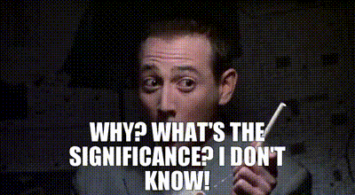
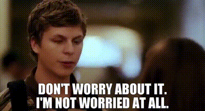

```{r setup, include=FALSE}
options(htmltools.dir.version = FALSE)
knitr::opts_chunk$set(warning = FALSE, message = FALSE, fig.showtext = TRUE)
library(tidyverse) # load tidyverse package
library(MASS)
library(ggplot2)
library(ggthemes)
library(kableExtra)
library(flextable)
library(cowplot)
library(xaringan)
library(xaringanthemer)
#library(gg3D)
library(leaflet)
library(maps)
library(fontawesome)
library(ggrepel)
library(DescTools)
library(renderthis)
library(ggtext)
#library(gganimate)
library(magick)

#img <- image_read("images/data-i-dont-care-about.gif")
#image_write_gif(img, path = "images/data-i-dont-care-about.gif", delay = 1/24)

## Function to sample from a Chi Squared Distribution
samplingchi<-function(n,size,df){
sampmean<-rep(NA,n)	                #create an empty vector where 
                                    #we will store the mean values

sampsd<-rep(NA,n)                   #create an empty vector where 
                                    #we will store our sd values

for (i in 1:n){		                  #indicate that we are repeating 
                                    #the operation n times
  
samp<-rchisq(size,df)	              #sample 'size' number of random (r) 
                                    #scores from a chi squared (chisq) 
                                    #distribution with df = df 

sampmean[i]<-mean(samp)			        #take the mean of those scores

sampsd[i]<-sd(samp)}			          #take the sd of those scores

sampdf<-data.frame(sampmean,sampsd)	#make a data frame out of the means 
                                    #and the standard deviations

return(sampdf)}	                    #the output of the function 
                                    #is the data frame

## Function to Sample from a Normal Distribution

samplingnorm<-function(n,size, mean, sd){
  sampmean<-rep(NA,n)	                #create an empty vector where 
                                      #we will store the mean values 
  
  sampsd<-rep(NA,n) 	                #create an empty vector where 
                                      #we will store the sd values 
  
  for (i in 1:n){ 		                #indicate that we are repeating 
                                      #the operation n times
    
    samp<-rnorm(size,mean,sd)	        #sample 'size' number of 
                                      #random (r) scores from a 
                                      #normal (norm) given mean and sd 
    
    sampmean[i]<-mean(samp)		        #take the mean of those scores
    
    sampsd[i]<-sd(samp)}			        #take the sd of those scores
  
  sampdf<-data.frame(sampmean,sampsd)	#make a data frame of the means 
                                      #and the standard deviations
  
  return(sampdf)}                     #the output of the function is 
                                      #the data frame
load("~/Documents/PSY 208/Spring 2023/PSY207_208/Sampling_Data_for_CLT_Demo.RData")
load("~/Documents/PSY 208/Spring 2023/PSY207_208/main_idea_samps.RData")

## To create pdf version:

# setwd("~/Documents/PSY 208/PSY_207-208_23-24/Lectures")
# renderthis::to_pdf("Repeated_measures_and_independent_groups_t_tests.Rmd", complex_slides = TRUE)

## To create PowerPoint version:

# renderthis::to_pptx("Repeated_measures_and_independent_groups_t_tests.Rmd", complex_slides = TRUE)

```

### Repeated Measures: The Basic Idea

**Repeated-measures** = **Within-groups** = **Randomized Block** (less commonly used today)

.slightly-smaller[

Repeated-measures can include the following:

> The same measurement taken at different times on the same sample

> Pre-test/post-test for an educational intervention

> Heart rate taken before and after exercise

> Self-report of mood at 6 am and 6 pm

> Two puzzles of differing difficulty

> Response to neutral vs. disgusting stimuli

]

---

### Matched or Paired Samples

.slightly-smaller[
Repeated-measures also includes **matched** or (synonymously) **paired samples**

Matched samples are two groups of **different individuals** that are **identical** (or at least very similar) **on some variable(s) of interest**, *e.g.*:

> Identical twins

> Genetically identical animals

> Pairs of people who are identical or similar on some critical aspect, e.g.:

>> Income

>> Age

>> Education level

]

---

### Repeated measures

In repeated measures, each individual – or half of a matched sample – is exposed to **each level of the measure or treatment**

> **Level:** the characteristics (*e.g.*, dosage, amount, category) of each **factor** being tested

For example, in a pre-test/post-test design, each individual takes the pre-test and the post-test.

```{r echo=FALSE, fig.align='center'}

```

---
### Advantages of Repeated-measures Designs

Repeated measures **compare individuals against themselves** (or against matched individuals).

This reduces the effect of individual differences, for example:

> In a memory experiment with different conditions, a repeated-measures design accounts for the fact that people naturally have different mnemonic capabilities


Differences related to different conditions are generally easier to detect, increasing **power** (more on that topic to come)
---

### Advantages of Repeated-measures Designs

Data can be collected **under different conditions** for the same participants

> Saves the researcher from recruiting different participants for different conditions

R-M designs generally use **fewer participants**

> **Less noise from individual variation** + **collecting data from the same participants for different conditions** = more **efficiency**


This is an important consideration – participant payment, animal subjects, and research time can be costly

---

### Limitations of Repeated Measures

There are certain situations in which a repeated-measure design should be used with care

> For example, some conditions may have order effects like **fatigue** or **learning** unrelated to the topic of the study

This is an example of an experimental design issue known as a **confound**. 

> Confounds tend to make it more difficult to interpret the results of a scientific study.

---

### Limitations of Repeated Measures (continued)

There are certain situations in which a repeated-measure design **cannot** be used 

> *e.g.*, Comparisons between:

>>Young adults and older adults


>>Experts and novices


>>Placebo-takers and drug-takers

---

### Repeated-measures $t$-tests

In repeated-measures $t$-tests, for each individual (or half of a pair), **one measure is subtracted from the other measure** and we **analyze the difference scores**.

.pull-left[
We are making an inference on the **mean difference $\mu_d$**

```{r echo=FALSE, fig.width = 5, fig.height = 3}
x<-seq(-3, 3, 6/1000)
y<-dnorm(x)

data.frame(x, y) %>% 
  ggplot(aes(x, y))+
  geom_line(linewidth = 2)+
  theme_tufte(ticks=FALSE)+
  theme_xaringan(css_file = "soundmachine.css")+
  labs(x="d", y="density", title = "differences in population")+
  theme(title = element_text(size=18),
        axis.text = element_text(size=16),
        axis.title.x = element_text(size = 32),
        axis.title.y = element_text(size=18))
```


]

.pull-right[
The sampling distribution are of **sampled mean differences**

```{r echo=FALSE, fig.width = 5, fig.height = 3}
#set.seed(77)
#diffsamplefigdf<-samplingnorm(1000000, 30, 0, 1)
#save(diffsamplefigdf, file = "repeated_measures_slides.RData")

load("~/Documents/PSY 208/Spring 2023/PSY207_208/repeated_measures_slides.RData")

diffsamplefigdf %>% 
  ggplot(aes(sampmean))+
  geom_histogram(color = "#c901a1", binwidth = 0.02)+
  theme_tufte(ticks = FALSE)+
  theme_xaringan(css_file = "soundmachine.css")+
  labs(x=bquote(bar(d)), 
       y="frequency",
       title = "sample means of differences")+
  theme(title = element_text(size=18),
        axis.text = element_text(size=16),
        axis.title.x = element_text(size = 32),
        axis.title.y = element_text(size=18))
```

]
---

The secret about One-sample and Repeated-measures $t$-tests:

<br>
<br>
<br>
<br>

# They're the same thing.
<br>
<br>
<br>
<br>
<br>
(after you do the subtraction.)


---
### Repeated-measures $t$-tests

.pull-left[


### $$t=\frac{\bar{d}-\mu_d}{se_d}$$
]

.pull-right[
.textbox[

### Assumptions

1. Scale data

2. **normality**

]
]

where:

> ** $\bar{d}$** is the **mean difference**

> ** $\mu_d$** is the **hypothesized mean difference**

> ** $se_d$** is the **standard error $\frac{sd_d}{\sqrt{n}}$**


Note: $\mu_d$ is *usually* zero, but sometimes the null hypothesis is that the difference is some non-zero value of scientific interest

---

### Repeated-measures $t$-test example

.slightly-smaller[
> A scientist tests out a new drug on 5 of his coworkers. 

> Each coworker will take a cognitive test **before taking the drug** and **after taking the drug**. 

> The scientist is interested in *any* difference between pre- and post-test scores.
]

***
$$n=5$$

.center[
**Two-tailed** hypothesis
]

$$\mu_d=0$$

.center[
Test statistic: $t(df=4)$ 

(and let's say $\alpha = .05$)
]

---

### Repeated-measures $t$ example: data

```{r echo=FALSE}
Participant<-c("Sterling",
               "Lana",
               "Pam",
               "Cheryl",
               "Cyril")

Pretest<-c(8.1,
           11.3,
           7.6,
           15.9,
           10.9)

Posttest<-c(6.3,
            10.8,
            4.1,
            15.8,
            10.0)

rm_ex_data<-data.frame(Participant,
                        Pretest,
                        Posttest) %>% 
  mutate(differences = Posttest - Pretest)

rm_ex_data %>% 
  dplyr::select(-differences) %>% 
  kable("html",
        col.names = c("Participant",
                      "Pre-test",
                      "Post-test")) %>% 
  kable_styling(font_size = 24)
```

```{r echo=FALSE, fig.align='center', out.width=400}
knitr::include_graphics("images/data-i-dont-care-about.gif")
```


---
### The important data

Step 1: find the **difference scores** (here, Post-test – Pre-test, but the sign really doesn’t matter as long as you are consistent)

```{r echo=FALSE}
rm_ex_data %>% 
    kable("html",
        col.names = c("Participant",
                      "Pre-test",
                      "Post-test",
                      "Difference")) %>% 
  kable_styling(font_size = 24) %>% 
  column_spec(4, 
           background = "#5ac2ad",
           color = "#fffaf1",
           bold = TRUE)
```

$$\bar{d}=`r round(mean(rm_ex_data$differences), 2)`$$

$$sd_{d}=`r round(sd(rm_ex_data$differences), 2)`$$
---
### A one-sample $t$ on the differences

Step 2: Treat the **difference scores** the same way we would a **single sample**

$$t_{obs}=\frac{\bar{d}-\mu_d}{se_d}=\frac{\bar{d}}{\frac{sd_d}{\sqrt{n}}}$$
$$t_{obs}=\frac{`r round(mean(rm_ex_data$differences), 2)` - 0}{\frac{`r round(sd(rm_ex_data$differences), 2)`}{\sqrt{5}}}$$

$$t_{obs}=-2.25$$
---

### Test for significance

With a **two-tailed test**, we have to include the area under the $t$ curve that $\le t_{obs}$ **and** the **opposite area** $(\ge -t_{obs})$

```{r echo=FALSE, fig.height = 4, fig.width = 12}
x<-seq(-4, 4, 8/1000)
y<-dt(x, 4)
rm_pval_fig<-data.frame(x, y)

rm_pval_fig %>% 
  ggplot(aes(x, y))+ 
  geom_line(linewidth=2)+
  theme_tufte(ticks=FALSE)+
  theme_xaringan(css_file = "soundmachine.css")+
  ggtitle("t with df = 4")+
  annotate("text",
           x=-2.25,
           y=0.15,
           label=bquote(t[obs]),
           size = 36/.pt)+
  geom_area(data=subset(rm_pval_fig, rm_pval_fig$x <= -2.25),
            fill="#5ac2ad")+
  annotate("text",
           x=2.25,
           y=0.15,
           label=bquote(-t[obs]),
           size = 36/.pt)+
  geom_area(data=subset(rm_pval_fig, rm_pval_fig$x >= 2.25),
            fill="#5ac2ad")
```

```{r}
pt(-2.25, df = 4)+ pt(2.25, df = 4, lower.tail = FALSE)
```

---

### Repeated-measures $t$-test in `R`

`R` allows you to enter the original, observed two columns of data:

```{r}
t.test(rm_ex_data$Posttest, rm_ex_data$Pretest,
       paired = TRUE, # the argument that makes it repeated-measures
       alternative = "two.sided")
```


---
### Repeated-measures Confidence Intervals

.pull-left[

.slightly-smaller[
**Confidence Interval** estimation is similar to the one-sample case, but performed on the **differences**:
]

> <br>
> $$(1-\alpha)\%~CI=\bar{d} \pm t_{\frac{\alpha}{2}}(se)$$
> <br>
]


.pull-right[

.slightly-smaller[

For this example, we can calculate the 95% confidence interval knowing that:
> $\bar{d}=-1.36$

> $se_d=0.604$ 

> $t_{\frac{\alpha}{2}}(4)=2.78$

]

]
***


$$95\%~CI=-1.36 \pm 2.78(0.604)= [-3.04, 0.32]$$
.center[
.slightly-smaller[
(which matches the result from the `t.test()` function)
]
]
---
### Returning to our example

.slightly-smaller[
**For the same example**, let’s assume that the scientist’s alternative hypothesis is that scores would be **lower** in the post-test condition

> now, we have a **one-tailed test** on the same data.
]

```{r}
t.test(rm_ex_data$Posttest, rm_ex_data$Pretest,
       paired = TRUE, # the argument that makes it repeated-measures
       alternative = "less") # doing this to illustrate a point
```

---
### The point of that exercise

.pull-left[
1. The choice of **one-tailed** *vs* **two-tailed** $t$-tests can make a substantial difference, especially for borderline cases.


]

.pull-right[

```{r echo=FALSE, fig.align='center', out.width="300px"}

```

]

2. Another reminder that the $p$-value is **not the probability of the data!**

> choices that the **analyst** make influence the $p$-value.
---

### Independent-groups $t$-tests

**Independent samples** are **different groups**.

> Each participant gets a different **level of the treatment**

**Independent samples** = **between-participants** = **completely randomized**


Sometimes a repeated-measures design is *undesirable* or *impossible*, for example:

> Comparing samples taken from **different populations** 

>>*e.g.*, young adults and older adults

> Drug studies

> Studies involving deception


---
### The Main Idea

.slightly-smaller[
An **independent-groups** analysis posits the existence of **two normally-distributed populations** of **equal variance**.
]

```{r echo=FALSE, fig.height = 2, fig.width = 12}
x<-seq(0, 10, 10/10000)

y1<-c(dnorm(x, 3, 1),
      dnorm(x, 7, 1))

data.frame(x=rep(x, 2),
                  y1,
                  group=rep(c("A", "B"), each = length(x))) %>% 
  ggplot(aes(x, y1, color = group))+
  geom_line(linewidth = 1.75)+
  theme_tufte(ticks=FALSE)+
  theme_xaringan(css_file = "soundmachine.css")+
  scale_color_manual(values = c("#c901a1", "#5ac2ad"))+
  theme(legend.position="none",
        axis.title = element_blank(),
        title = element_text(size = 48/.pt),
        axis.text = element_text(size = 48/.pt))


```

.slightly-smaller[
What if we wanted to **analyze the difference** between those means? Well, we could **subtract one from the other** (a **linear combination**) and use our $t$-test tools to analyze the result.
]

```{r echo=FALSE, fig.height = 2, fig.width = 12}
x<-seq(1, 7, 10/10000)

y1<-dnorm(x, 4, sqrt(2))

data.frame(x=rep(x, 2),
                  y1) %>% 
  ggplot(aes(x, y1))+
  geom_line(linewidth = 1.75)+
  theme_tufte(ticks=FALSE)+
  theme_xaringan(css_file = "soundmachine.css")+
  theme(legend.position="none",
        axis.title = element_blank(),
        title = element_text(size = 48/.pt),
        axis.text = element_text(size = 48/.pt))


```
---

### The Main Idea

We take **samples** from **each of the parent distributions**. The **difference between the sample means** represents a sample from the **linearly combined distribution** with $\mu = \mu_1-\mu_2$ and $\sigma^2=\sigma^2_1+\sigma^2_2$.

***

```{r echo=FALSE, fig.height = 3, fig.width = 12}
x<-seq(1, 7, 10/10000)

y1<-dnorm(x, 4, sqrt(2))

main_idea_parent<-data.frame(x=rep(x, 2),
                  y1) %>% 
  ggplot(aes(x, y1))+
  geom_line(linewidth = 1.75)+
  theme_tufte(ticks=FALSE)+
  theme_xaringan(css_file = "soundmachine.css")+
  theme(legend.position="none",
        axis.title = element_blank(),
        title = element_text(size = 48/.pt),
        axis.text = element_text(size = 48/.pt))

#main_idea_samps<-samplingnorm(1000000, 25, 4, sqrt(2)) 

#save(main_idea_samps, file = "main_idea_samps.RData")


main_idea_hist<-main_idea_samps %>% 
  ggplot(aes(sampmean))+
  geom_histogram(binwidth= 0.1, fill = "#3021D6", color="dodgerblue")+
  theme_tufte(ticks=FALSE)+
  theme_xaringan(css_file = "soundmachine.css")+
  theme(legend.position="none",
        axis.title = element_blank(),
        title = element_text(size = 48/.pt),
        axis.text = element_text(size = 48/.pt))+
  xlim(1, 7)

plot_grid(main_idea_parent, main_idea_hist, nrow=1)
```

***

That sampling distribution is modeled by the $t$-distribution.


---
### Independent-groups $t$ Assumptions:

1. Scale data (of course)

2. Normality

3. **Random assignment** (not necessarily **random selection**)

4. **Homoscedasticity**

Note: the independent-samples $t$-test *does not assume* equal $n$

(but, unequal $n$ may increase the risk of violating the homoscedasticity assumption)

---

### Normality

.pull-left[

Normality requires that **all of the data** are sampled from a normal distribution.

However, in an **independent-groups** situation, each group is likely to have a **different sample mean**, which leads to decidedly not-from-normal-distribution-looking sample distributions.


]
.pull-right[
```{r echo=FALSE, fig.height=6, fig.width = 5}


set.seed(77)
x1<-rnorm(50, 2, 2)
sampmean1<-mean(x1)

x2<-rnorm(50, 12, 2)
sampmean2<-mean(x2)

sample1hist<-data.frame(x=x1) %>% 
  ggplot(aes(x))+
  geom_histogram(fill = "#3021D6", color = "#fffaf1", binwidth = 1)+
  theme_tufte(ticks=FALSE)+
  theme_xaringan(css_file = "soundmachine.css")+
  theme(axis.text.y = element_blank(),
        axis.title = element_blank(),
        title = element_text(size=48/.pt))+
  ggtitle("sample 1")+
  coord_cartesian(clip="off", xlim = c(min(c(x1, x2)),
                                       max(c(x1, x2))))

sample2hist<-data.frame(x=x2) %>% 
  ggplot(aes(x))+
  geom_histogram(fill = "#990000", color = "#fffaf1", binwidth = 1)+
  theme_tufte(ticks=FALSE)+
  theme_xaringan(css_file = "soundmachine.css")+
  theme(axis.text.y = element_blank(),
        axis.title = element_blank(),
        title = element_text(size=48/.pt))+
  ggtitle("sample 2")+
  coord_cartesian(clip="off", xlim = c(min(c(x1, x2)),
                                       max(c(x1, x2))))

combined<-data.frame(x=c(x1, x2)) %>% 
  ggplot(aes(x))+
  geom_histogram(color = "#c901a1")+
  theme_tufte(ticks=FALSE)+
  theme_xaringan(css_file = "soundmachine.css")+
  theme(axis.text.y = element_blank(),
        axis.title = element_blank(),
        title = element_text(size=48/.pt))+
  ggtitle("combined")+
  coord_cartesian(clip="off", xlim = c(min(c(x1, x2)),
                                       max(c(x1, x2))))

plot_grid(sample1hist, sample2hist,
          combined,
          nrow=3)
```
]

---

### Normality


.pull-left[
.slightly-smaller[

Therefore, instead of the *observed scores*, we test the **residuals** for normality:

$$residual = x-\bar{x}$$

Subtracting the mean of a group from **every** number in that group **always** results in a group of residuals **with a mean of 0**.

With the data recentered, we can **combine** them and test **all the residuals combined** for normality.
]
]
.pull-right[
```{r echo=FALSE, fig.height=6, fig.width = 5}


set.seed(77)
x1<-rnorm(50, 2, 2)
sampmean1<-mean(x1)

x2<-rnorm(50, 12, 2)
sampmean2<-mean(x2)

sample1hist<-data.frame(x=x1-mean(x1)) %>% 
  ggplot(aes(x))+
  geom_histogram(fill = "#3021D6", color = "#fffaf1")+
  theme_tufte(ticks=FALSE)+
  theme_xaringan(css_file = "soundmachine.css")+
  theme(axis.text.y = element_blank(),
        axis.title = element_blank(),
        title = element_text(size=48/.pt))+
  labs(title = bquote("sample 1 -"~bar(x)[1]))+
  coord_cartesian(clip="off")

sample2hist<-data.frame(x=x2-mean(x2)) %>% 
  ggplot(aes(x))+
  geom_histogram(fill = "#990000", color = "#fffaf1")+
  theme_tufte(ticks=FALSE)+
  theme_xaringan(css_file = "soundmachine.css")+
  theme(axis.text.y = element_blank(),
        axis.title = element_blank(),
        title = element_text(size=48/.pt))+
  labs(title = bquote("sample 2 -"~bar(x)[2]))+
  coord_cartesian(clip="off")

combined<-data.frame(x=c(x1-mean(x1), x2-mean(x2))) %>% 
  ggplot(aes(x))+
  geom_histogram(color = "#c901a1")+
  theme_tufte(ticks=FALSE)+
  theme_xaringan(css_file = "soundmachine.css")+
  theme(axis.text.y = element_blank(),
        axis.title = element_blank(),
        title = element_text(size=48/.pt))+
  ggtitle("combined residuals")+
  coord_cartesian(clip="off")

plot_grid(sample1hist, sample2hist,
          combined,
          nrow=3)
```
]

---

## Normality

Once we have the **residuals**, the testing proceeds exactly as it does for the **one-sample** and the **repeated-measures** analyses.

Given two groups of data `x1` and `x2` with `n = 50` each:

```{r}
residuals <- c((x1 - mean(x1)), 
               (x2 - mean(x2)))

shapiro.test(residuals)
```

---

### Random assignment (not necessarily random selection)


```{r echo=FALSE, fig.align = 'center'}

```

Handled using research methods

---

### Homoscedasticity

In an independent-groups $t$-test situation, we're looking at the **differences between population means.** 

That's a relatively straightforward comparison to make when the variables in the population are distributed with **equal variance**:


```{r echo=FALSE, fig.height = 3, fig.width = 12}
x<-seq(0, 10, 10/10000)

y1<-c(dnorm(x, 3.5, 0.5),
      dnorm(x, 6.5, 0.5))

y2<-c(dnorm(x, 2, 0.5),
      dnorm(x, 8, 0.5))

y3<-c(dnorm(x, 4.91, 0.5),
      dnorm(x, 5.09, 0.5))

plot1<-data.frame(x=rep(x, 2),
                  y1,
                  group=rep(c("A", "B"), each = length(x))) %>% 
  ggplot(aes(x, y1, color = group))+
  geom_line(linewidth = 1.75)+
  theme_tufte(ticks=FALSE)+
  theme_xaringan(css_file = "soundmachine.css")+
  scale_color_manual(values = c("#c901a1", "#5ac2ad"))+
  theme(legend.position="none",
        axis.title = element_blank(),
        title = element_text(size = 48/.pt),
        axis.text = element_text(size = 48/.pt))+
  ggtitle("Looks Different!")

plot2<-data.frame(x=rep(x, 2),
                  y2,
                  group=rep(c("A", "B"), each = length(x))) %>% 
  ggplot(aes(x, y2, color = group))+
  geom_line(linewidth = 1.75)+
  theme_tufte(ticks=FALSE)+
  theme_xaringan(css_file = "soundmachine.css")+
  scale_color_manual(values = c("#c901a1", "#5ac2ad"))+
  theme(legend.position="none",
        axis.title = element_blank(),
        title = element_text(size = 48/.pt),
        axis.text = element_text(size = 48/.pt))+
  ggtitle("Also Different!")

plot3<-data.frame(x=rep(x, 2),
                  y2,
                  group=rep(c("A", "B"), each = length(x))) %>% 
  ggplot(aes(x, y3, color = group))+
  geom_line(linewidth = 1.75)+
  theme_tufte(ticks=FALSE)+
  theme_xaringan(css_file = "soundmachine.css")+
  scale_color_manual(values = c("#c901a1", "#5ac2ad"))+
  theme(legend.position="none",
        axis.title = element_blank(),
        title = element_text(size = 48/.pt),
        axis.text = element_text(size = 48/.pt))+
  ggtitle("Probably Not Different!")
plot_grid(plot1, plot2, plot3, nrow=1)
```
When variables have the same variance, we say they are **homoscedastic** (or, that there is **homogeneity of variance**).
---
## Homoscedasticity

It's harder to say that there's a **difference of means** if two variables are **heteroscedastic** (or, have **heterogeneity of variance**).

```{r echo=FALSE, fig.width = 12, fig.height = 3}

y1<-c(dnorm(x, 4, 0.5),
      dnorm(x, 6, 0.5))

plot1<-data.frame(x=rep(x, 2),
                  y1,
                  group=rep(c("A", "B"), each = length(x))) %>% 
  ggplot(aes(x, y1, color = group))+
  geom_line(linewidth = 1.75)+
  theme_tufte(ticks=FALSE)+
  theme_xaringan(css_file = "soundmachine.css")+
  scale_color_manual(values = c("#c901a1", "#5ac2ad"))+
  theme(legend.position="none",
        axis.title = element_blank(),
        title = element_text(size = 48/.pt),
        axis.text = element_text(size = 48/.pt))+
  ggtitle("Same difference of means...")

y4<-c(dnorm(x, 4, 0.5),
      dnorm(x, 6, 2.5))

plot4<-data.frame(x=rep(x, 2),
                  y4,
                  group=rep(c("A", "B"), each = length(x))) %>% 
  ggplot(aes(x, y4, color = group))+
  geom_line(linewidth = 1.5)+
  theme_tufte(ticks=FALSE)+
  theme_xaringan(css_file = "soundmachine.css")+
  scale_color_manual(values = c("#c901a1", "#5ac2ad"))+
  theme(legend.position="none",
        axis.title = element_blank(),
        title = element_text(size = 48/.pt),
        axis.text = element_text(size = 48/.pt))+
  ggtitle("...much different overlap!")

plot_grid(plot1, plot4, nrow=1)
```


The independent-groups $t$-test (original recipe) **assumes homoscedasticity**.

---
### Pooled Variance

.slightly-smaller[

In the cases of the **one-sample $t$-test** and the **repeated-measures $t$-test**, we estimate the **variance** of the **parent population** based on a **single sample variance**\* 

The same is *basically* true in the case of the **independent-groups $t$-test**, with one slight complication:

> The parent population for independent-groups is a **linear combination** of *two* populations.

The **homoscedasticity** assumption tells us that the variance of the two populations is the same. But *how do we know what that variance is when we have* **two** *sample variances*?

]
.footnote[
\*the variance of the sample and the variance of the differences, respectively.
]
---
### Pooled Variance

The variance that we will use for the standard error is based on the variances of **both groups** and is called the **pooled variance**.

The pooled variance uses the **observed sample variances** to estimate the **common variance** of the two **parent populations**

$$s_p^2=\frac{(n_1-1)s^2_1+(n_2-1)s^2_2}{n_1+n_2-2}$$

It is, effectively, a **weighted average** of the two sample variances (weighted by the $df$ of each sample).

---

### Pooled standard error

> Pooled standard error:

$$se_p=\sqrt{\frac{s_p^2}{n_1}+\frac{s^2_p}{n_2}}$$

The **sum** in the pooled standard error comes from the fact that each sample is a draw from a **parent distribution** that is a **linear combination of two normal distributions** that each have the same variance (estimated by $s_p^2$).

---
### Independent-groups $t$: formula

### ** $$t_{obs}=\frac{\bar{x}_1-\bar{x}_2-\Delta}{se_p}$$**

where:

> $\bar{x}_1$ and $\bar{x}_2$ are the sample means

>> note: $1$ and $2$ are arbitrary designations

> $\Delta$ is the hypothesized difference between the means (usually 0)


---
### Independent-groups analysis

We use the observed sample difference $\bar{x}_1-\bar{x}_2$ and the pooled standard error $se_p$ to make an inference on the **population difference** $\mu_1-\mu_2$.

Example statements from the six-step procedure:

> One-tailed:

$$H_0: \mu_1-\mu_2\ge0$$
$$H_1: \mu_1-\mu_2<0$$
> Two-tailed:

$$H_0: \mu_1-\mu_2=0$$
$$H_1: \mu_1-\mu_2\ne0$$
---

### Independent-groups $t$ example

.pull-left[
```{r echo=FALSE}
Group1<-c(11.5,
          10.7,
          8.8,
          9.0,
          10.0,
          "\\(\\bar{x}_1=10.0\\)",
          "\\(s^2_1=1.295\\)",
          "\\(n_1=5\\)")

Group2<-c(15.0,
          14.5,
          16.7,
          14.8,
          15.5,
          "\\(\\bar{x}_2=15.3\\)",
          "\\(s^2_2=0.745\\)",
          "\\(n_2=5\\)"
          )
data.frame(Group1, Group2) %>% 
  kable("html", 
      col.names = c("Group 1",
                    "Group 2"),
      escale = FALSE,
      align="c") %>% 
  kable_styling() %>% 
  row_spec(6:8, background = "#fffaf1")
```
]

.pull-right[

***
$$\alpha = 0.05$$
***


$$df = n_1+n_2-2=8$$
***

$$H_0: \mu_1-\mu_2 \le0$$
$$H_1: \mu_1-\mu_2>0$$
$$\Delta = 0$$

***
.slightly-smaller[
Hi! See how $\bar{x}_1-\bar{x_2}<0$? Our hypothesis might be in trouble.
]
]
---
### Test of normality:

```{r}
Group1<-c(11.5, 10.7, 8.8, 9.0, 10.0)
Group2<-c(15.0, 14.5, 16.7, 14.8, 15.5)

residuals<-c(Group1-mean(Group1), Group2-mean(Group2))

shapiro.test(residuals)
```

---

### Test of homoscedasticity:

Let's use **Levene's Test**

```{r}
library(car)

leveneTest(data~group, 
	data.frame(data=c(Group1, Group2), 	
	           group=c(rep("Group1", 5), rep("Group2", 5))))
```

---

### Pooled variance:

$$s_p^2=\frac{(n_1-1)s^2_1+(n_2-1)s^2_2}{n_1+n_2-2}$$

$$=s_p^2=\frac{(4)(1.295)+(4)(.745)}{5+5−2}=\frac{8.16}{8}=1.02$$

### Pooled standard error:

$$se_p=\sqrt{\frac{s_p^2}{n_1}+\frac{s^2_p}{n_2}}$$

$$se_p=\sqrt{\frac{1.02}{5}+\frac{1.02}{5}}=0.639$$
---
### $t$!

$$t_{obs}=\frac{\bar{x}_1-\bar{x}_2-\Delta}{se_p}$$

$$t_{obs}=\frac{10.0−15.3−0}{0.639}=-8.29$$
***
.pull-left[
.slightly-smaller[

Now, because 
$$H_0: \mu_1-\mu_2\le0$$
$$H_1: \mu_1-\mu_2>0$$
We are looking at the **upper-tail** probability of the $t(8)$ distribution:
]
]

.pull-right[
```{r echo=FALSE, fig.height = 3, fig.width = 5}
x<-seq(-4, 4, 8/1000)
y<-dt(x, df=8)

uhoh<-data.frame(x, y)

ggplot(uhoh, aes(x, y))+
  geom_line(linewidth = 1.5)+
  geom_area(data=subset(uhoh, uhoh$x>=-8.29),
            fill="#5ac2ad")+
  theme_tufte(ticks=FALSE)+
  theme_xaringan(css_file = "soundmachine.css")+
    ggtitle("uh oh")+
    theme(title=element_text(size=60/.pt))+
  annotate("text",
           x=2,
           y=0.3,
           label=bquote(p%~~%1),
           size=24/.pt)
```

]
---
### A cautionary tale

Our hypothesis was *way off*! No matter how large the **magnitude of $t$**, the result will not be significant if the **direction is wrong**.

```{r}
t.test(Group1,        
       Group2,
       alternative = "greater", 
       var.equal=TRUE, # tell R to assume homoscedasticity
       paired = FALSE) # it's the default, so you can skip it
```

---
### A more reasonable result

Now, if we had a one-tailed hypothesis **in the other direction**, we'd have been fine. But **please don't choose your direction after the fact!**

```{r}
t.test(Group1, Group2,
       alternative = "less", 
       var.equal=TRUE, paired = FALSE)
```

---

### Another reasonable result

We also would be fine in this case with a **two-tailed** hypothesis.

```{r}
t.test(Group1, Group2,
       alternative = "two.sided", 
       var.equal=TRUE, 
       paired = FALSE) 
```

---
### Confidence intervals

.slightly-smaller[

Confidence intervals in independent-groups analyses are centered on the **difference between the means** and use the **pooled standard error**

$$(1-\alpha)\%~CI=\bar{x}_1-\bar{x}_2\pm t_{\frac{\alpha}{2}}(se_p)$$
For this example, we can calculate the 95% confidence interval knowing that:

> $\bar{x}_1-\bar{x}_2=-5.3$

> $se_p=0.639$ 

> $t_{\frac{\alpha}{2}}(8)=2.31$

]

***


$$95\%~CI=-5.3 \pm 2.31(0.639)= [-6.77, -3.83]$$
---
### Welch's test

**Welch's Test** is a varietal of the independent-groups $t$-test that **relaxes the homoscedasticity assumption**. 

It **adjusts** the $p$-value by messing\* with the $df$

`R` uses the Welch test if the argument `var.equal = FALSE` or *by default* if the `var.equal` argument is omitted.

.footnote[
\*and by _messing_, I mean using a very technical method known as the **Welch-Satterthwaite equation** that computers are good at calculating for us. 
]

---
### Welch's test

.slightly_smaller[
**Not assuming homoscedasticity** includes the case where the variances happen to be equal. So, feel free to just use it whenever.
]

```{r}
t.test(Group1, Group2)
```


---

### Last thing: a neat regression trick

.slightly-smaller[
The $t$ and the $p$-value on the **coefficient** _Group_ are the $t$ and $p$ from our test.

The **estimates** are directly related to the group means.

]
.smaller-output[

```{r}
y <-c(Group1, Group2)
Group<-rep(c("Group1", "Group2"),each = 5)
summary(glm(y~Group)) 
```

]


