```{r setup, include=FALSE}
options(htmltools.dir.version = FALSE)
knitr::knit_hooks$set(crop = knitr::hook_pdfcrop)
library(officer)
library(tidyverse)
library(flextable)
library(ftExtra)
library(ggplot2)
library(ggthemes)
library(xaringan)
library(xaringanthemer)
library(cowplot)
library(showtext)
library(showtextdb)
library(extrafont)
library(sysfonts)
library(MASS)
library(ggtext)
library(ggmap)
library(see)
library(plotly)
library(ggh4x)
library(riverplot)

font_add(family = "Futura",
         regular = "/System/Library/Fonts/Supplemental/Futura.ttc")

knitr::opts_chunk$set(fig.showtext = TRUE,
                      warning = FALSE,
                      message = FALSE)

## To create pdf version:

## To create pdf version:
# setwd("~/Documents/PSY 208/PSY_207-208_23-24/Lectures")
# renderthis::to_pdf("Visual_Representations_of_Data.Rmd", complex_slides = TRUE)

## To create PowerPoint version:

# renderthis::to_pptx("Visual_Representations_of_Data.Rmd", complex_slides = TRUE)

```

# Part 1

## Principles of Visualization

---

### Why we visualize data

.pull-left[
**For ourselves**

***

Visualizing data can help reveal **patterns** that are not clear from summary statistics.

Those patterns inform **how we analyze the data**.

]

.pull-right[

**For everybody else**

***

Visualizations **call attention** to important **features** of the **data** and the **analytic results**.

The goal is to **help your audience understand** the often-complicated science that you did.


]

---

### Anscombe's (1973) Quartet

.left-column[
**Four sets** of data, each with an $x$ and a $y$ value. 

Pretty tough to identify any patterns.

]

.right-column[

```{r echo=FALSE}
x1<-c(10,
      8,
      13,
      9,
      11,
      14,
      6,
      4,
      12,
      7,
      5
)

y1<-c(8.04,
      6.95,
      7.58,
      8.81,
      8.33,
      9.96,
      7.24,
      4.26,
      10.84,
      4.82,
      5.68
)

x2<-x1

y2<-c(9.14,
      8.14,
      8.74,
      8.77,
      9.26,
      8.1,
      6.13,
      3.1,
      9.13,
      7.26,
      4.74
)

x3 <- x2

y3 <- c(7.46,
        6.77,
        12.74,
        7.11,
        7.81,
        8.84,
        6.08,
        5.39,
        8.15,
        6.42,
        5.73
)

x4 <-c(8,
       8,
       8,
       8,
       8,
       8,
       8,
       19,
       8,
       8,
       8
)

y4 <- c(6.58,
        5.76,
        7.71,
        8.84,
        8.47,
        7.04,
        5.25,
        12.5,
        5.56,
        7.91,
        6.89
)

data.frame(x1, y1, x2, y2, x3, y3, x4, y4) %>% 
  flextable() %>% 
  set_header_labels(x1 = "$x$",
                    y1 = "$y$",
                    x2 = "$x$",
                    y2 = "$y$",
                    x3 = "$x$",
                    y3 = "$y$",
                    x4 = "$x$",
                    y4 = "$y$") %>% 
  colformat_md(part = "header") %>% 
  add_header_row(values = c("Set 1",
                            "Set 2",
                            "Set 3",
                            "Set 4"),
                            colwidths = rep(2, 4)) %>% 
  align(align = "center", part = "all") %>% 
  fontsize(size = 16, part = "all") %>% 
  border(border.top = fp_border(color = "#a28557"), part = "header") %>% 
  hline(border = fp_border(color = "#a28557"), part = "header") %>% 
  hline_bottom(border = fp_border(color = "#a28557")) %>% 
  color(i = 1, color = "#283399", part = "header") %>% 
  bold(i = 1, bold = TRUE, part = "header") %>% 
  color(i = 2, color = "#972626", part = "header") %>% 
  color(color = "#283399", part = "body") %>% 
  font(fontname = "futura", part = "all")
  
```
]


---

### Anscombe's Quartet

.pull-leftcolumn[

Calculating **summary statistics** isn't helpful in this case.

The **means** and **standard deviations** of $x$ and $y$ for each group are **identical**.

]
.pull-rightcolumn[
```{r echo=FALSE}
data.frame(Set = c("Set 1",
                       "Set 2",
                       "Set 3",
                       "Set 4"),
           meanx = c(mean(x1),
                     mean(x2),
                     mean(x3),
                     mean(x4)),
           sdx = c(sd(x1),
                   sd(x2),
                   sd(x3),
                   sd(x4)),
           meany = c(mean(y1),
                     mean(y2),
                     mean(y3),
                     mean(y4)),
           sdy = c(sd(y1),
                   sd(y2),
                   sd(y3),
                   sd(y4))) %>% 
  flextable() %>% 
  set_header_labels(meanx = "mean",
                    sdx = "sd",
                    meany = "mean",
                    sdy = "sd") %>% 
  colformat_double(digits = 2) %>% 
  add_header_row(values = c(" ",
                            "$x$", 
                            "$y$"),
                            colwidths = c(1,
                                          rep(2, 2))) %>% 
    colformat_md(part = "header") %>% 
  align(align = "center", part = "all") %>% 
  fontsize(size = 16, part = "all") %>% 
  border(border.top = fp_border(color = "#a28557"), part = "header") %>% 
  hline(border = fp_border(color = "#a28557"), part = "header") %>% 
  hline_bottom(border = fp_border(color = "#a28557")) %>% 
  color(i = 1, color = "#283399", part = "header") %>% 
  bold(i = 1, bold = TRUE, part = "header") %>% 
  color(i = 2, color = "#972626", part = "header") %>% 
  color(color = "#283399", part = "body") %>% 
  font(fontname = "futura", part = "all")
```


```{r echo=FALSE, fig.align='center', out.width = "60%"}

```

]
---

### Anscombe's Punchline

The patterns are much easier to **see** when we **plot** the data sets.

```{r echo=FALSE, fig.width = 12, fig.height = 6.5, fig.showtext=TRUE}

xmin = min(c(x1, x2, x3, x4))-1
xmax = max(c(x1, x2, x3, x4))+1

ymin = 0
ymax = max(c(y1, y2, y3, y4))+1

set1<-data.frame(x1, y1) %>% 
  ggplot(aes(x1, y1)) + 
  geom_point(size = 3)+
  geom_smooth(se = FALSE, method = "lm", linewidth = 1.5)+
  ggtitle("Set 1")+
  theme_tufte(ticks = FALSE)+
  theme_xaringan(css_file = "nofrills.css")+
  labs(x = "x",
       y = "y")+
  xlim(xmin, xmax)+
  ylim(ymin, ymax)

set2<-data.frame(x2, y2) %>% 
  ggplot(aes(x2, y2)) + 
  geom_point(size = 3)+
  geom_smooth(se = FALSE, method = "lm", linewidth = 1.5)+
  ggtitle("Set 2")+
  theme_tufte(ticks = FALSE)+
  theme_xaringan(css_file = "nofrills.css")+
  labs(x = "x",
       y = "y")+
  xlim(xmin, xmax)+
  ylim(ymin, ymax)

set3<-data.frame(x3, y3) %>% 
  ggplot(aes(x3, y3)) + 
  geom_point(size = 3)+
  geom_smooth(se = FALSE, method = "lm", linewidth = 1.5)+
  ggtitle("Set 3")+
  theme_tufte(ticks = FALSE)+
  theme_xaringan(css_file = "nofrills.css")+
  labs(x = "x",
       y = "y")+
  xlim(xmin, xmax)+
  ylim(ymin, ymax)

set4<-data.frame(x4, y4) %>% 
  ggplot(aes(x4, y4)) + 
  geom_point(size = 3)+
  geom_smooth(se = FALSE, method = "lm", linewidth = 1.5)+
  ggtitle("Set 4")+
  theme_tufte(ticks = FALSE)+
  theme_xaringan(css_file = "nofrills.css")+
  labs(x = "x",
       y = "y")+
  xlim(xmin, xmax)+
  ylim(ymin, ymax)

plot_grid(set1, set2, set3, set4, nrow = 2)

```

---

### Guidelines for displaying data

Data displays should be **clear** and **as easily understood as possible**

> **Keep the focus** on what is **important** about the data

> **Avoid extra items** that may distract a reader

> **Do not** present the data in a way that may be **misleading**

---

### Figures and Tables

.pull-left[

### **Figures** use **images** to represent:
]


.pull-right[

```{r echo=FALSE, fig.height = 2, fig.width = 5}
data.frame(x = rnorm(1000)) %>% 
  ggplot(aes(x))+
  geom_histogram(color = "#a28557")+
  theme_tufte(ticks = FALSE)+
  theme_xaringan(css_file = "nofrills.css")+
  theme(axis.text = element_blank(),
        axis.title = element_blank(),
        axis.ticks = element_blank())
```

**distributions** of data

]

***

.pull-left[


```{r echo=FALSE, fig.height = 2, fig.width = 5}
set.seed(77)

x<-runif(1000, -2*pi, 2*pi)
y<-sin(x)+rnorm(1000, 0, 1)

data.frame(x, y) %>% 
  ggplot(aes(x, y))+
  geom_point()+
  theme_tufte(ticks = FALSE)+
  theme_xaringan(css_file = "nofrills.css")+
  labs(x = "time")+
  geom_smooth(se = FALSE, linewidth = 3, color = "#a28557")+
  theme(axis.text = element_blank(),
        axis.title = element_blank(),
        axis.ticks = element_blank())

```

**trends** in data 
]


.pull-right[

**comparisons** between data. 


```{r echo=FALSE, fig.height = 2, fig.width = 5}
data.frame(x = c("A", "A", "B", "B"),
           y = c(2, 4, 3, 5),
           label = c("A", "B", "A", "B")) %>% 
  ggplot(aes(x = x, y = y, fill = label))+
  geom_bar(stat = "identity", position = "dodge")+
  theme_tufte(ticks = FALSE)+
  theme_xaringan(css_file = "nofrills.css")+
  scale_fill_manual(values = c("#283399", "#a28557"),
                    guide = NULL)+
  theme(axis.text = element_blank(),
        axis.title = element_blank())
```
]
---

### Tables and Figures

**Tables** present **text** and precise\* **numbers** for the reader to reference.

.textbox[

```{r echo=FALSE}
data.frame(Movie = c("The Imitation Game",
                     "It",
                     "Moneyball",
                     "Wind River",
                     "The Choice"),
           Year = c("2014",
                    "2017",
                    "2011",
                    "2017",
                    "2016"),
           Genre = c("Biography, Drama, Thriller",
                     "Horror",
                     "Biography, Drama, Sport",
                     "Crime, Drama, Mystery",
                     "Drama, Romance"),
           Gross = c("91.13M",
                     "327.48M",
                     "75.61M",
                     "33.80M",
                     "18.71M")) %>% 
  flextable() %>% 
  set_header_labels(Gross = "Gross ($)",
                    Genre = "Genre(s)") %>% 
#  colformat_double(digits = 2) %>% 
#  align(align = "center", part = "all") %>% 
  fontsize(size = 16, part = "all") %>% 
  border(border.top = fp_border(color = "#f9f5fd"), part = "header") %>% 
  hline(border = fp_border(color = "#f9f5fd"), part = "header") %>% 
  hline_bottom(border = fp_border(color = "#f9f5fd")) %>% 
    add_footer_lines("SOURCE: imdb.com") %>% 
  color(color = "#f9f5fd", part = "all") %>% 
  bold(i = 1, bold = TRUE, part = "header") %>% 
 # color(i = 2, color = "#972626", part = "header") %>% 
 # color(color = "#283399", part = "body") %>% 
#  color(color = "#283399", part = "footer") %>%
  font(fontname = "futura", part = "all") %>% 
  set_table_properties(layout = "autofit") %>% 
  set_caption(caption = as_paragraph(
    as_chunk('Most Popular Feature Films tagged with keyword "statistics"',
                                     props = fp_text(font.size = 16,
                             color = "#f9f5fd",
                             font.family = "futura"))),
              fp_p = fp_par(padding = 10))
```

]

.footnote[
\*well, as *precise* as your stats get. We do *a lot* of estimating.
]
---


### Keeping Things Tidy

The goal of data visualization is to take **a lot of information** and make it **easier to understand**.

.pull-left[
```{r echo=FALSE, fig.align = "center", fig.cap = "Where's Waldo? he's in the upper-right. please pay attention to the lecture.", fig.out="70%"}
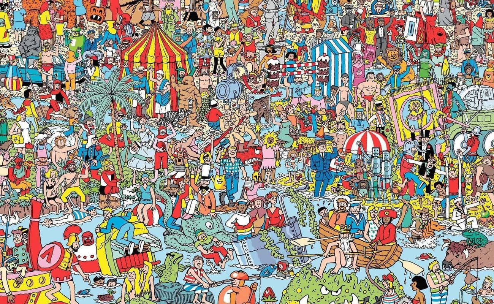
```

]

.pull-right[
```{r echo=FALSE, fig.align = "center", fig.cap = "Human-centered design", out.width = "85%"}
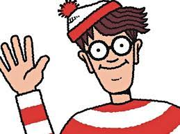
```

]

**Unnecessary visual elements** make it harder for the audience to focus on what is **important about the data**.


---

### Stuff You Don't Need


.pull-left[

**Gridlines** in figures

> Figure gridlines connect visual elements to the $y$ and/or $x$ axis.

> Thing is: **You never need that!**

]

.pull-right[

.textbox[


```{r echo = FALSE, out.width= "100%", fig.align='center'}
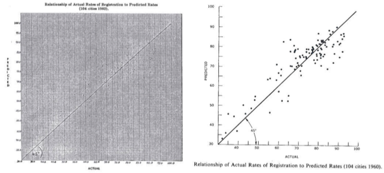

```

These figures represent the **exact same data**. The figure on the right is a reprint of the figure on the left with the gridlines removed (Tufte, 2001)
]

]

Figures are for **impressions** of trends, comparisons, shapes, *etc.*

If exact values are important, **use a table**.

---

### More stuff you don't need

.pull-left[

```{r echo=FALSE, out.width = "90%", fig.align = "center", fig.cap = "complex patterns"}
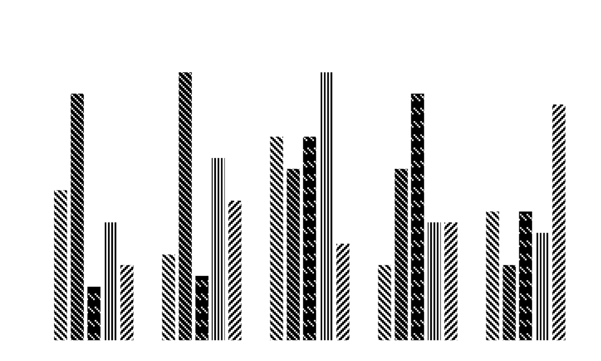
```

]

.pull-right[

```{r echo=FALSE, fig.width = 5, out.width="90%", fig.align = "center", fig.cap = "graphics"}
knitr::include_graphics("images/pencil_bar.jpg")
```

]

.pull-left[

```{r echo=FALSE, out.width = "90%", fig.align = "center", fig.cap = "shadows"}
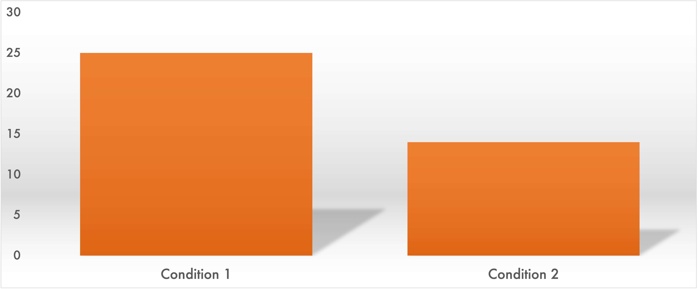
```
]

.pull-right[

```{r echo=FALSE, out.width = "90%", fig.align = "center", fig.cap = "3D shapes for 2D data"}
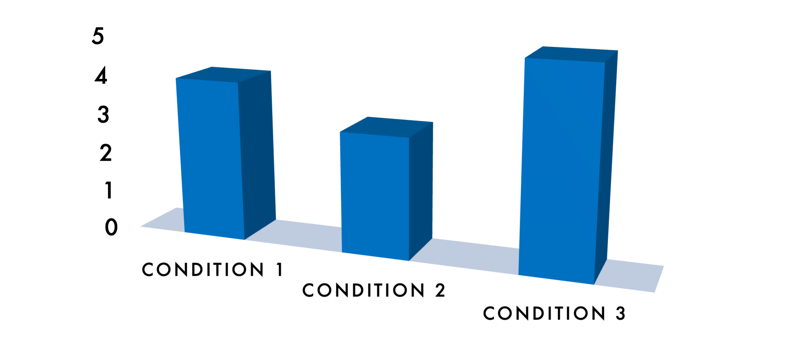
```

]

---

### Proportion and Dimension

.slightly-smaller[
Representations of data in figures need to be **proportional** to the data being represented.


> When using statistical software to make figures, that's *usually* taken care of.

]


.pull-left[

.slightly-smaller[
Scaling **two dimensions** instead of **one** (see right), for example, can **exaggerate differences**.

> Differences in area are more salient than differences in width and/or height

]
]

.pull-right[


```{r echo=FALSE, fig.width = 5, fig.height = 4}

prop_data<-data.frame(x = 1:2,
           y = c(1, 1),
           n = c(1, 2),
           label = c("n = 1",
                     "n = 2")) 

plot <- prop_data %>% 
  ggplot(aes(x, y, size = n))+
  geom_point()+
  theme_tufte(ticks = FALSE)+
  theme_xaringan(css_file = "nofrills.css",)+
  theme(legend.position = "none") +
  geom_text(aes(label = label),
            nudge_y = -0.25,
            size = 24/.pt)+
  coord_fixed(ratio = 6/8,
              xlim = c(0.5, 2.5),
              ylim = c(0.5, 1.35))+
  theme(axis.text = element_text(size = 12),
        axis.title = element_blank(),
        plot.title = element_markdown(size = 24))
  
  
area <- plot +
  scale_size_area()+
  labs(title = ("area scale"))+
  annotate("text",
           x = Inf,
           y = Inf,
           hjust = 1,
           vjust = 1,
           label = "2x bigger",
           size = 16/.pt,
           color = "#972626")

radius<-plot + 
  scale_radius(guide = NULL)+
  ggtitle("radius scale")+
  annotate("text",
           x = Inf,
           y = Inf,
           hjust = 1,
           vjust = 1,
           label = "4x bigger",
           size = 16/.pt,
           color = "#972626")

plot_grid(radius, area, nrow = 2)+
  theme(panel.background = element_rect(fill = "#f9f5fd",
                                        color = "#f9f5fd"))
```


]

---

### Proportion and Dimension


You can **say** that **elements are not drawn to scale**...

.pull-left[
```{r echo=FALSE, fig.align = "center", out.width = "90%"}
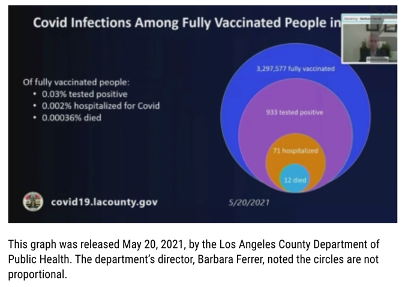
```

...but you can't **overcome human perception**: the thing people **see** is going to **stick**.

]

.pull-right[
```{r echo=FALSE, fig.align='center', fig.height = 4, fig.width = 6}
lavax.df<-data.frame(x=rep(0, 4),
                     y = rep(0, 4),
                     cat = factor(c("Fully\nVaccinated",
                             "Tested\nPositive",
                             "Hospitalized",
                             "Died"),
                             levels = c("Fully\nVaccinated",
                             "Tested\nPositive",
                             "Hospitalized",
                             "Died")),
                     size = c(3297577,
                              933,
                              71,
                              12))

lavax.df %>% 
  ggplot(aes(x = x, y = y, size = size, color = cat))+
  geom_point()+
  scale_color_manual(values = c("#3344DD",
                                "#8D51B7",
                                "#C97D13",
                                "#37A6D6"),
                     name = "")+
  coord_fixed(ratio = 1)+
  scale_size_area(max_size = 95,
                  guide = NULL)+
  theme_tufte(ticks = FALSE)+
  theme_xaringan(css_file = "nofrills.css")+
  ggtitle("Drawn to scale")+
  theme(axis.title = element_blank(),
        axis.text = element_blank())+
  guides(color = guide_legend(override.aes=list(size = 5)))
```


]

---

### Proportion and Dimension

**Color** (or **shading**, or **pattern**, *etc*.) can also represent a **dimension** of data.

.pull-left[
.slightly-smaller[
Commonly, we use it to denote **categories** when *labels* are unavailable.
]

```{r echo=FALSE, fig.align='center', fig.width = 6, fig.height = 4}
data.frame(x = c("Group 1", "Group 1", "Group 2", "Group 2"),
           y = c(2, 4, 3, 5),
           label = c("A", "B", "A", "B")) %>% 
  ggplot(aes(x = x, y = y, fill = label))+
  geom_bar(stat = "identity", position = "dodge")+
  theme_tufte(ticks = FALSE)+
  theme_xaringan(css_file = "nofrills.css")+
  scale_fill_manual(values = c("#283399", "#a28557"),
                    name = "Subgroup:")+
  theme(axis.text.y = element_blank(),
        axis.title = element_blank(),
        legend.position = "bottom",
        legend.title = element_text(size = 24))
```

]

.pull-right[

```{r echo=FALSE, fig.align='center', fig.height = 4, fig.width = 6}
masspop.df<-data.frame(county = tolower(c("Barnstable",	
                       "Berkshire",	  
                       "Bristol",   
                       "Dukes",   
                       "Essex",   
                       "Franklin",	  
                       "Hampden",   
                       "Hampshire",	  
                       "Middlesex",	  	
                       "Nantucket",	  
                       "Norfolk",   
                       "Plymouth",	  
                       "Suffolk",   
                       "Worcester")),
                       population = c(228996,	
                                      129026,	
                                      579200,	
                                      20600	,
                                      809829,	
                                      71029	,
                                      465825,	
                                      162308,	
                                      1632002,
                                      14255	,
                                      725981,	
                                      530819,	
                                      797936,	
                                      862111)/1000)

map_data('county', 'massachusetts') %>% 
  rename("county" = subregion) %>% 
  left_join(masspop.df,
            by = "county") %>% 
  ggplot(aes(long, lat, group = group))+
  geom_polygon(aes(fill = population))+
  theme_tufte(ticks = FALSE)+
  theme_xaringan(css_file = "nofrills.css")+
  scale_fill_viridis_c(name = "county population\n(thousands)")+
  theme(legend.direction = "horizontal",
        legend.position = c(0.3, 0.2),
        legend.title = element_text(size = 18),
        legend.text = element_text(size = 18),
        legend.key.width = unit(12, "mm"),
        axis.text = element_blank(),
        axis.title = element_blank())+
  guides(fill = guide_legend(title.position = "top",
                             title.hjust = 0.5))
```
.slightly-smaller[
It can also be used to depict features of a **continuous** variable
]
]

---


### Proportion and Dimension

.slightly-smaller[
Using **multiple colors** to represent **different levels of the same variable** can **confuse your audience** (they might be trying to figure out what the different colors represent).

]

.pull-left[
```{r echo=FALSE, fig.height = 3, fig.width = 5}
samecolplot<-data.frame(y = c(rnorm(1000, 1, 1),
                               rnorm(1000, 3, 1),
                               rnorm(1000, 2, 2)),
                         x = rep(c("A", "B", "C"),
                                 each = 1000)) %>% 
  ggplot(aes(x = x, y = y))+
  geom_boxplot(linewidth = 1.25)+
  theme_tufte(ticks = FALSE)+
  theme_xaringan(css_file = "nofrills.css")+
  labs(x = "group",
       y = "values")

samecolplot
```

]

.pull-right[

```{r echo=FALSE, fig.height = 3, fig.width = 5}
extracolplot<-data.frame(y = c(rnorm(1000, 1, 1),
                               rnorm(1000, 3, 1),
                               rnorm(1000, 2, 2)),
                         x = rep(c("A", "B", "C"),
                                 each = 1000)) %>% 
  ggplot(aes(x = x, y = y, color = x))+
  geom_boxplot(linewidth = 1.25)+
  theme_tufte(ticks = FALSE)+
  theme_xaringan(css_file = "nofrills.css")+
  labs(x = "group",
       y = "values")+
  scale_color_manual(values = c("#283399",
                                "#a28557",
                                "#972626"),
                     name = "group")+
  theme(
        legend.title = element_text(size = 18))

extracolplot
```
]


.center[

.slightly-smaller[

Note that the color categorization in the figure on the right is redundant with the $x$-axis labels (and the legend takes up valuable space).

]
]

---

### Speaking of Colors...

.slightly-smaller[

1. Basic primary colors are **visually boring**: try to find more interesting shades.

2. Be respectful of individuals with colorblindness

> Different groups can be indicated using different patterns or shades of gray.

> There are also color schemes that are **colorblind-friendly**, *e.g.*:

]

```{r echo = FALSE, fig.height = 3, fig.width = 12 }

ggplot()+
  geom_rect(aes(xmin = 0, xmax = 1, ymin = 0, ymax = 1),
            fill = "#648fff")+
    geom_rect(aes(xmin = 1, xmax = 7, ymin = 0, ymax = 1),
            fill = "#785ef0")+
    geom_rect(aes(xmin = 2, xmax = 7, ymin = 0, ymax = 1),
            fill = "#dc267f")+
    geom_rect(aes(xmin = 3, xmax = 7, ymin = 0, ymax = 1),
            fill = "#fe6100")+
    geom_rect(aes(xmin = 4, xmax = 7, ymin = 0, ymax = 1),
            fill = "#ffb000")+
    geom_rect(aes(xmin = 5, xmax = 7, ymin = 0, ymax = 1),
            fill = "#000000")+
    geom_rect(aes(xmin = 6, xmax = 7, ymin = 0, ymax = 1),
            fill = "#ffffff")+
  annotate("text",
           x = c(0.5, 1.5, 2.5, 3.5, 4.5, 5.5, 6.5),
           y = 0.5,
           color = c(rep("#ffffff", 6),
                     "#000000"),
           label = c("#648FFF",
                     "#785eF0",
                     "#DC267F",
                     "#FE6100",
                     "#FFB000",
                     "#000000",
                     "#FFFFFF"),
           size = 18/.pt)+
  theme_void()+
  labs(title = "The accessible IBM palette",
       caption = "labels indicate hex color codes")+
  theme(title = element_text(color = "#283399",
        size = 64/.pt,
        family = "Futura"),
        plot.caption = element_text(size = 48/.pt),
        panel.background = element_rect(fill = "#f9f5fd",
                                        color = "#f9f5fd"),
        plot.background = element_rect(fill = "#f9f5fd",
                                       color = "#f9f5fd"))

```

---

### Chart Scale

** $y$-axes should start at 0**.

```{r echo=FALSE, fig.align='center', out.height="95%"}

```

If they can't, please include a note to explain.
---

### Dual $y$-axes

.pull-leftcolumn[

**yikes.**

***

**Scale starts** are different.

**Scale steps** are different.

**Intersection** is meaningless.

***

**Avoid** double axes!

]

.pull-rightcolumn[

```{r echo = FALSE}
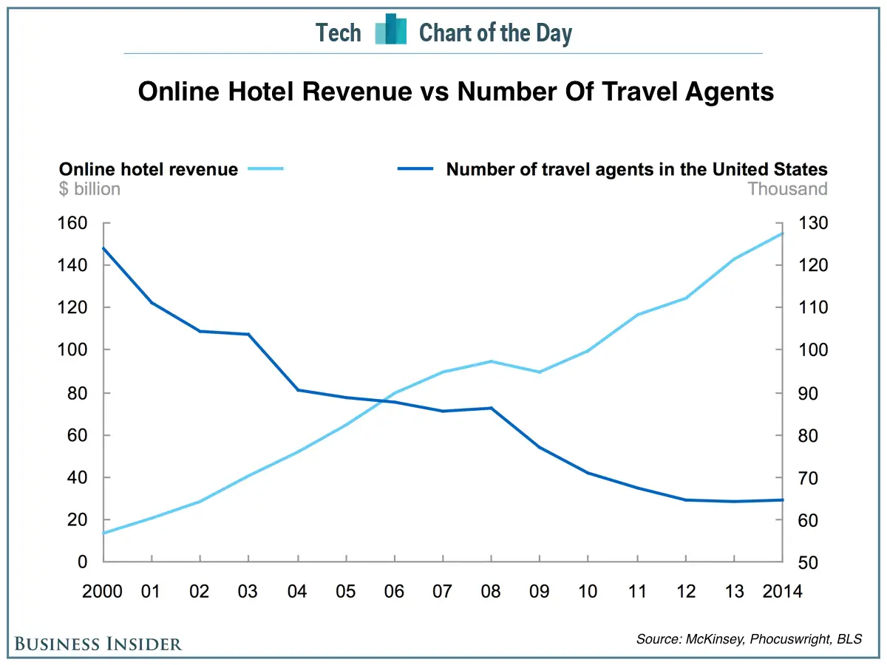
```

]

---

class: title-slide

# Part 2: Data Visualization Tools


---

### Histograms

**Histograms** are **visualizations of observations** of **univariate data**

.pull-left[

.slightly-smaller[
This unsightly mess...
]
```{r echo = FALSE}
set.seed(77)

hist_examp <- round(rnorm(100, mean = 5, sd = 1), 1)

as.data.frame(matrix(hist_examp, nrow = 10)) %>% 
  flextable() %>% 
  delete_part(part = "header") %>% 
  add_header_row(values = "$x$",
                 colwidths = 10) %>% 
  align(align = "center", part = "header") %>% 
  colformat_md(part = "all") %>% 
  fontsize(size = 11, part = "body")

```

]

.pull-right[
```{r echo = FALSE, fig.width = 6, fig.height = 5}
hist_exampplot <- data.frame(x = hist_examp) %>% 
  ggplot(aes(x))+
  geom_histogram(color = "dodgerblue")+
  theme_tufte(ticks = FALSE)+
 theme_xaringan(css_file = "nofrills.css")+
  theme(#axis.text = element_blank(),
        axis.ticks = element_blank())
  
hist_exampplot
```

.slightly-smaller[
...becomes this pretty picture 
]
]
---

### Parts of a Histogram

```{r echo=FALSE, fig.height = 7, fig.width = 12}
set.seed(77)

data.frame(x = rchisq(1000, df = 3)) %>% 
  ggplot(aes(x))+
  geom_histogram(color = "#e2ce1b",
                 fill = "#a28557")+
  theme_tufte()+
  theme_xaringan(css_file = "nofrills.css")+
  theme(axis.ticks = element_blank(),
        plot.caption = element_text(color = "#283399",
                                    size = 18))+
  labs(caption = "x-axis values indicate the top of a bin",
       x = "size of variable x",
       y = "frequency (aka count)")+
  annotate("text",
           x = 9,
           y = 150,
           halign = 0,
           hjust = 0.5,
           size = 18/.pt,
           label = "continuous values are binned into groups")+
    geom_segment(x = 4.5,
               xend = 2,
               y = 150,
               yend = 150,
               color = "#972626",
               arrow = arrow(),
               linewidth = 1.25)+
    annotate("text",
           x = 16,
           y = 50,
           halign = 1,
           hjust = 1,
           size = 18/.pt,
           label = "Empty spaces indicate\nno values of this size")+
  geom_segment(x = 15,
               xend = 15,
               y = 35,
               yend = 0,
               color = "#972626",
               arrow = arrow(),
               linewidth = 1.25)+
  annotate("text",
           x = 4,
           y = 100,
           halign = 0,
           hjust = 0,
           size = 18/.pt,
           label = "No spaces between bars\nindicate one continuous variable")+
  geom_segment(x = 5.25,
               xend = 5.25,
               y = 85,
               yend = 40,
               color = "#972626",
               arrow = arrow(),
               linewidth = 1.25)
  
```


---

### Boxplots

.slightly-smaller[

**Boxplots** (or **box-and-whisker plots**) visualize **summary statistics** about the **distribution** of a variable.

]


.pull-left[
```{r echo = FALSE, fig.width = 7, fig.height = 7}
set.seed(77)

box.x<-data.frame(x = rchisq(100, df = 4),
                  label = rep("x", 100))

box.x %>% 
  ggplot(aes(label, x))+
  geom_boxplot()+
  theme_tufte()+
  theme_xaringan()+
  labs(x = "variable name",
       y = "values")+
  geom_segment(x = 1.3,
               xend = 1.01,
               y = mean(c(sort(box.x$x, decreasing = TRUE)[1],
                             sort(box.x$x, decreasing = TRUE)[2])),
               yend = mean(c(sort(box.x$x, decreasing = TRUE)[1],
                             sort(box.x$x, decreasing = TRUE)[2])),
               arrow = arrow(),
           color = "#a28557")+
  annotate("text",
           x = 1.35,
           y = mean(c(sort(box.x$x, decreasing = TRUE)[1],
                             sort(box.x$x, decreasing = TRUE)[2])),
           hjust = 0,
           label = "outliers",
           size = 24/.pt,
           color = "#a28557")+
    annotate("text",
           x = 1.4,
           y = quantile(box.x$x, 0.75),
           hjust = 0,
           label = "75th percentile",
           size = 24/.pt,
           color = "#a28557")+
      annotate("text",
           x = 1.4,
           y = quantile(box.x$x, 0.5),
           hjust = 0,
           label = "median",
           size = 24/.pt,
           color = "#a28557")+
      annotate("text",
           x = 1.4,
           y = quantile(box.x$x, 0.25),
           hjust = 0,
           label = "25th percentile",
           size = 24/.pt,
           color = "#a28557")+
      annotate("text",
           x = 1.01,
           y = 10,
           vjust = 1,
           hjust = 0,
           label = "outlier\ndefinition*",
           size = 24/.pt,
           color = "#a28557")+
  expand_limits(x = c(0.5, 3))+
  theme(axis.ticks = element_blank())
```

]

.pull-right[

.textbox[


\*The default **outlier definition** in R is the one preferred by **John Tukey** (he invented the boxplot):

1. Add the **interquartile range** to the **75th percentile**.

2. Subtract the **interquartile range** from the **25th percentile**.

3. The **greatest value** $\le$ the result from (1) is the end of the **upper whisker**; the **smallest value** $\ge$ the result from (2) is the end of the **lower whisker**.


]
]

---

### Bar Charts

**Bar charts** are visual representations of **summary statistics** (*e.g.*, *counts* or *proportions*) of (typically) two or more variables.

```{r echo = FALSE, fig.width = 12, fig.height = 6}
data.frame(x = c("Group 1",
                 "Group 2"),
           y = c(5, 7)) %>% 
  ggplot(aes(x, y))+
  geom_bar(stat = "identity")+
  theme_tufte()+
  theme_xaringan()+
  labs(x = "Variable",
       y = "Summary Statistic")+
  theme(axis.ticks = element_blank())
```

---

### Error Bars

.pull-left[

.slightly-smaller[
**Error bars** indicate **variability** associated with the measurement of a summary statistic, *e.g.*:

> **standard error**

> Classical **confidence interval**

> Bayesian **credible interval**

You should **use them** and **explain them** whenever applicable!
]


]

.pull-right[
```{r echo = FALSE, fig.width = 6, fig.height = 7}
data.frame(x = c("Group 1",
                 "Group 2"),
           y = c(5, 7),
           lower = c(4.5, 6.5),
           upper = c(5.5, 7.5)) %>% 
  ggplot(aes(x, y))+
  geom_bar(stat = "identity")+
  geom_errorbar(aes(ymin = lower,
                    ymax = upper),
                width = 0.25,
                color = "#a28557",
                linewidth = 2)+
  theme_tufte()+
  theme_xaringan()+
  labs(x = "Variable",
       y = "Summary Statistic",
       caption = "Error bars indicate [se, CI, etc.]")+
  theme(axis.ticks = element_blank())
```
]
---
### Grouped Bar Charts

.pull-left[
.slightly-smaller[
**Grouped Bar Charts** use **color** (or patterns, shades, or tints) to add **another dimension** to the summary data.

Colors **within $x$-axis positions** can indicate:

> **subgroups** within larger groups

> **levels** of **factors**

> **conditions** within **experiments**

> *etc.*

]
]

.pull-right[
```{r echo = FALSE, fig.width = 6, fig.height = 7}
data.frame(x = rep(c("Group 1",
                 "Group 2"), 2),
           subgroup = c("A", "A",
                        "B", "B"),
           y = c(5, 7,
                 6, 4),
           lower = c(4.5, 6.5,
                     5.5, 3.5),
           upper = c(5.5, 7.5,
                     6.5, 4.5)) %>% 
  ggplot(aes(x, y, fill = subgroup))+
  geom_bar(stat = "identity",
           position = "dodge")+
  geom_errorbar(aes(ymin = lower,
                    ymax = upper,
                    color = subgroup),
                width = 0.25,
                linewidth = 2,
                position = position_dodge(width = 0.9))+
  scale_fill_manual(values = c("#283399",
                               "#972626"))+
  scale_color_manual(values = c("#181e5b",
                                "#390e0e"))+
  theme_tufte()+
  theme_xaringan()+
  labs(x = "Variable",
       y = "Summary Statistic")+
  theme(axis.ticks = element_blank(),
        legend.position = "bottom",
        legend.text = element_text(size = 24),
        legend.title = element_text(size = 24))
```
]

---

### Pareto Bar Chart

.pull-left[
.slightly-smaller[
The $x$-axis on a bar chart is **arbitrary**. 

In a **Pareto chart**, the $x$-axis is ordered **according to the $y$-axis values**.

> that makes **comparisons** easier

***

Also: note that sometimes - like in the example on the right - it's a good idea to **rotate** a bar chart so the **labels are more readable**.
]
]

.pull-right[
```{r echo = FALSE, fig.width = 6}
masspop.df %>% 
  ggplot(aes(x = reorder(county,
                         -population),
             y = population))+
  geom_bar(stat = "identity")+
  theme_tufte()+
  theme_xaringan()+
  theme(axis.ticks = element_blank())+
  coord_flip()+
  labs(x = "county",
       y = "population\n(thousands)",
       title = "Massachusetts County\nPopulations")
```

]
---

### A Minor Issue with Bar Charts

.slightly-smaller[
If we have a dataset that looks like this:
]

```{r echo = FALSE, fig.height = 2, fig.width = 12}
set.seed(77)
x = runif(200, 0, 100)
data.frame(x) %>% 
  ggplot(aes(x))+
  geom_histogram(binwidth = 5,
                 color = "#181e5b")+
  geom_segment(x = mean(x),
               xend = mean(x),
               y = -Inf,
               yend = Inf,
               lty = 2,
               linewidth = 1.25,
               color = "#a28557")+
  annotate("text",
           x = mean(x),
           y = Inf,
           hjust = -0.1,
           vjust = 1,
           color = "#a28557",
           label = "mean(x)",
           size = 24/.pt)+
  ylim(NA, 20)+
  theme_tufte()+
  theme_xaringan()+
  theme(axis.ticks = element_blank())
```

.pull-leftcolumn[

```{r echo = FALSE, fig.height = 5, fig.width = 4}
data.frame(x = "x",
           y = mean(x),
           se.lower = mean(x) - sd(x)/sqrt(length(x)),
           se.upper = mean(x) + sd(x)/sqrt(length(x))) %>% 
  ggplot(aes(x = x, y = y))+
  geom_bar(stat = "identity")+
  geom_errorbar(aes(ymin = se.lower,
                    ymax = se.upper),
                width = 0.25,
                color = "#181e5b",
                linewidth = 1)+
  annotate("text",
           x = 1,
           y = c(65, mean(x)/2),
           label = c("nothing\nhere!",
                     "data\nlive\nhere?"),
           color = c("#a28557",
                     "#f9f5fd"),
           size = 24/.pt)+
  theme_tufte()+
  theme_xaringan()+
  labs(y = "mean(x)")+
  scale_y_continuous(limits = c(NA, 72), breaks = seq(10, 70, 10))+
  theme(axis.ticks = element_blank(),
        axis.text.x = element_blank())
```


]

.pull-rightcolumn[

.slightly-smaller[

...plotting the **mean** using a bar chart makes it look like the mean is actually the **maximum**.

Bar charts are **ideal** for **counts** and **proportions**, not so much for **means**

(not terrible, though! and ok for making comparisons between different means!)]

]

---
### Bar Chart Alternatives

**Boxplots**

.pull-left[

**Original Bar Chart**
```{r echo = FALSE}
set.seed(77)
hist_examp2 <- round(rnorm(100, mean = 8, sd = 1), 1)

data.frame(group = rep(c("A", "B"), each = 100),
           y = c(hist_examp, hist_examp2)) %>% 
  ggplot(aes(x = group, y = y))+
  stat_summary(geom = "bar", fun = "mean")+
  stat_summary(geom = "errorbar", fun.data = mean_se,
               width = 0.25,
               color = "#181e5b",
               linewidth = 2)+
  theme_tufte()+
  theme_xaringan()+
  theme(axis.ticks = element_blank())
```

]

.pull-right[

**Boxplots**

```{r echo = FALSE}
set.seed(77)
hist_examp2 <- round(rnorm(100, mean = 8, sd = 1), 1)

data.frame(group = rep(c("A", "B"), each = 100),
           y = c(hist_examp, hist_examp2)) %>% 
  ggplot(aes(x = group, y = y))+
  geom_boxplot(linewidth = 2)+
  theme_tufte()+
  theme_xaringan()+
  theme(axis.ticks = element_blank())
```


]

---

### Bar Chart Alternatives

**Comparative Histograms**


.pull-left[

**Stacked**

```{r echo = FALSE, fig.height = 6}
set.seed(77)
hist_examp2 <- round(rnorm(100, mean = 8, sd = 1), 1)

hist_exampplot2 <- data.frame(x = hist_examp2) %>% 
  ggplot(aes(x))+
  geom_histogram(color = "#e2ce1b",
                 fill = "#a28557")+
  theme_tufte(ticks = FALSE)+
 theme_xaringan(css_file = "nofrills.css")+
  theme(#axis.text = element_blank(),
        axis.ticks = element_blank())

plot_grid(hist_exampplot+
  xlim(1, 11)+
    scale_y_continuous(breaks = c(0, 5, 10, 15))+
    labs(x = "A"), 
          hist_exampplot2+
  xlim(1, 11)+
    scale_y_continuous(breaks = c(0, 5, 10, 15))+
    labs(x = "B"),
          nrow = 2) 
```
]

.pull-right[

**Superimposed**

```{r echo = FALSE, fig.height = 6, warning = FALSE}

ggplot()+
  geom_histogram(data = data.frame(x = c(hist_examp, hist_examp2),
                                   group = rep(c("A", "B"), each = 100)),
                 aes(x, fill = group, color = group),
               #  fill = "#283399",
                 alpha = 0.75,
               position = "identity")+
  scale_fill_manual(values = c("#283399", "#a28557"))+
  scale_color_manual(values = c("dodgerblue", "#e2ce1b"))+
  theme_tufte()+
  theme_xaringan()+
  theme(axis.ticks = element_blank(),
        legend.position = "bottom",
        axis.title.x = element_blank())
```

]

---

### Jitterplots

.pull-left[

**Jitterplot**

```{r echo = FALSE, fig.height = 6}
set.seed(77)
hist_examp2 <- round(rnorm(100, mean = 8, sd = 1), 1)

data.frame(group = rep(c("A", "B"), each = 100),
           y = c(hist_examp, hist_examp2)) %>% 
  ggplot(aes(x = group, y = y))+
  geom_jitter(size = 2)+
  theme_tufte()+
  theme_xaringan()+
  labs(y = "values")+
  theme(axis.ticks = element_blank())
```

]

.pull-right[

**Jitterplot + Boxplot**\*

```{r echo = FALSE, fig.height = 6}
set.seed(77)
hist_examp2 <- round(rnorm(100, mean = 8, sd = 1), 1)

data.frame(group = rep(c("A", "B"), each = 100),
           y = c(hist_examp, hist_examp2)) %>% 
  ggplot(aes(x = group, y = y))+
    geom_boxplot(linewidth = 1.5,
                 color = "#181e5b",
                 outlier.shape = NA)+
  geom_jitter(size = 1.5)+
  theme_tufte()+
  theme_xaringan()+
  labs(y = "values")+
  theme(axis.ticks = element_blank())
```
]

.footnote[
\*note: remove outliers from boxplot when combining with jitterplots, otherwise you get extra dots.
]
---

### Violin Plots

.pull-left[

**Violin plot**
```{r echo = FALSE, fig.height = 6}
set.seed(77)
hist_examp2 <- round(rnorm(100, mean = 8, sd = 1), 1)

data.frame(group = rep(c("A", "B"), each = 100),
           y = c(hist_examp, hist_examp2)) %>% 
  ggplot(aes(x = group, y = y))+
  geom_violin()+
  theme_tufte()+
  theme_xaringan()+
  labs(y = "values")+
  theme(axis.ticks = element_blank())
```

]

.pull-right[

**Half-violin plot**

```{r echo = FALSE, fig.height = 6}
set.seed(77)
hist_examp2 <- round(rnorm(100, mean = 8, sd = 1), 1)

data.frame(group = rep(c("A", "B"), each = 100),
           y = c(hist_examp, hist_examp2)) %>% 
  ggplot(aes(x = group, y = y))+
  geom_violinhalf(fill = "#283399")+
  theme_tufte()+
  theme_xaringan()+
  labs(y = "values")+
  theme(axis.ticks = element_blank())
```
]
---
### Scatterplot

**Scatterplots** depict **paired**, **bivariate** data.

.pull-left[

.slightly-smaller[
> The $y$-axes on histograms, boxplots, and bar charts (plus variants) are **functions** of the values indicated on the $x$-axis.

> In a scatterplot, **both** $x$ and $y$ are observed variables

> Each observation of $x$ is paired with an observation of $y$
]
]

.pull-right[

```{r echo = FALSE}
set.seed(12)
# create the variance covariance matrix
sigma<-rbind(c(1,-0.8, 0.7), c(-0.8,1, -0.2), c(0.7, -0.2, 1))
# create the mean vector
mu<-c(10, 5, 2) 
# generate the multivariate normal distribution
scatter_df<-as.data.frame(mvrnorm(n=50, mu=mu, Sigma=sigma)) %>% 
  rename(y = V1,
         x1 = V2,
         x2 = V3) %>% 
  arrange(x1)

ggplot(scatter_df, aes(x1, y))+
  theme_tufte()+
  geom_point(size = 3)+
  theme_xaringan()+
  labs(x = "x", y = "y")+
  theme(axis.ticks = element_blank(),
        axis.title = element_text(size = 48))
  
  
```

]
---

### Scatterplots

.pull-leftcolumn[

.slightly-smaller[
Scatterplots can also be **multivariate**.

**3D plots** *of all kinds* are **tricky to present in 2D formats**


**Dynamic** formats can help! Otherwise, **consider another visualization**.
]

]

.pull-rightcolumn[
```{r echo=FALSE, warning = FALSE, message = FALSE, out.width="100%"}
scatter_df %>% 
  plot_ly(type = 'scatter3d',
          x = ~ x1,
          y = ~ x2,
          z = ~ y,
          marker = list(color = "#283399")) %>% 
  layout(scene = list(xaxis = list(title = 'x'),
                      yaxis = list(title = 'y'),
                      zaxis = list(title = 'z')),
         paper_bgcolor = "#f9f5fd")
```

]

---

### Pie Charts

.pull-left[
```{r echo = FALSE, out.width = "100%"}

pie<-data.frame(value = c(35, 32, 33, 34, 36),
           group = LETTERS[1:5]) %>% 
  ggplot(aes(x = "", y = value, fill = group))+
  geom_col()+
  coord_polar(theta = "y")+
  theme_tufte()+
  theme_xaringan()+
  scale_fill_viridis_d(name = NULL)+
  theme(legend.position = "bottom",
        axis.ticks = element_blank(),
        axis.text = element_blank(),
        axis.title = element_blank(),
        plot.background = element_rect(fill = "#f9f5fd"),
        panel.background = element_rect(fill = "#f9f5fd"),
        legend.text = element_text(size = 128))


ggsave("pie.png", pie)

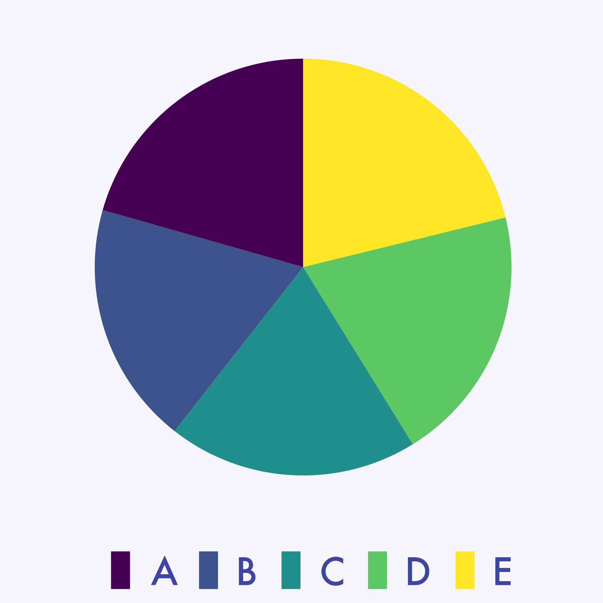
```

]

.pull-right[
### **Pop quiz!**

### Which of the pie slices in the chart on the left is the **smallest?**
]
---

### Please don't use pie charts

.pull-left[
```{r echo = FALSE, out.width = "100%"}


```

]

.pull-right[

```{r echo = FALSE}
data.frame(value = c(35, 32, 33, 34, 36),
           group = LETTERS[1:5]) %>% 
  ggplot(aes(x = group, y = value))+
  geom_bar(stat = "identity")+
  theme_tufte()+
  theme_xaringan()+
  theme(axis.ticks = element_blank(),
        axis.title = element_blank())
```

]
---

### Tables

**Tables** present **precise** values

.pull-left[

As with figures, try to **minimize non-data elements**

> *e.g.*, limit **coloring and shading**

> Minimize **lines** (especially vertical ones)

]

.pull-right[
```{r echo = FALSE}
data.frame(Category = c("Group A",
                        "Group B",
                        "Group C",
                        "Total"),
           Header_1 = c(1,
                        2,
                        3,
                        6),
           Header_2 = c(4, 
                        5, 
                        6, 
                        15),
           Header_3 = c(7,
                        8,
                        9,
                        24)) %>% 
  flextable() %>% 
  set_header_labels(Header_1 = "Header",
                    Header_2 = "Header",
                    Header_3 = "Header") %>% 
  add_header_row(values = c("",
                            "Superheader"),
                 colwidths = c(2, 2)) %>% 
  fontsize(size = 12, part = "all")
```

]

---

### Heatmaps

.slightly-smaller[
**Heatmaps** use **color scales** to represent a dimension of data to make it easy to pick up on **patterns** (in a table, in an area, on a map, *etc*.).

]

.pull-left[


The example on the right uses:

> **position** to show location

> **size** to show frequency

> **color** to show success (relative to other players in the league)


]

.pull-right[
```{r echo = FALSE}
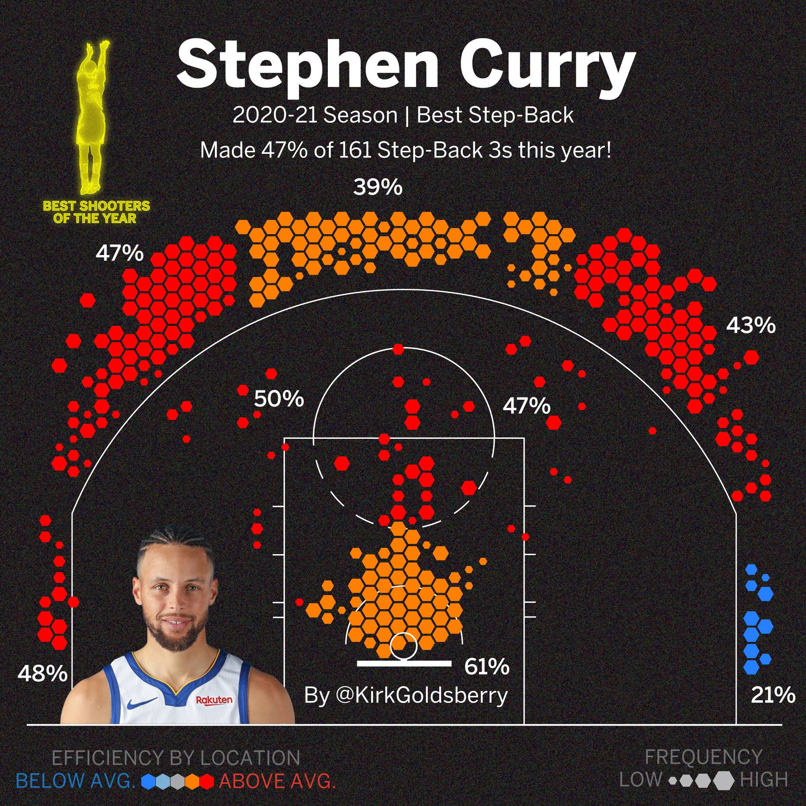
```

]

---

### Choropleth Maps

.pull-left[
.slightly-smaller[

**Choropleth maps** superimpose data onto **geography**.


(most maps are, technically, choropleth maps)


They are most effective when **relative position** is a factor.

> Otherwise, the risk is to *overemphasize* **physical** factors when other factors may be more important.

]
]
.pull-right[
```{r echo = FALSE}
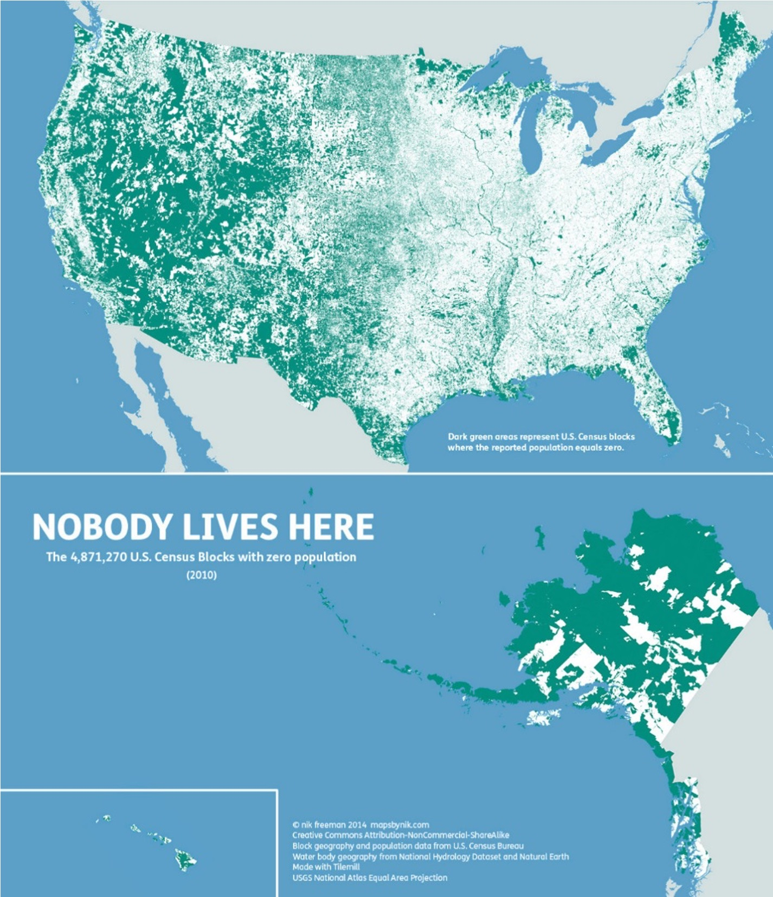
```
]

.footnote[
Map source: https://mapsbynik.com
]
---

### Line Charts

.slightly-smaller[
**Connected points** on charts indicate **flowing change**,*e.g*, from one measured time period to the next in a **time-series plot**.

**Line charts** can help show **trends** (like **periodicity**) over measurements.
]

```{r echo = FALSE, fig.width = 12, fig.height = 4}
Quarter <- c("Q1&2023", 
             "Q4&2022", 
             "Q3&2022", 
             "Q2&2022", 
             "Q1&2022", 
             "Q4&2021", 
             "Q3&2021", 
             "Q2&2021", 
             "Q1&2021", 
             "Q4&2020", 
             "Q3&2020", 
             "Q2&2020", 
             "Q1&2020", 
             "Q4&2019", 
             "Q3&2019", 
             "Q2&2019", 
             "Q1&2019", 
             "Q4&2018", 
             "Q3&2018", 
             "Q2&2018", 
             "Q1&2018" )

Shipments <- c(55.20, 
               72.30, 
               51.9, 
               44.6, 
               56.5, 
               84.1, 
               50.4, 
               44.2, 
               55.2, 
               90.10, 
               41.70, 
               37.60, 
               36.70, 
               73.80, 
               46.60, 
               33.80, 
               36.40, 
               68.40, 
               46.90, 
               41.30, 
               52.20 )

data.frame(Quarter, Shipments) %>% 
  mutate(Quarter = factor(Quarter, levels = rev(Quarter))) %>% 
  ggplot(aes(x = Quarter, y = Shipments, group = 1))+
  geom_point(size = 3)+
  geom_line(linewidth = 1.5)+
  scale_x_discrete(labels = scales::wrap_format(4))+
  scale_y_continuous(limits = c(0, NA))+
  labs(y = "Millions of\nUnits Shipped",
       title = "iPhone Sales",
       subtitle = "Q1 2018 - Q1 2023")+
  guides(x = ggh4x::guide_axis_nested(delim = "&"))+
  theme_tufte()+
  theme_xaringan()+
  theme(axis.ticks = element_blank(),
        axis.text.x = element_text(size = 18,
                                   color = "#283399"),
        axis.title.y = element_text(size = 18),
        plot.title = element_text(size = 36),
        plot.subtitle = element_text(size = 24))
```

.footnote[
Source: https://www.bankmycell.com/blog/how-many-iphones-have-been-sold/
]
---

### Sankey Diagrams

**Sankey Diagrams** (*a.k.a.* **ribbonplots**, **riverplots**, or **alluvial diagrams**) indicate **flow between categories**

.pull-left[

```{r echo = FALSE}

edges<-data.frame(N1 = rep(c("From Democratic",
                        "From Republican",
                        "From ThirdParty",
                        "From Didnotvote"), each = 4),
           N2 = rep(c("To Democratic",
                        "To Republican",
                        "To ThirdParty",
                        "To Didnotvote"), 4),
           Value = c(1000,
                    50, 
                    100, 
                    200,
                    200,
                    800,
                    300,
                    100,
                    150,
                    175,
                    100,
                    135,
                    200,
                    100,
                    50,
                    40))

nodes <- data.frame(ID=unique(c(edges$N1, edges$N2)),
x=rep(c(1,2), each=4), y=c(4,3,2,1,4, 3,2,1))

cols <- c(Democratic="#283399",
Republican ="#972626",
ThirdParty ="#a28557",
Didnotvote ="#8f00ff")

style <- sapply(nodes$ID, function(id)
list(col=cols[ gsub("(From|To) ", "", id) ]), simplify=FALSE)

r <- makeRiver(nodes=nodes, edges=edges, styles=style,
               node_labels = c("Democrat",
                               "Republican",
                               "Third Party",
                               "Did not vote"))
par(bg="#f9f5fd")
d <- list(srt=0, textcex=0, textcol = "#f9f5fd") # default style
plot(r, plot_area=1, nodewidth=10, default_style=d)
title(main = "Voter patterns from 2016 (left) to 2020 (right)")

```


]

.pull-right[

> The measurement points are called **nodes**

> The nodes are connected by **edges**.
]
---

### Combining plot types

**Minard's plot (1869)** combines a **time-series plot**, a **Sankey plot**, a **choropleth map**, a **table**, and an **anti-war protest**.

```{r echo = FALSE}
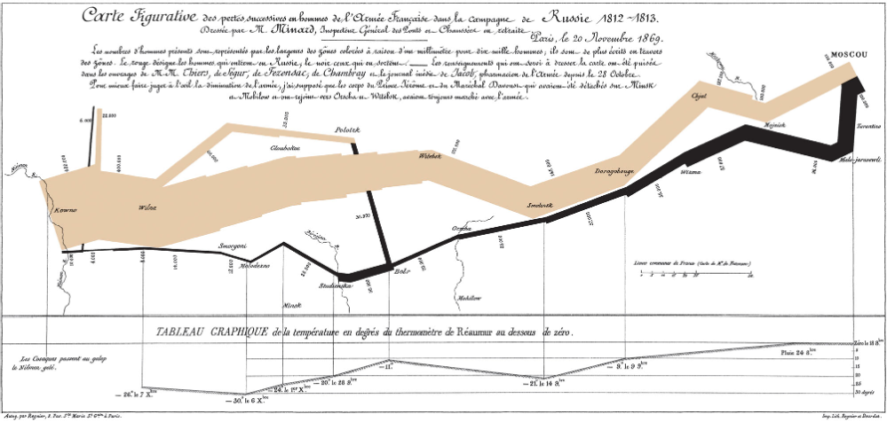
```

---

### Infographics


**Infographics** combine data visualization with graphic design.

.pull-leftcolumn[I can't really help you with the graphic design part.

But **don't do this. $\to$**

]

.pull-rightcolumn[
```{r echo = FALSE, out.width = "90%"}
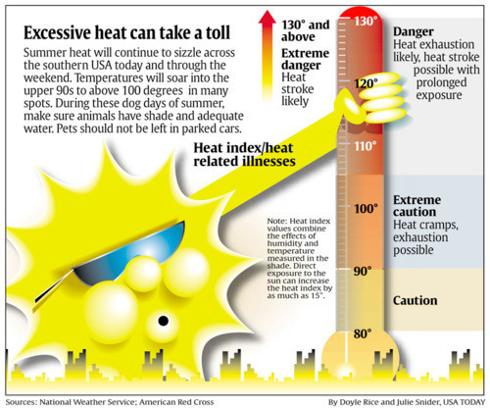
```

]

